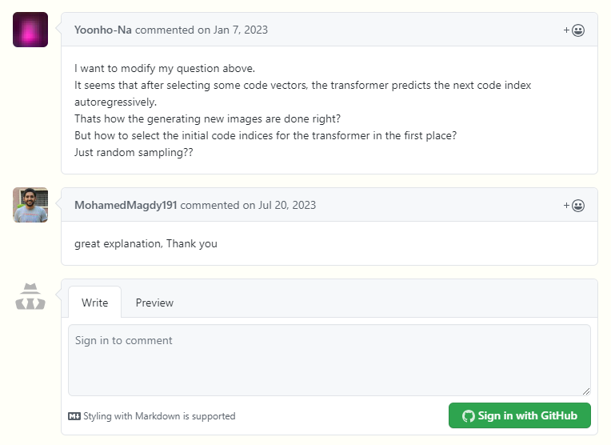

As I browse through different tech blog articles and able to read [this](https://ljvmiranda921.github.io/notebook/2021/08/08/clip-vqgan/), inspired me to add commenting system in this blog.
This used [utterances](https://github.com/utterance/utterances), but I haven't found any reliable documentation on how to set it up on Docusaurus until I've stumbled upon [giscus](https://giscus.app/).

<!--truncate-->

## Here's a step-by-step guide on how to add Giscus to Docusaurus:

### Install Giscus

```bash
npm install -D @giscus/react
```

### Enable Github Discussions

Discussion feature of Github can be seen [here](https://docs.github.com/en/repositories/managing-your-repositorys-settings-and-features/enabling-features-for-your-repository/enabling-or-disabling-github-discussions-for-a-repository).

### Giscus Configuration

Fill up necessary details [here](https://giscus.app/) to acquire giscus configuration. Look something like this:

```html
<script src="https://giscus.app/client.js"
        data-repo="[ENTER REPO HERE]"
        data-repo-id="[ENTER REPO ID HERE]"
        data-category="[ENTER CATEGORY NAME HERE]"
        data-category-id="[ENTER CATEGORY ID HERE]"
        data-mapping="pathname"
        data-strict="0"
        data-reactions-enabled="1"
        data-emit-metadata="0"
        data-input-position="bottom"
        data-theme="preferred_color_scheme"
        data-lang="en"
        crossorigin="anonymous"
        async>
</script>
```

### Generate BlogPostItem component

Run this comand in your terminal.

```bash
npm run swizzle [theme name] [component name] -- --wrap

# Example:
npm run swizzle @docusaurus/theme-classic BlogPostItem -- --wrap
```

It will generate a BlogPostItem component under `src/theme`. Edit `index.js`

```js
import React from 'react';
import { useBlogPost } from '@docusaurus/theme-common/internal'
import BlogPostItem from '@theme-original/BlogPostItem';
import GiscusComponent from '@site/src/components/GiscusComponent';
import useIsBrowser from '@docusaurus/useIsBrowser';

export default function BlogPostItemWrapper(props) {
  const { metadata, isBlogPostPage } = useBlogPost()
  const isBrowser = useIsBrowser();

  const { frontMatter, slug, title } = metadata
  const { enableComments } = frontMatter

  return (
    <>
      <BlogPostItem {...props} />
      {(enableComments && isBlogPostPage) && (
        <GiscusComponent />
      )}
    </>
  );
}
```

### Create your Blog
On your markdown file, add `enableComments`
```markdown
---
title: Title of blog
authors: author
tags: [tagOne, tagTwo]
enableComments: true # To enable Giscus
---
```

### Test Your Docusaurus Site

Run your Docusaurus development server to test the changes

```bash
npm start
```

Open your browser and navigate to the page where you added the Giscus comments section.
Check if the comments section is displayed and functional.

:::note Congratulations!

You have successfully added Giscus to your Docusaurus site, allowing users to leave comments using their GitHub accounts.

:::