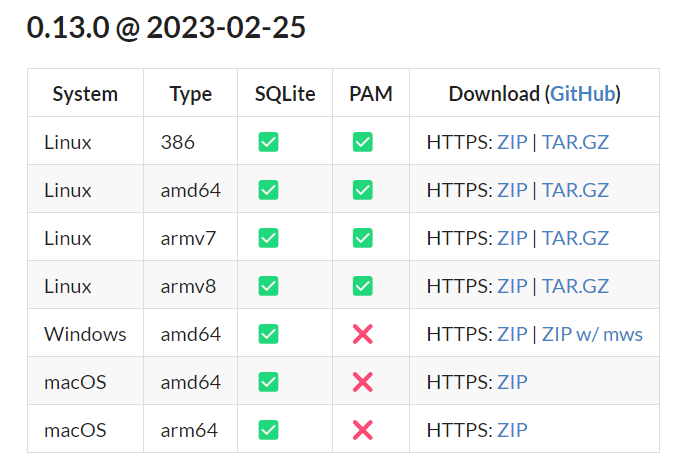
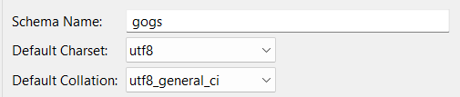
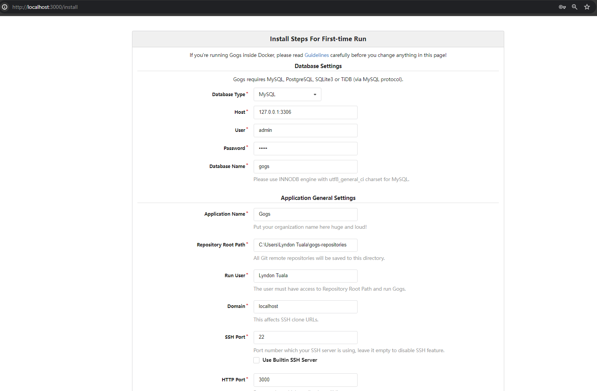
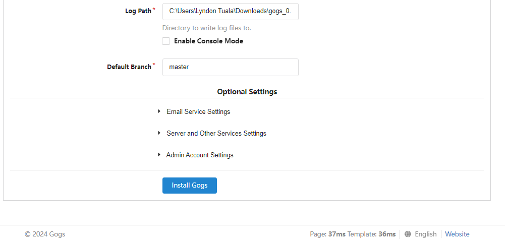
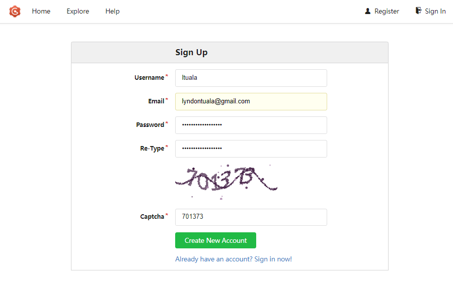
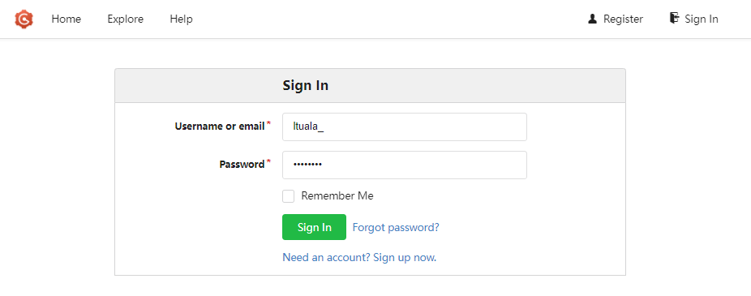
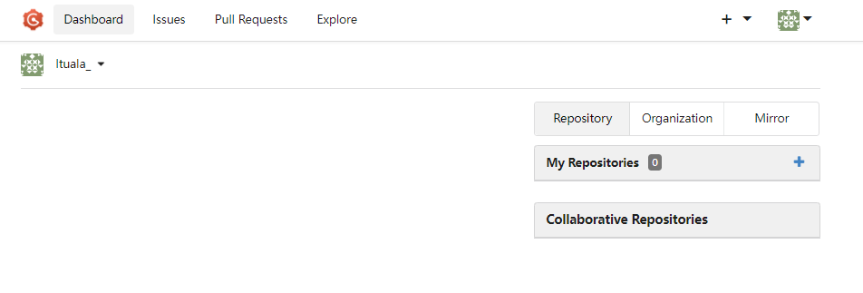

Gogs allows deploying a local Git Server on your local machine. It comes with a web UI to facilitate pushing and pulling of code, it also includes pull requests and issues features. 

<!--truncate-->
:::caution Prerequisites
Gogs requires the following to be installed on your local machine: [Database (MySQL)](https://dev.mysql.com/downloads/) and [Git](https://git-scm.com/download/win)
:::
## Here's a step-by-step guide on how to setup Gogs on your Windows machine:

### 1. Install Gogs

Gogs can be downloaded [here](https://gogs.io/docs/installation/install_from_binary). Select ZIP under Windows system.


### 2. Create a MySQL database named `gogs`

Make sure to set the charset to `utf8_general_ci`.


### 3. Unzip the file and install Gogs

Run the following command:

```
./gogs web
```
For the `Database Type`, select `MySQL`.Fill up the necessary details like `User` and `Password`.


Click `Install Gogs`.


### 4. Create a Gogs account
After clicking Install Gogs. You'll be redirected to the login page. Create an account by clicking the `Need an account? Sign up now.`


### 5. Sign in

Sign in to your account.

After signing in you should now be able to use Gogs. Try to create your new Gogs repo.



:::note Congratulations!

You have now successfully installed Gogs on your local machine, allowing you to create code repository, push and pull code changes, and use the features like pull requests and issues.

:::