A search bar provides a way for user to easily navigate across your website. Here will explore ho to add a search bar powered by [Algolia](https://www.algolia.com) in [Docusaurus](https://docusaurus.io/).

<!--truncate-->

:::info Reference
Here is a [youtube video](https://www.youtube.com/watch?v=xXwvDVGBlqQ) used as a main reference on how to configure this.
There is also an official documentation in [Docusaurus](https://docusaurus.io/docs/search#using-algolia-docsearch)    


Here is the [pricing](https://www.algolia.com/pricing/) of Algolia, it comes with a free option.
:::

## Create an Algolia account
To create an Algolia account, check [here](https://www.algolia.com/).

## Create a New Application
On Algolia, select **Create Application**.
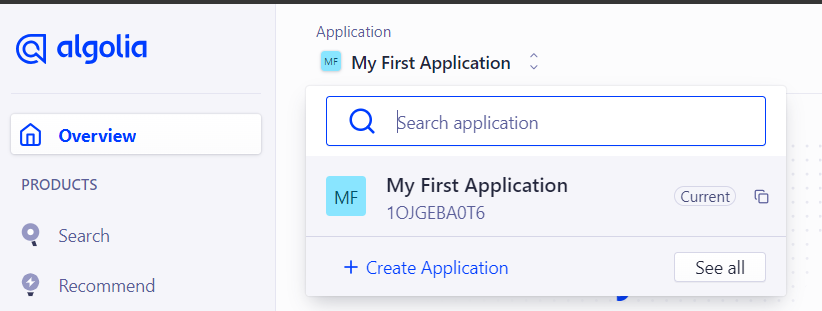
Select **US West** as the region.
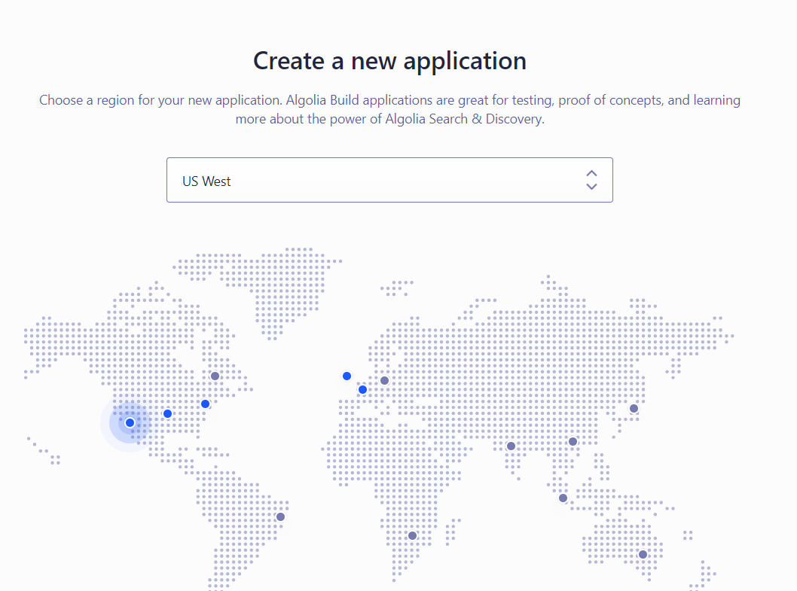
Select **Create Application**.
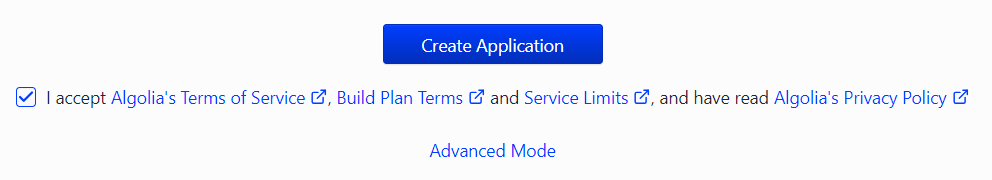

### Rename an Application
To rename an application go to **Settings > Applications**.
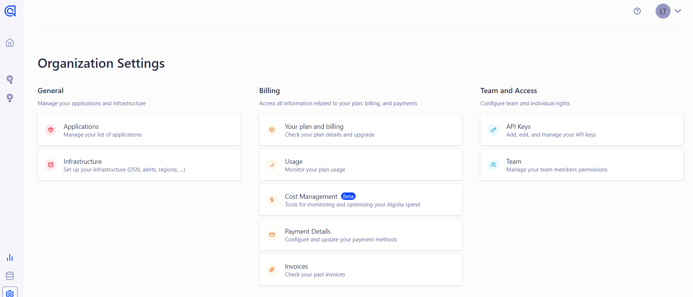
Select the application you want to rename click on the three dots icon. Select **Rename**.
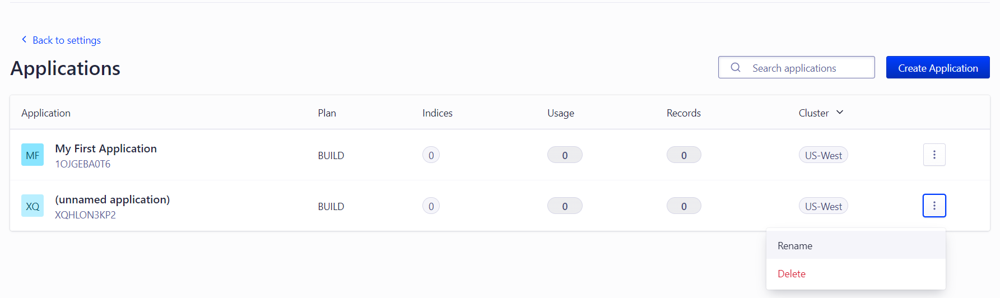
Input the name of the application.


## Create a New API Key
To create a new API key go to **Settings > API Keys**. Select **New API Key**.
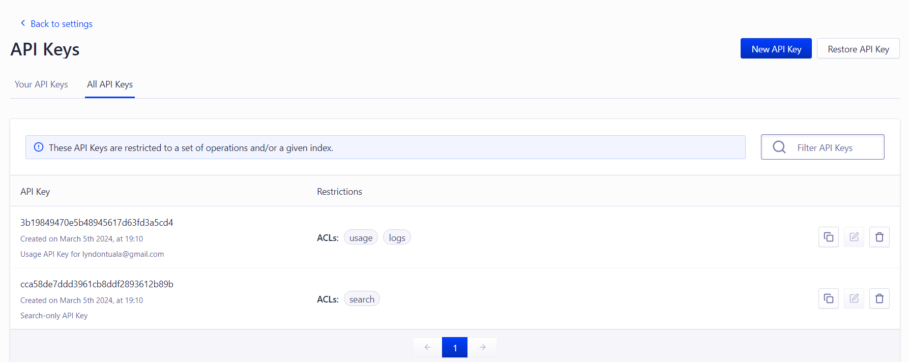
Input a description on the **Description** field. For the `Validity`, set it to `0`.
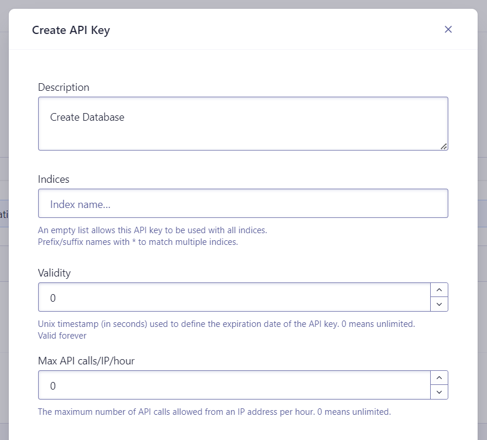
On the `ACL`, select `addObject`, `editSettings`, and `deleteIndex`.
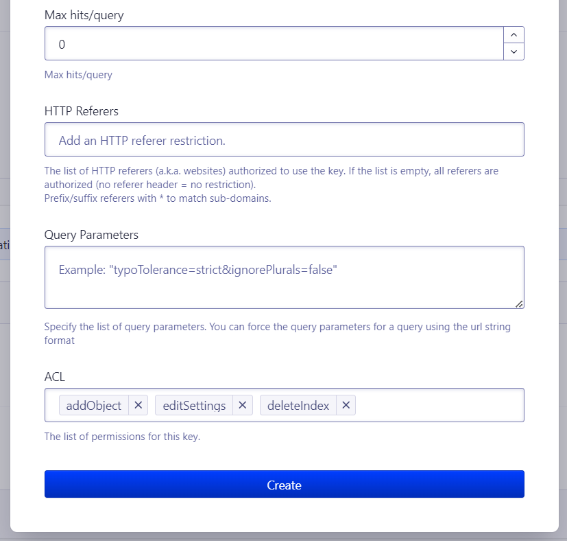
Once the API Key is created, it should be shown on the list of **All API Keys**.
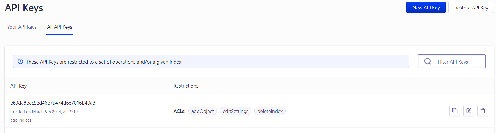

## Create `.env` and `config.json` files
The `.env` and `config.json` files should be created inlide with your main folder. Here is a sample folder structure:  
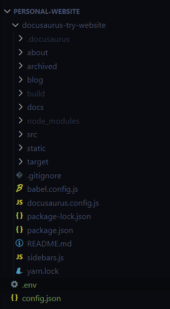

### The `.env` file
The `.env` file should contain a key value pair of the `APPLICATION_ID` and `API_KEY`. Coppy the API key created at the previous step.
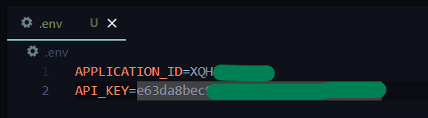  
The Application ID can be found on **Settings > API Keys**.
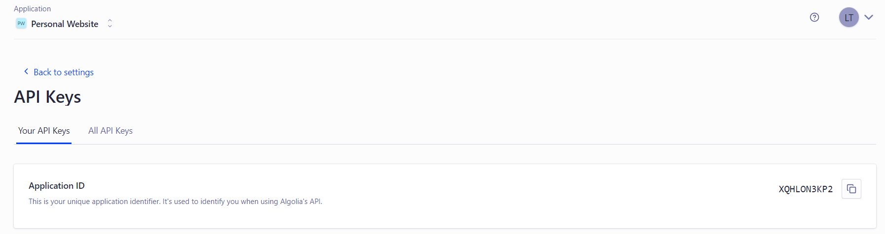 
### The `config.json` file
The `config.json` contents can be found in this [link](https://github.com/algolia/docsearch-configs/blob/master/configs/docusaurus-2.json). 
Make sure to modify the following: `index_name`, `start_urls`, and `sitemap_urls`.
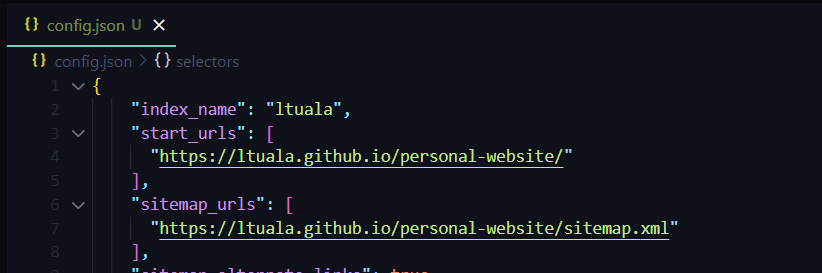 

## Run the Crawler
:::caution Prerequisites
To run the crawler there are some installations to be done, see details [here](https://docsearch.algolia.com/docs/legacy/run-your-own/#run-the-crawl-from-the-docker-image).
:::
Make sure to use a bash terminal, here i'm using gitbash to run the following docker command:
```
docker run -it --env-file=.env -e "CONFIG=$(cat /path/to/your/config.json | jq -r tostring)" algolia/docsearch-scraper
```
Modify the path `/path/to/your/config.json`, see image below for example.
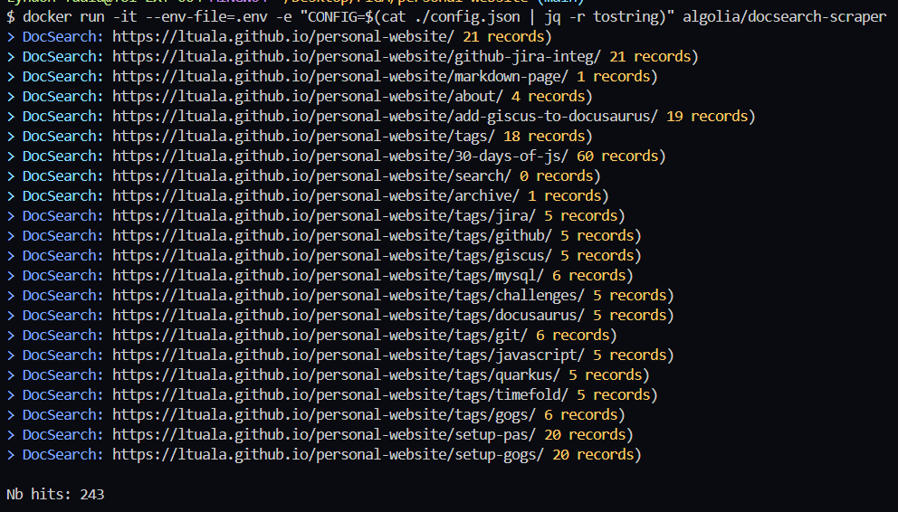
Once the crawler is done. A index should be created on your Algolia account with the name of the `index_name` configured on `config.json` file.
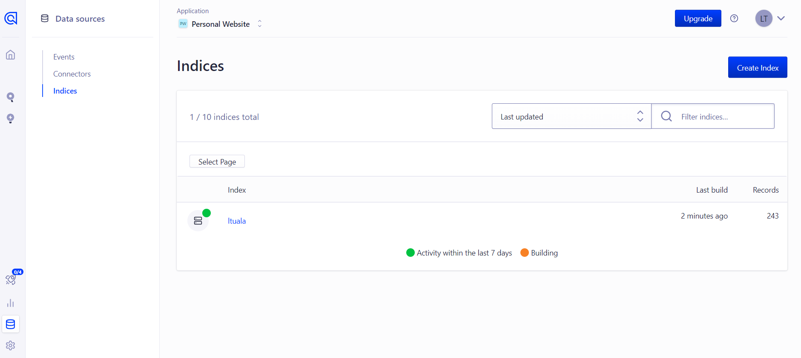

## Update `docusaurus.config.js` file 
Update the `docusaurus.config.js` file include these `Algolia: ` value under `themeConfig.`
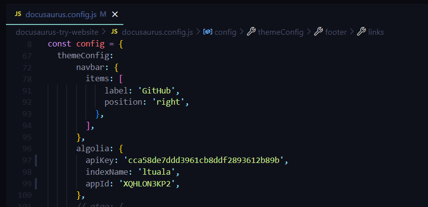
On the `apiKey` use the search only API key.
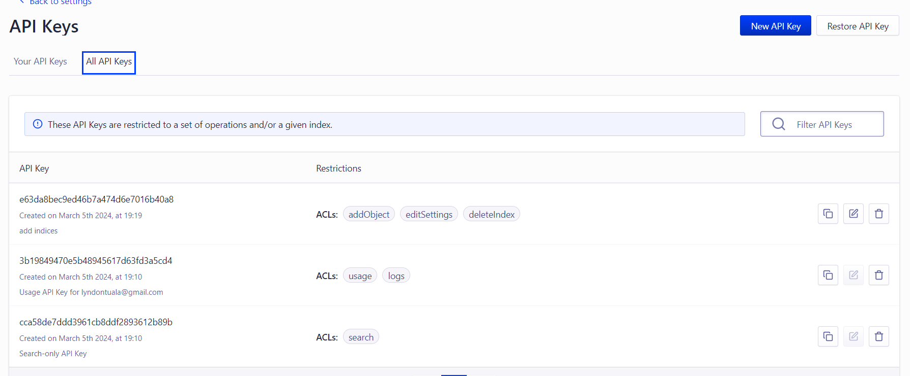
## Test locally
Once able to successfully test, deploy the changes on your website.
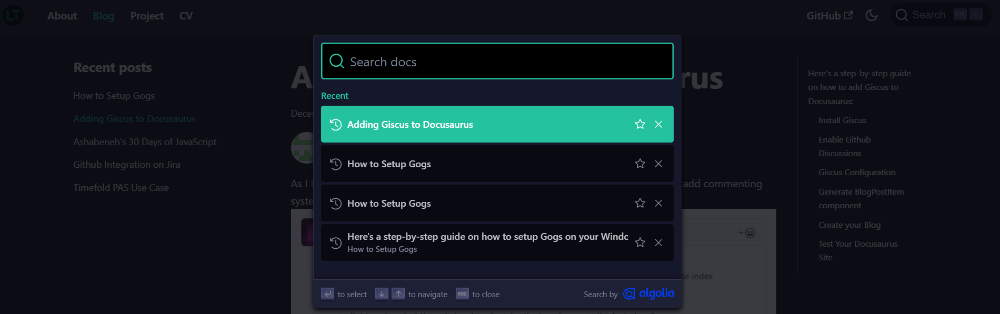
:::note Congratulations!

You have now successfully added a search bar with [Algolia](https://www.algolia.com) in [Docusaurus](https://docusaurus.io/). Make sure to not push the `.env` and `config.json` files.

:::