Introduction message... [**"Python Mega Course: Learn Python in 60 Days, Build 20 Apps"**](https://www.udemy.com/course/the-python-mega-course/?course_id=692188) by Ardit Sulce.

<!--truncate-->

:::info
[**"Python Mega Course: Learn Python in 60 Days, Build 20 Apps"**](https://www.udemy.com/course/the-python-mega-course/?course_id=692188) by Ardit Sulce, can be found in Udemy, each day consist of lectures as well as exercises....
:::

## Course Outline [^1]
<iframe
  src="https://docs.google.com/viewer?url=https://drive.google.com/uc?id=1T0szUG729O9-Pl4dVP8mmG3OpeiLGsyO&embedded=true"
  width="100%"
  height="1000px"
  style={{ border: "none" }}
></iframe>

### Day 1 to 20: Python Basics
Lorem ipsum dolor sit amet, consectetur adipiscing elit. Cras pulvinar fringilla sem, nec mollis eros mollis at. Cras quis lorem accumsan, molestie nulla a, viverra dui. Praesent blandit efficitur augue, vehicula vulputate sapien eleifend at.
[](https://asciinema.org/a/HVAbdApgKA6aEcLwzao2yQ5c9)
[](https://asciinema.org/a/8xO82Pasvbuk0MKT7MROiRBhf)
I have also explored the capability of hosting the web application on Streamlit. Here’s an example demonstrating its [implementation.](https://ltuala-learning-python-web-app1.streamlit.app/)
#### Some Learnings 
Lorem ipsum dolor sit amet, consectetur adipiscing elit. Cras pulvinar fringilla sem, nec mollis eros mollis at. Cras quis lorem accumsan, molestie nulla a, viverra dui. Praesent blandit efficitur augue, vehicula vulputate sapien eleifend at.

:::note Python shell

Lorem ipsum dolor sit amet, consectetur adipiscing elit. Cras pulvinar fringilla sem, nec mollis eros mollis at. Cras quis lorem accumsan, molestie nulla a, viverra dui. Praesent blandit efficitur augue, vehicula vulputate sapien eleifend at.

```python
print('Hello World')
```
:::

### Day 21 to 26: Python Intermediate
Lorem ipsum dolor sit amet, consectetur adipiscing elit. Cras pulvinar fringilla sem, nec mollis eros mollis at. Cras quis lorem accumsan, molestie nulla a, viverra dui. Praesent blandit efficitur augue, vehicula vulputate sapien eleifend at.

:::note sample streamlit app
Lorem ipsum dolor sit amet, consectetur adipiscing elit. Cras pulvinar fringilla sem, nec mollis eros mollis at. Cras quis lorem accumsan, molestie nulla a, viverra dui. Praesent blandit efficitur augue, vehicula vulputate sapien eleifend at.

See [sample streamlit app](https://ltuala-learning-python-app2-portfolio.streamlit.app/)
:::
Here is a sample output of automating a PDF page.
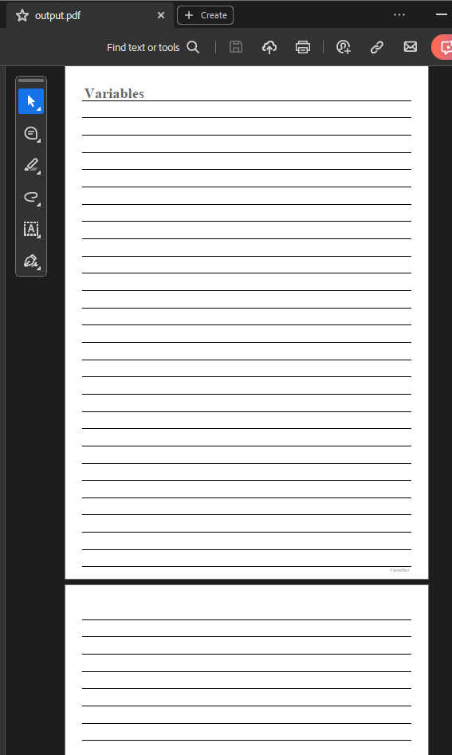  
Automation of PDF creation was also explored by generating some sort of invoices.
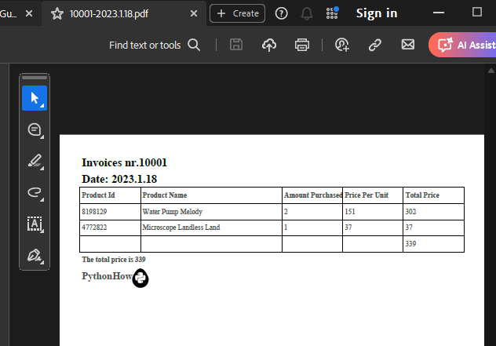
### Day 27 to 28: APIs 
Lorem ipsum dolor sit amet, consectetur adipiscing elit. Cras pulvinar fringilla sem, nec mollis eros mollis at. Cras quis lorem accumsan, molestie nulla a, viverra dui. Praesent blandit efficitur augue, vehicula vulputate sapien eleifend at.   
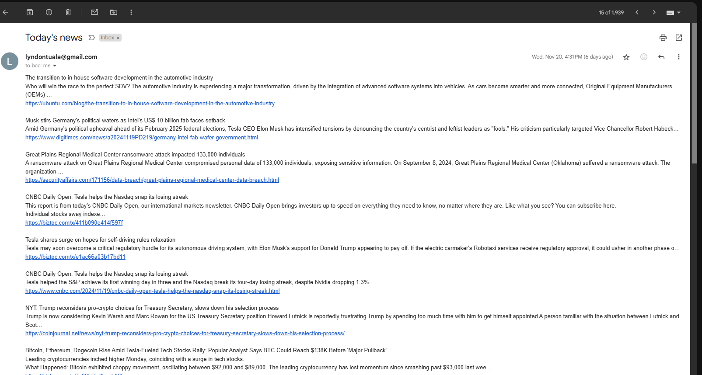
### Day 29 to 37: Data Analysis
Lorem ipsum dolor sit amet, consectetur adipiscing elit. Cras pulvinar fringilla sem, nec mollis eros mollis at. Cras quis lorem accumsan, molestie nulla a, viverra dui. Praesent blandit efficitur augue, vehicula vulputate sapien eleifend at.  

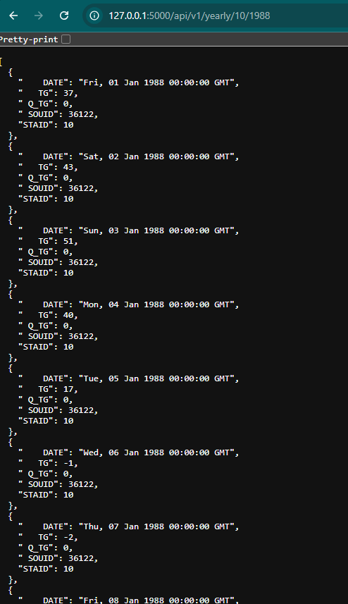
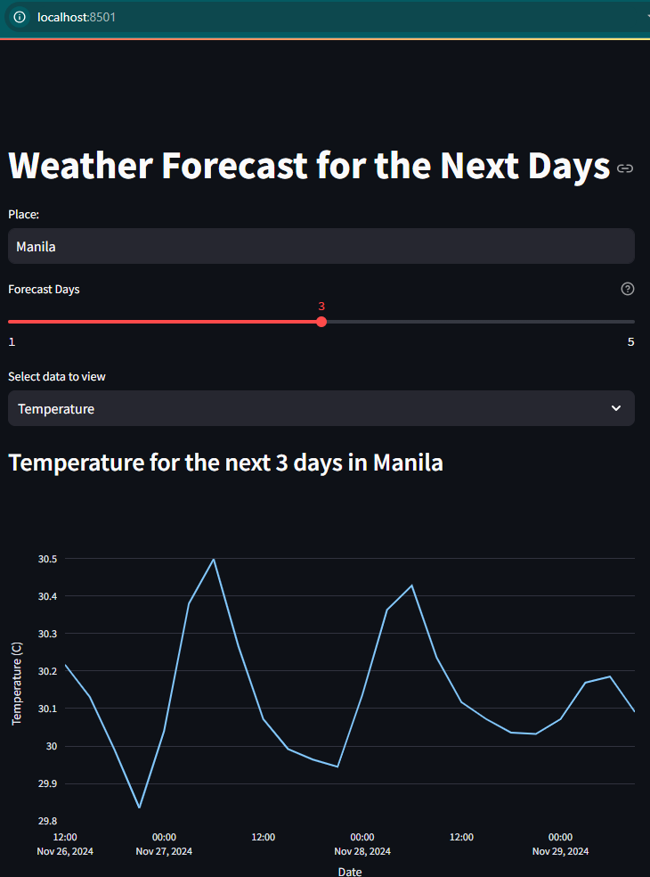
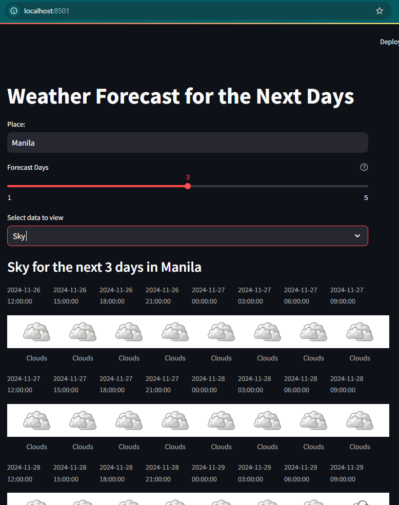
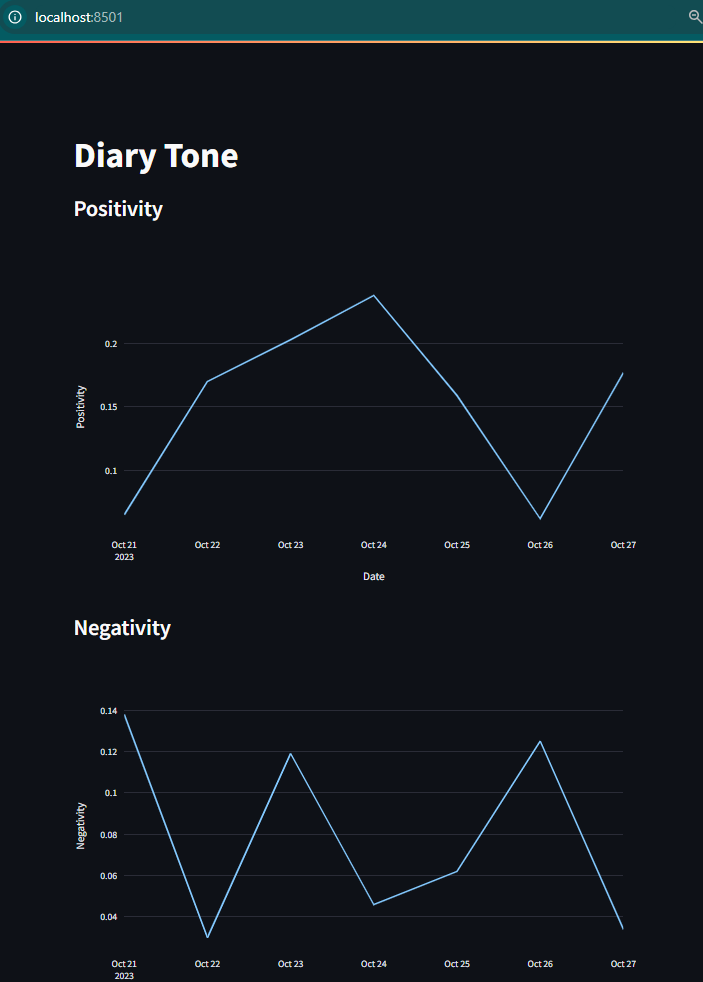
### Day 38 to 39: Web Scraping 
Lorem ipsum dolor sit amet, consectetur adipiscing elit. Cras pulvinar fringilla sem, nec mollis eros mollis at. Cras quis lorem accumsan, molestie nulla a, viverra dui. Praesent blandit efficitur augue, vehicula vulputate sapien eleifend at.
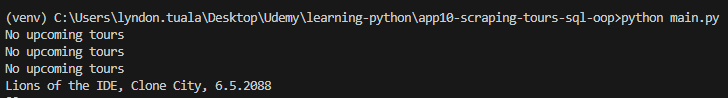
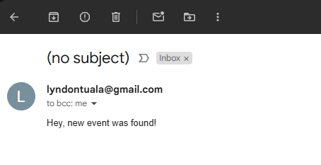
### Day 40 to 44: OOP (Object-Oriented Programming) 
Lorem ipsum dolor sit amet, consectetur adipiscing elit. Cras pulvinar fringilla sem, nec mollis eros mollis at. Cras quis lorem accumsan, molestie nulla a, viverra dui. Praesent blandit efficitur augue, vehicula vulputate sapien eleifend at.
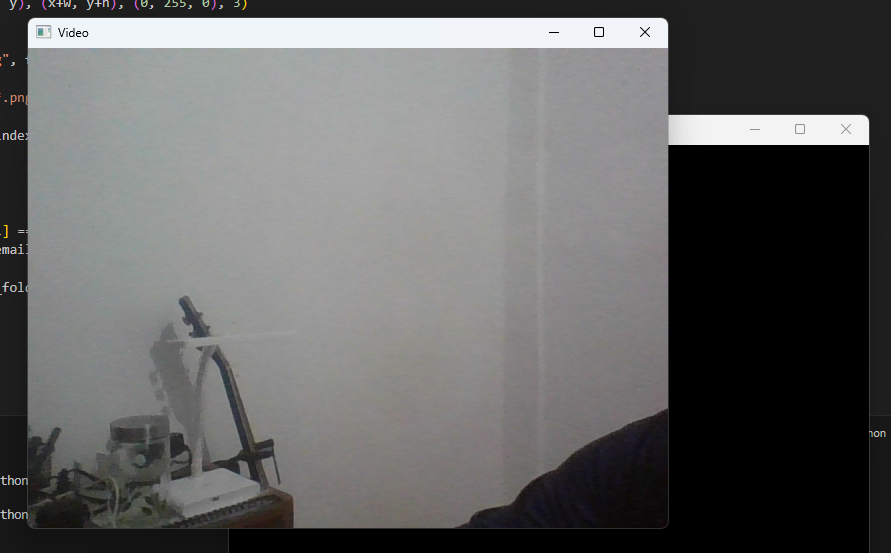
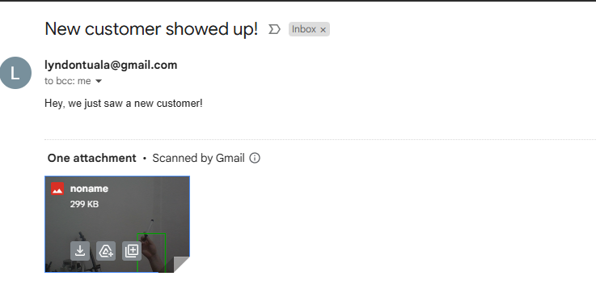
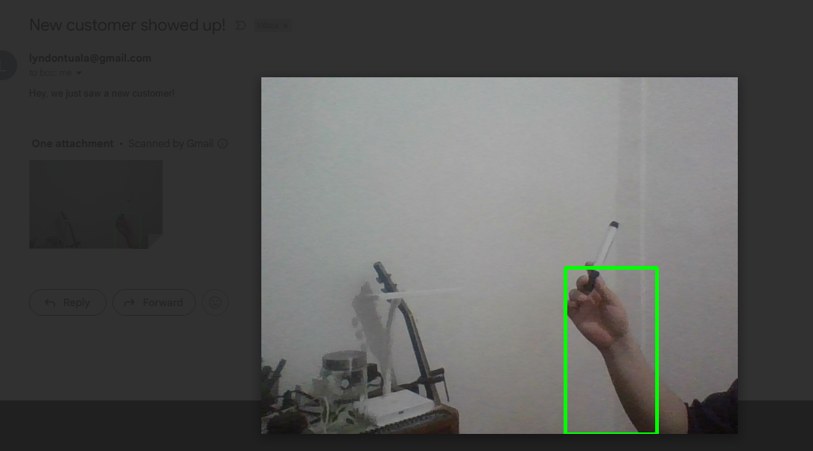
### Day 45 to 49: SQL and GUI
Lorem ipsum dolor sit amet, consectetur adipiscing elit. Cras pulvinar fringilla sem, nec mollis eros mollis at. Cras quis lorem accumsan, molestie nulla a, viverra dui. Praesent blandit efficitur augue, vehicula vulputate sapien eleifend at.
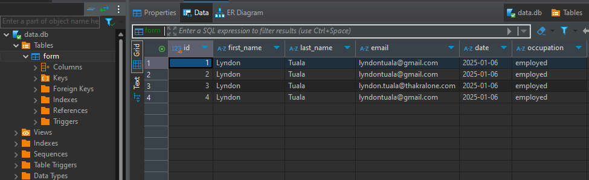
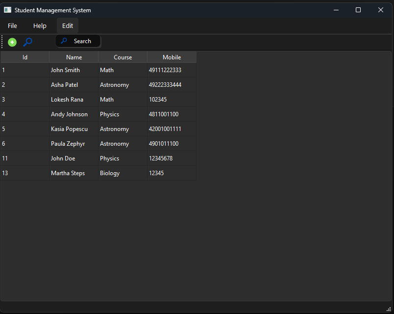
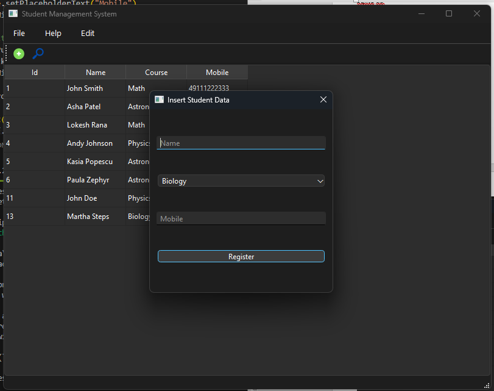
### Day 50 to 57: Web Development
Lorem ipsum dolor sit amet, consectetur adipiscing elit. Cras pulvinar fringilla sem, nec mollis eros mollis at. Cras quis lorem accumsan, molestie nulla a, viverra dui. Praesent blandit efficitur augue, vehicula vulputate sapien eleifend at.

### Day 58 to 59: Data Science and Machine Learning
Lorem ipsum dolor sit amet, consectetur adipiscing elit. Cras pulvinar fringilla sem, nec mollis eros mollis at. Cras quis lorem accumsan, molestie nulla a, viverra dui. Praesent blandit efficitur augue, vehicula vulputate sapien eleifend at.

### Day 60: Publish a Python Package
Lorem ipsum dolor sit amet, consectetur adipiscing elit. Cras pulvinar fringilla sem, nec mollis eros mollis at. Cras quis lorem accumsan, molestie nulla a, viverra dui. Praesent blandit efficitur augue, vehicula vulputate sapien eleifend at.
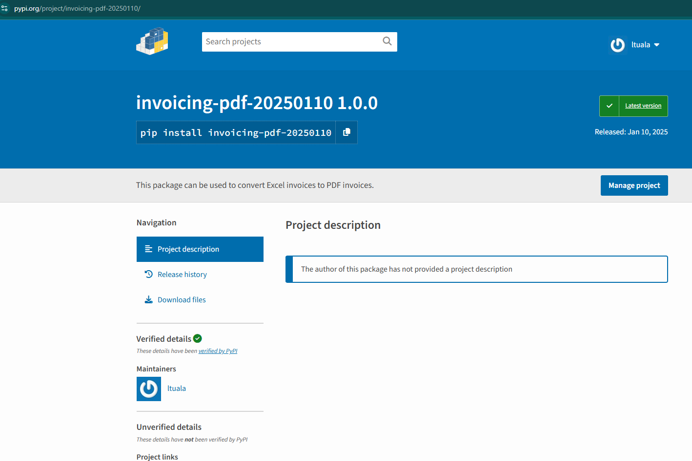
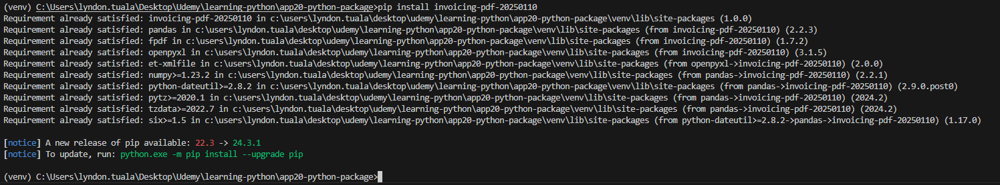
## Some Other Learnings
Lorem ipsum dolor sit amet, consectetur adipiscing elit. Cras pulvinar fringilla sem, nec mollis eros mollis at. Cras quis lorem accumsan, molestie nulla a, viverra dui. Praesent blandit efficitur augue, vehicula vulputate sapien eleifend at.

:::note virtual environment

Lorem ipsum dolor sit amet, consectetur adipiscing elit. Cras pulvinar fringilla sem, nec mollis eros mollis at. Cras quis lorem accumsan, molestie nulla a, viverra dui. Praesent blandit efficitur augue, vehicula vulputate sapien eleifend at.

```python
python -m venv .venv
```

See [virtual environment](https://ltuala-learning-python-web-app1.streamlit.app/)
:::

## Final Thoughts
Lorem ipsum dolor sit amet, consectetur adipiscing elit. Cras pulvinar fringilla sem, nec mollis eros mollis at. Cras quis lorem accumsan, molestie nulla a, viverra dui. Praesent blandit efficitur augue, vehicula vulputate sapien eleifend at.
Here's the [repository](https://ltuala-learning-python-web-app1.streamlit.app/) of my progress.

:::caution Heads up

Talk about the need to modify the portfolio app as the project is not updated

:::

Ending note... Lorem ipsum dolor sit amet, consectetur adipiscing elit. Cras pulvinar fringilla sem, nec mollis eros mollis at. Cras quis lorem accumsan, molestie nulla a, viverra dui. Praesent blandit efficitur augue, vehicula vulputate sapien eleifend at.

## Footnotes
[^1]: Derived from the course material