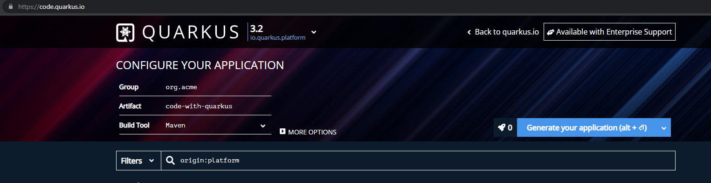
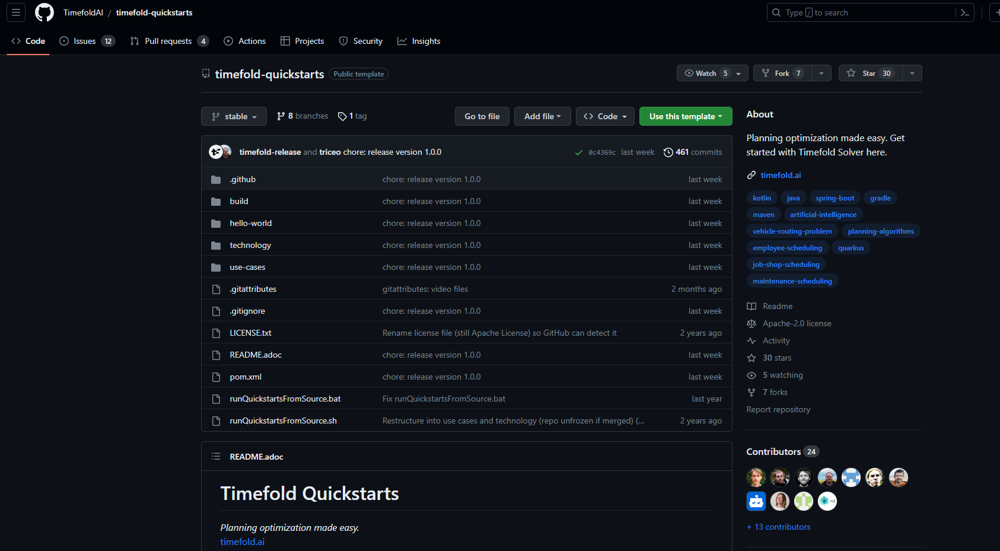
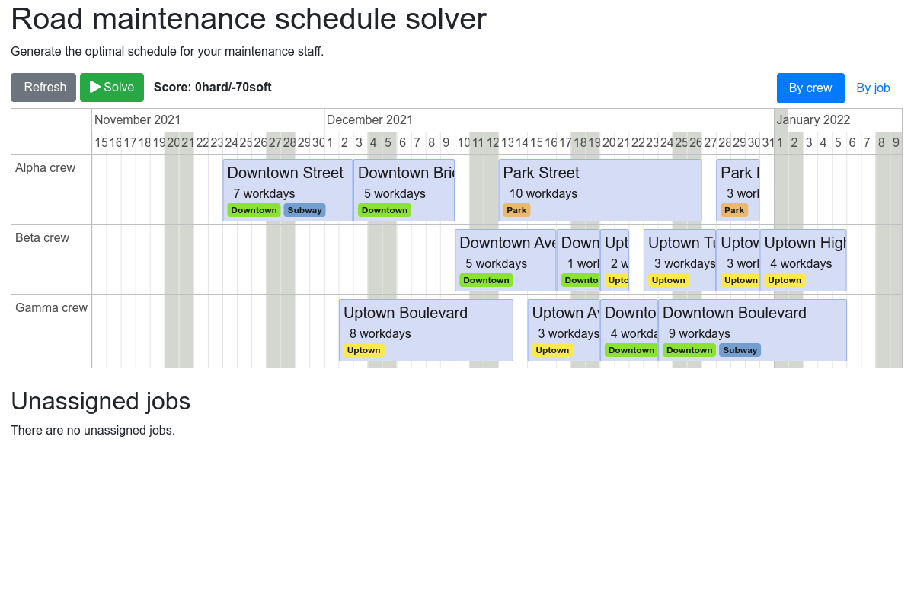
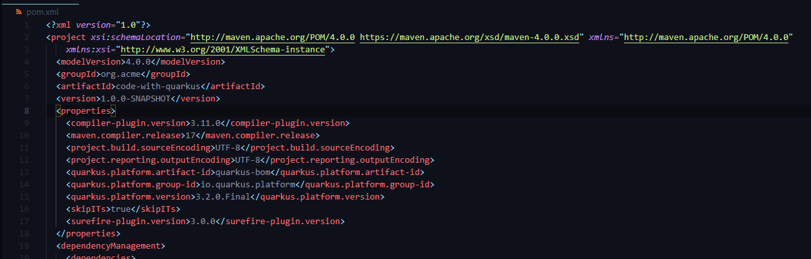

Current Timefold examples already runs on Quarkus 3 already. Let’s see how we can successfully setup a Timefold use case example and use it as a baseline for another Timefold project.

<!--truncate-->
:::info
Timefold [PAS](https://timefold.ai/docs/timefold-solver/latest/use-cases-and-examples/use-cases-and-examples.html#bedAllocation) example was not built with Quarkus, 
as a result I just use the [Maintenance scheduling](https://github.com/TimefoldAI/timefold-quickstarts#maintenance-scheduling) use case as a baseline.
:::

## Setup a new Quarkus Project
:::caution
**Quarkus 3** requires a Java version **17+**. See [JDK on Windows](https://docs.oracle.com/en/java/javase/20/install/installation-jdk-microsoft-windows-platforms.html), for official documentation on how to install JDK.
:::
### Go to [code.quarkus.io](https://code.quarkus.io/)
Fill in the `Group`, `Artifact` and `Build Tool`

### Click Generate your application
No other library or package is needed on our new project.

### Select download the zip.

### Extract and open via code editor.
The folder structure and content should look like this.

## Setup Timefold Quickstarts
### Clone or download timefold-quickstarts repository
Click [here](https://github.com/TimefoldAI/timefold-quickstarts) to clone or download the repository.

### Run the Maintence scheduling use case

### Merge the Maintenance scheduling use case to the new Quarkus project.
Make sure to refactor the package name on every code files. Just overwrite the `pom.xml` with the example packages.  
On `line 8` onwards, this is where I overwrite all the packages.

Customize `index.html` to your liking.