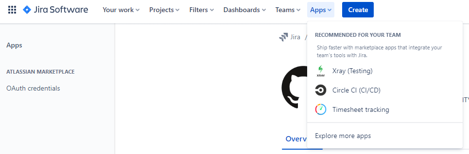

Integrating Jira and Github provides a more organized software development lifecycle.
As the issues will link to a specific branch in your Github code repository.
Providing a more organized workflow since Jira will be used as a develop management tool and Github will be the version control tool as a result a more structured development workflow.

<!--truncate-->

:::caution
To follow along the steps make sure you have Admin privileges on the Jira account and Github account.
:::

## 1. On the Jira account under Apps, get the app Github for Jira
Installing __Github for Jira__ will be the first step to configure Github Jira integration.

### a. Go to Apps > Explore more apps.

### b. On the search box, type Github for Jira. then, select Get app.

### c. Select Get it now.

## 2. Github for Jira configuration
Next steps, are how to setup the configuration for integrating Github to Jira.
### a. Select Get Started.

### b. Select Connect Github organization.

### c. Select Github Cloud. Then, select Continue.

### d. Login to Github.

### e. Click Authorize Jira.

### f. Select Install Github for Jira on a new organization.

### g. Go back to Jira, select Conect Github organization and click Connect.
 
Now, Jira will take few minutes depending on the size of Github repositories.

 

:::info
See [Integrate Jira Software with GitHub Cloud](https://support.atlassian.com/jira-cloud-administration/docs/integrate-with-github/), for official documentation.
:::

