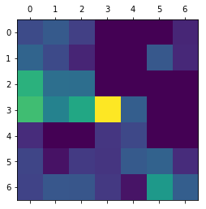

I tried to explore transfer learning using [Keras](https://keras.io/) CNN on [Baybayin](https://en.wikipedia.org/wiki/Baybayin) dataset. 
Here I used [MobileNet](https://keras.io/api/applications/mobilenet/) Keras model, create heatmaps to visualize what the model sees.

<!--truncate-->

:::info
This Python exploratory data analysis was originally created in [kaggle](https://www.kaggle.com/). I used [nbconvert](https://nbconvert.readthedocs.io/en/latest/usage.html) command to convert it to markdown.
:::

## Loading data
```python
# This Python 3 environment comes with many helpful analytics libraries installed
# It is defined by the kaggle/python docker image: https://github.com/kaggle/docker-python
# For example, here's several helpful packages to load in 

import numpy as np # linear algebra
import pandas as pd # data processing, CSV file I/O (e.g. pd.read_csv)

# Input data files are available in the "../input/" directory.
# For example, running this (by clicking run or pressing Shift+Enter) will list all files under the input directory

import os
for dirname, _, filenames in os.walk('/kaggle/input'):
    for filename in filenames:
        print(os.path.join(dirname, filename))

# Any results you write to the current directory are saved as output.
```
    
## Train, validation, test dataset
```python
import keras
from keras.layers import Dense, Flatten
from keras.optimizers import Adam
from keras.preprocessing.image import ImageDataGenerator
from keras.models import Model
from sklearn.metrics import confusion_matrix
import itertools
import matplotlib.pyplot as plt

train_path = '../input/baybayin/BAYBAYIN/train'
valid_path = '../input/baybayin/BAYBAYIN/validation'
test_path = '../input/baybayin/BAYBAYIN/test'
```

    Using TensorFlow backend.
    


```python
class_labels=['a',
              'ba',
              'be, bi',
              'bo, bu',
              'da; ra',
              'de, di; re, ri',
              'do, du; ro, ru',
              'e, i',
              'ga',
              'ge, gi',
              'go, gu',
              'ha',
              'he, hi',
              'ho, hu',
              'ka',
              'ke, ki',
              'ko, ku',
              'la',
              'le, li',
              'lo, lu',
              'ma',
              'me, mi',
              'mo, mu',
              'na',
              'ne, ni',
              'nga',
              'nge, ngi',
              'ngo, ngu',
              'no, nu',
              'o, u',
              'pa',
              'pe, pi',
              'po, pu',
              'sa',
              'se, si',
              'so, su',
              'ta',
              'to, tu',
              'wa',
              'we, wi',
              'wo, wu',
              'ya',
              'ye, yi',
              'yo, yu']
    
train_batches = ImageDataGenerator(preprocessing_function=keras.applications.mobilenet.preprocess_input)\
    .flow_from_directory(train_path, target_size=(224,224),
                         classes=class_labels, batch_size=128)
valid_batches = ImageDataGenerator(preprocessing_function=keras.applications.mobilenet.preprocess_input)\
    .flow_from_directory(valid_path, target_size=(224,224),
                         classes=class_labels, batch_size=128)
test_batches = ImageDataGenerator(preprocessing_function=keras.applications.mobilenet.preprocess_input)\
    .flow_from_directory(test_path, target_size=(224,224),
                         classes=class_labels, batch_size=128, shuffle=False)
```

    Found 52815 images belonging to 44 classes.
    Found 13203 images belonging to 44 classes.
    Found 13203 images belonging to 44 classes.
    
## Build and train MobileNet model

```python
base_model = keras.applications.mobilenet.MobileNet(include_top=False, input_shape=(224, 224, 3), weights=None)
x = base_model.layers[-6].output
x = Flatten()(x)
predictions = Dense(44, activation='softmax')(x)
model = Model(inputs=base_model.input, outputs=predictions)
N = 20
model.compile(Adam(lr=.0001), loss='categorical_crossentropy', metrics=['accuracy'])
history = model.fit_generator(train_batches, steps_per_epoch=413, validation_data=valid_batches,
                    validation_steps=104, epochs=N, verbose=1)
```

    Epoch 1/20
    413/413 [==============================] - 434s 1s/step - loss: 1.0402 - accuracy: 0.7809 - val_loss: 4.8828 - val_accuracy: 0.0227
    Epoch 2/20
    413/413 [==============================] - 400s 968ms/step - loss: 0.0821 - accuracy: 0.9814 - val_loss: 0.2951 - val_accuracy: 0.9355
    Epoch 3/20
    413/413 [==============================] - 401s 972ms/step - loss: 0.0209 - accuracy: 0.9963 - val_loss: 0.0024 - val_accuracy: 0.9886
    Epoch 4/20
    413/413 [==============================] - 400s 968ms/step - loss: 0.0050 - accuracy: 0.9996 - val_loss: 0.0012 - val_accuracy: 0.9905
    Epoch 5/20
    413/413 [==============================] - 399s 967ms/step - loss: 0.0014 - accuracy: 1.0000 - val_loss: 8.3712e-04 - val_accuracy: 0.9925
    Epoch 6/20
    413/413 [==============================] - 400s 968ms/step - loss: 5.9781e-04 - accuracy: 1.0000 - val_loss: 0.0145 - val_accuracy: 0.9927
    Epoch 7/20
    413/413 [==============================] - 399s 965ms/step - loss: 3.7187e-04 - accuracy: 1.0000 - val_loss: 7.7444e-05 - val_accuracy: 0.9924
    Epoch 8/20
    413/413 [==============================] - 399s 966ms/step - loss: 2.4474e-04 - accuracy: 1.0000 - val_loss: 0.0012 - val_accuracy: 0.9927
    Epoch 9/20
    413/413 [==============================] - 400s 968ms/step - loss: 1.7393e-04 - accuracy: 1.0000 - val_loss: 0.0019 - val_accuracy: 0.9930
    Epoch 10/20
    413/413 [==============================] - 399s 966ms/step - loss: 1.2735e-04 - accuracy: 1.0000 - val_loss: 0.0011 - val_accuracy: 0.9926
    Epoch 11/20
    413/413 [==============================] - 399s 966ms/step - loss: 1.0391e-04 - accuracy: 1.0000 - val_loss: 3.0157e-04 - val_accuracy: 0.9929
    Epoch 12/20
    413/413 [==============================] - 400s 968ms/step - loss: 7.3739e-05 - accuracy: 1.0000 - val_loss: 9.9014e-05 - val_accuracy: 0.9927
    Epoch 13/20
    413/413 [==============================] - 399s 967ms/step - loss: 5.3927e-05 - accuracy: 1.0000 - val_loss: 0.2495 - val_accuracy: 0.9930
    Epoch 14/20
    413/413 [==============================] - 399s 966ms/step - loss: 4.2406e-05 - accuracy: 1.0000 - val_loss: 0.0061 - val_accuracy: 0.9924
    Epoch 15/20
    413/413 [==============================] - 399s 967ms/step - loss: 3.3802e-05 - accuracy: 1.0000 - val_loss: 5.1579e-05 - val_accuracy: 0.9927
    Epoch 16/20
    413/413 [==============================] - 399s 966ms/step - loss: 2.4303e-05 - accuracy: 1.0000 - val_loss: 7.2278e-06 - val_accuracy: 0.9927
    Epoch 17/20
    413/413 [==============================] - 399s 967ms/step - loss: 1.9376e-05 - accuracy: 1.0000 - val_loss: 0.2409 - val_accuracy: 0.9930
    Epoch 18/20
    413/413 [==============================] - 399s 966ms/step - loss: 1.5836e-05 - accuracy: 1.0000 - val_loss: 0.3151 - val_accuracy: 0.9930
    Epoch 19/20
    413/413 [==============================] - 398s 964ms/step - loss: 1.2180e-05 - accuracy: 1.0000 - val_loss: 2.5853e-05 - val_accuracy: 0.9930
    Epoch 20/20
    413/413 [==============================] - 400s 969ms/step - loss: 9.7858e-06 - accuracy: 1.0000 - val_loss: 7.3905e-04 - val_accuracy: 0.9930
    
## Test model

```python
test_labels = test_batches.classes
predictions = model.predict_generator(test_batches, steps=104, verbose=1)
cm = confusion_matrix(test_labels, predictions.argmax(axis=1))
```

    104/104 [==============================] - 51s 495ms/step
    
## Confusion matrix

```python
import seaborn as sns
fig = plt.figure(figsize = (20,20))
ax = sns.heatmap(cm, 
                 xticklabels=class_labels, 
                 yticklabels=class_labels, 
                 cmap="YlGnBu", 
                 annot=True, 
                 fmt="d", 
                 linewidths=0.5, 
                 robust=True,
                 square=True)

ax.axes.set_title("Baybayin Using MobileNet",fontsize=35)
ax.set_xlabel("Predicted label",fontsize=30)
ax.set_ylabel("True label",fontsize=30)
ax.tick_params(labelsize=20)
fig.tight_layout()
plt.savefig('Confusion_Matrix_of_MobileNet_Baybayin.png', dpi=100)
```


    

    


```python
cm = cm.astype('float') / cm.sum(axis=1)[:, np.newaxis]
fig = plt.figure(figsize = (20,20))
ax = sns.heatmap(cm, 
                 xticklabels=class_labels, 
                 yticklabels=class_labels, 
                 cmap="YlGnBu", 
                 annot=True, 
                 fmt=".2f", 
                 linewidths=0.5, 
                 robust=True,
                 square=True)

ax.axes.set_title("Baybayin Using MobileNet",fontsize=35)
ax.set_xlabel("Predicted label",fontsize=30)
ax.set_ylabel("True label",fontsize=30)
ax.tick_params(labelsize=20)
fig.tight_layout()
plt.savefig('Normalized_Confusion_Matrix_of_MobileNet_Baybayin.png', dpi=100)
```


    

    

## Model accuracy and loss

```python
from sklearn.metrics import classification_report
from sklearn.metrics import accuracy_score

score=accuracy_score(test_labels, predictions.argmax(axis=1))
print("Rank-1 accuracy: %0.3f" % score)
print(classification_report(test_labels, predictions.argmax(axis=1), target_names=class_labels))
```

    Rank-1 accuracy: 0.979
                    precision    recall  f1-score   support
    
                 a       0.97      0.97      0.97       300
                ba       0.97      0.98      0.98       300
            be, bi       0.99      0.97      0.98       300
            bo, bu       1.00      0.99      0.99       300
            da; ra       0.97      0.96      0.97       302
    de, di; re, ri       0.97      0.94      0.95       300
    do, du; ro, ru       0.99      0.99      0.99       300
              e, i       0.98      0.99      0.99       301
                ga       0.97      0.99      0.98       300
            ge, gi       1.00      0.98      0.99       300
            go, gu       0.99      0.97      0.98       300
                ha       0.97      0.95      0.96       300
            he, hi       0.96      0.98      0.97       300
            ho, hu       0.98      0.99      0.98       300
                ka       0.96      0.98      0.97       300
            ke, ki       0.96      0.97      0.96       300
            ko, ku       1.00      0.98      0.99       300
                la       0.95      0.98      0.97       300
            le, li       0.98      0.97      0.97       300
            lo, lu       0.98      1.00      0.99       300
                ma       0.96      0.99      0.98       300
            me, mi       0.99      0.95      0.97       300
            mo, mu       1.00      0.99      0.99       300
                na       0.97      0.99      0.98       300
            ne, ni       1.00      1.00      1.00       300
               nga       0.98      0.99      0.99       300
          nge, ngi       1.00      0.98      0.99       300
          ngo, ngu       0.99      1.00      1.00       300
            no, nu       0.99      0.97      0.98       300
              o, u       1.00      1.00      1.00       300
                pa       0.99      0.95      0.97       300
            pe, pi       0.98      0.93      0.96       300
            po, pu       0.99      1.00      1.00       300
                sa       0.98      1.00      0.99       300
            se, si       0.97      0.99      0.98       300
            so, su       0.99      1.00      0.99       300
                ta       0.97      0.99      0.98       300
            to, tu       0.99      0.93      0.96       300
                wa       0.99      0.99      0.99       300
            we, wi       0.98      1.00      0.99       300
            wo, wu       1.00      1.00      1.00       300
                ya       0.93      0.98      0.95       300
            ye, yi       0.94      0.93      0.93       300
            yo, yu       0.99      0.99      0.99       300
    
          accuracy                           0.98     13203
         macro avg       0.98      0.98      0.98     13203
      weighted avg       0.98      0.98      0.98     13203
    
    


```python
plt.figure(figsize = (12,9))
plt.style.use("ggplot")
plt.plot(np.arange(0, N), history.history["loss"], label="train_loss")
plt.plot(np.arange(0, N), history.history["val_loss"], label="val_loss")
plt.title("MobileNet Model Loss")
plt.xlabel("Epoch")
plt.ylabel("Loss")
plt.legend(loc="upper left")
plt.savefig('MobileNet_Model_Loss_Babayin.png', dpi=100)
```


    

    


```python
plt.figure(figsize = (12,9))
plt.style.use("ggplot")
plt.plot(np.arange(0, N), history.history["accuracy"], label="train_acc")
plt.plot(np.arange(0, N), history.history["val_accuracy"], label="val_acc")
plt.title("MobileNet Model Accuracy")
plt.xlabel("Epoch")
plt.ylabel("Accuracy")
plt.legend(loc="upper left")
plt.savefig('MobileNet_Model_Accuracy_Baybayin.png', dpi=100)
```


    

    

## Save model

```python
from keras.models import load_model
import time
from keras import backend as K
model.save('MobileNet_Baybayin.h5')
K.clear_session()
start=time.time()
model=load_model('MobileNet_Baybayin.h5', compile=False)
end=time.time()
print('Loading time of MobileNet model is {:0.3f} seconds.'.format(end-start))
```

    Loading time of MobileNet model is 1.686 seconds.
    
## Visualizing heatmaps
### Loading data
```python
# This Python 3 environment comes with many helpful analytics libraries installed
# It is defined by the kaggle/python docker image: https://github.com/kaggle/docker-python
# For example, here's several helpful packages to load in 

import numpy as np # linear algebra
import pandas as pd # data processing, CSV file I/O (e.g. pd.read_csv)

# Input data files are available in the "../input/" directory.
# For example, running this (by clicking run or pressing Shift+Enter) will list all files under the input directory

import os
for dirname, _, filenames in os.walk('/kaggle/input'):
    for filename in filenames:
        print(os.path.join(dirname, filename))

# Any results you write to the current directory are saved as output.
```

    /kaggle/input/baybayin-mobilenet/MobileNet_Model_Accuracy_Baybayin.png
    /kaggle/input/baybayin-mobilenet/custom.css
    /kaggle/input/baybayin-mobilenet/__notebook__.ipynb
    /kaggle/input/baybayin-mobilenet/__results__.html
    /kaggle/input/baybayin-mobilenet/__output__.json
    /kaggle/input/baybayin-mobilenet/MobileNet_Baybayin.h5
    /kaggle/input/baybayin-mobilenet/MobileNet_Model_Loss_Babayin.png
    /kaggle/input/baybayin-mobilenet/__results___files/__results___6_1.png
    /kaggle/input/baybayin-mobilenet/__results___files/__results___8_0.png
    /kaggle/input/baybayin-mobilenet/__results___files/__results___5_1.png
    /kaggle/input/baybayin-mobilenet/__results___files/__results___9_0.png
    /kaggle/input/heatmap/Heatmap_pictures/do_1.png
    /kaggle/input/heatmap/Heatmap_pictures/ko_1.png
    /kaggle/input/heatmap/Heatmap_pictures/yo_2.png
    /kaggle/input/heatmap/Heatmap_pictures/ne_2.png
    /kaggle/input/heatmap/Heatmap_pictures/ho_1.png
    /kaggle/input/heatmap/Heatmap_pictures/bo_2.png
    /kaggle/input/heatmap/Heatmap_pictures/a_2.png
    /kaggle/input/heatmap/Heatmap_pictures/po_1.png
    /kaggle/input/heatmap/Heatmap_pictures/ba_2.png
    /kaggle/input/heatmap/Heatmap_pictures/sa_2.png
    /kaggle/input/heatmap/Heatmap_pictures/la_1.png
    /kaggle/input/heatmap/Heatmap_pictures/pa_2.png
    /kaggle/input/heatmap/Heatmap_pictures/da_1.png
    /kaggle/input/heatmap/Heatmap_pictures/wo_2.png
    /kaggle/input/heatmap/Heatmap_pictures/na_1.png
    /kaggle/input/heatmap/Heatmap_pictures/na_2.png
    /kaggle/input/heatmap/Heatmap_pictures/ha_2.png
    /kaggle/input/heatmap/Heatmap_pictures/o_2.png
    /kaggle/input/heatmap/Heatmap_pictures/wa_2.png
    /kaggle/input/heatmap/Heatmap_pictures/da_2.png
    /kaggle/input/heatmap/Heatmap_pictures/bo_1.png
    /kaggle/input/heatmap/Heatmap_pictures/se_1.png
    /kaggle/input/heatmap/Heatmap_pictures/he_1.png
    /kaggle/input/heatmap/Heatmap_pictures/la_2.png
    /kaggle/input/heatmap/Heatmap_pictures/le_2.png
    /kaggle/input/heatmap/Heatmap_pictures/ye_2.png
    /kaggle/input/heatmap/Heatmap_pictures/yo_1.png
    /kaggle/input/heatmap/Heatmap_pictures/do_2.png
    /kaggle/input/heatmap/Heatmap_pictures/be_2.png
    /kaggle/input/heatmap/Heatmap_pictures/e_2.png
    /kaggle/input/heatmap/Heatmap_pictures/nge_2.png
    /kaggle/input/heatmap/Heatmap_pictures/he_2.png
    /kaggle/input/heatmap/Heatmap_pictures/ke_1.png
    /kaggle/input/heatmap/Heatmap_pictures/so_1.png
    /kaggle/input/heatmap/Heatmap_pictures/ma_1.png
    /kaggle/input/heatmap/Heatmap_pictures/wo_1.png
    /kaggle/input/heatmap/Heatmap_pictures/ge_2.png
    /kaggle/input/heatmap/Heatmap_pictures/ka_2.png
    /kaggle/input/heatmap/Heatmap_pictures/ka_1.png
    /kaggle/input/heatmap/Heatmap_pictures/ya_2.png
    /kaggle/input/heatmap/Heatmap_pictures/me_2.png
    /kaggle/input/heatmap/Heatmap_pictures/lo_1.png
    /kaggle/input/heatmap/Heatmap_pictures/po_2.png
    /kaggle/input/heatmap/Heatmap_pictures/mo_2.png
    /kaggle/input/heatmap/Heatmap_pictures/wa_1.png
    /kaggle/input/heatmap/Heatmap_pictures/mo_1.png
    /kaggle/input/heatmap/Heatmap_pictures/be_1.png
    /kaggle/input/heatmap/Heatmap_pictures/e_1.png
    /kaggle/input/heatmap/Heatmap_pictures/de_1.png
    /kaggle/input/heatmap/Heatmap_pictures/ngo_1.png
    /kaggle/input/heatmap/Heatmap_pictures/go_2.png
    /kaggle/input/heatmap/Heatmap_pictures/ga_2.png
    /kaggle/input/heatmap/Heatmap_pictures/we_1.png
    /kaggle/input/heatmap/Heatmap_pictures/ma_2.png
    /kaggle/input/heatmap/Heatmap_pictures/no_2.png
    /kaggle/input/heatmap/Heatmap_pictures/ta_2.png
    /kaggle/input/heatmap/Heatmap_pictures/go_1.png
    /kaggle/input/heatmap/Heatmap_pictures/to_1.png
    /kaggle/input/heatmap/Heatmap_pictures/ne_1.png
    /kaggle/input/heatmap/Heatmap_pictures/ko_2.png
    /kaggle/input/heatmap/Heatmap_pictures/o_1.png
    /kaggle/input/heatmap/Heatmap_pictures/le_1.png
    /kaggle/input/heatmap/Heatmap_pictures/pa_1.png
    /kaggle/input/heatmap/Heatmap_pictures/se_2.png
    /kaggle/input/heatmap/Heatmap_pictures/ke_2.png
    /kaggle/input/heatmap/Heatmap_pictures/ba_1.png
    /kaggle/input/heatmap/Heatmap_pictures/pe_1.png
    /kaggle/input/heatmap/Heatmap_pictures/lo_2.png
    /kaggle/input/heatmap/Heatmap_pictures/ngo_2.png
    /kaggle/input/heatmap/Heatmap_pictures/ge_1.png
    /kaggle/input/heatmap/Heatmap_pictures/ho_2.png
    /kaggle/input/heatmap/Heatmap_pictures/nga_1.png
    /kaggle/input/heatmap/Heatmap_pictures/nga_2.png
    /kaggle/input/heatmap/Heatmap_pictures/so_2.png
    /kaggle/input/heatmap/Heatmap_pictures/nge_1.png
    /kaggle/input/heatmap/Heatmap_pictures/pe_2.png
    /kaggle/input/heatmap/Heatmap_pictures/ta_1.png
    /kaggle/input/heatmap/Heatmap_pictures/me_1.png
    /kaggle/input/heatmap/Heatmap_pictures/sa_1.png
    /kaggle/input/heatmap/Heatmap_pictures/to_2.png
    /kaggle/input/heatmap/Heatmap_pictures/no_1.png
    /kaggle/input/heatmap/Heatmap_pictures/a_1.png
    /kaggle/input/heatmap/Heatmap_pictures/ha_1.png
    /kaggle/input/heatmap/Heatmap_pictures/we_2.png
    /kaggle/input/heatmap/Heatmap_pictures/de_2.png
    /kaggle/input/heatmap/Heatmap_pictures/ga_1.png
    /kaggle/input/heatmap/Heatmap_pictures/ye_1.png
    /kaggle/input/heatmap/Heatmap_pictures/ya_1.png
    
### Model layers

```python
from keras.applications.mobilenet import preprocess_input
import numpy as np
from keras import backend as K
import matplotlib.pyplot as plt
from keras.preprocessing import image
from keras.models import Model
from keras.models import load_model

model=load_model('../input/baybayin-mobilenet/MobileNet_Baybayin.h5')
model.summary()
```

    Using TensorFlow backend.
    

    Model: "model_1"
    _________________________________________________________________
    Layer (type)                 Output Shape              Param #   
    =================================================================
    input_1 (InputLayer)         (None, 224, 224, 3)       0         
    _________________________________________________________________
    conv1_pad (ZeroPadding2D)    (None, 225, 225, 3)       0         
    _________________________________________________________________
    conv1 (Conv2D)               (None, 112, 112, 32)      864       
    _________________________________________________________________
    conv1_bn (BatchNormalization (None, 112, 112, 32)      128       
    _________________________________________________________________
    conv1_relu (ReLU)            (None, 112, 112, 32)      0         
    _________________________________________________________________
    conv_dw_1 (DepthwiseConv2D)  (None, 112, 112, 32)      288       
    _________________________________________________________________
    conv_dw_1_bn (BatchNormaliza (None, 112, 112, 32)      128       
    _________________________________________________________________
    conv_dw_1_relu (ReLU)        (None, 112, 112, 32)      0         
    _________________________________________________________________
    conv_pw_1 (Conv2D)           (None, 112, 112, 64)      2048      
    _________________________________________________________________
    conv_pw_1_bn (BatchNormaliza (None, 112, 112, 64)      256       
    _________________________________________________________________
    conv_pw_1_relu (ReLU)        (None, 112, 112, 64)      0         
    _________________________________________________________________
    conv_pad_2 (ZeroPadding2D)   (None, 113, 113, 64)      0         
    _________________________________________________________________
    conv_dw_2 (DepthwiseConv2D)  (None, 56, 56, 64)        576       
    _________________________________________________________________
    conv_dw_2_bn (BatchNormaliza (None, 56, 56, 64)        256       
    _________________________________________________________________
    conv_dw_2_relu (ReLU)        (None, 56, 56, 64)        0         
    _________________________________________________________________
    conv_pw_2 (Conv2D)           (None, 56, 56, 128)       8192      
    _________________________________________________________________
    conv_pw_2_bn (BatchNormaliza (None, 56, 56, 128)       512       
    _________________________________________________________________
    conv_pw_2_relu (ReLU)        (None, 56, 56, 128)       0         
    _________________________________________________________________
    conv_dw_3 (DepthwiseConv2D)  (None, 56, 56, 128)       1152      
    _________________________________________________________________
    conv_dw_3_bn (BatchNormaliza (None, 56, 56, 128)       512       
    _________________________________________________________________
    conv_dw_3_relu (ReLU)        (None, 56, 56, 128)       0         
    _________________________________________________________________
    conv_pw_3 (Conv2D)           (None, 56, 56, 128)       16384     
    _________________________________________________________________
    conv_pw_3_bn (BatchNormaliza (None, 56, 56, 128)       512       
    _________________________________________________________________
    conv_pw_3_relu (ReLU)        (None, 56, 56, 128)       0         
    _________________________________________________________________
    conv_pad_4 (ZeroPadding2D)   (None, 57, 57, 128)       0         
    _________________________________________________________________
    conv_dw_4 (DepthwiseConv2D)  (None, 28, 28, 128)       1152      
    _________________________________________________________________
    conv_dw_4_bn (BatchNormaliza (None, 28, 28, 128)       512       
    _________________________________________________________________
    conv_dw_4_relu (ReLU)        (None, 28, 28, 128)       0         
    _________________________________________________________________
    conv_pw_4 (Conv2D)           (None, 28, 28, 256)       32768     
    _________________________________________________________________
    conv_pw_4_bn (BatchNormaliza (None, 28, 28, 256)       1024      
    _________________________________________________________________
    conv_pw_4_relu (ReLU)        (None, 28, 28, 256)       0         
    _________________________________________________________________
    conv_dw_5 (DepthwiseConv2D)  (None, 28, 28, 256)       2304      
    _________________________________________________________________
    conv_dw_5_bn (BatchNormaliza (None, 28, 28, 256)       1024      
    _________________________________________________________________
    conv_dw_5_relu (ReLU)        (None, 28, 28, 256)       0         
    _________________________________________________________________
    conv_pw_5 (Conv2D)           (None, 28, 28, 256)       65536     
    _________________________________________________________________
    conv_pw_5_bn (BatchNormaliza (None, 28, 28, 256)       1024      
    _________________________________________________________________
    conv_pw_5_relu (ReLU)        (None, 28, 28, 256)       0         
    _________________________________________________________________
    conv_pad_6 (ZeroPadding2D)   (None, 29, 29, 256)       0         
    _________________________________________________________________
    conv_dw_6 (DepthwiseConv2D)  (None, 14, 14, 256)       2304      
    _________________________________________________________________
    conv_dw_6_bn (BatchNormaliza (None, 14, 14, 256)       1024      
    _________________________________________________________________
    conv_dw_6_relu (ReLU)        (None, 14, 14, 256)       0         
    _________________________________________________________________
    conv_pw_6 (Conv2D)           (None, 14, 14, 512)       131072    
    _________________________________________________________________
    conv_pw_6_bn (BatchNormaliza (None, 14, 14, 512)       2048      
    _________________________________________________________________
    conv_pw_6_relu (ReLU)        (None, 14, 14, 512)       0         
    _________________________________________________________________
    conv_dw_7 (DepthwiseConv2D)  (None, 14, 14, 512)       4608      
    _________________________________________________________________
    conv_dw_7_bn (BatchNormaliza (None, 14, 14, 512)       2048      
    _________________________________________________________________
    conv_dw_7_relu (ReLU)        (None, 14, 14, 512)       0         
    _________________________________________________________________
    conv_pw_7 (Conv2D)           (None, 14, 14, 512)       262144    
    _________________________________________________________________
    conv_pw_7_bn (BatchNormaliza (None, 14, 14, 512)       2048      
    _________________________________________________________________
    conv_pw_7_relu (ReLU)        (None, 14, 14, 512)       0         
    _________________________________________________________________
    conv_dw_8 (DepthwiseConv2D)  (None, 14, 14, 512)       4608      
    _________________________________________________________________
    conv_dw_8_bn (BatchNormaliza (None, 14, 14, 512)       2048      
    _________________________________________________________________
    conv_dw_8_relu (ReLU)        (None, 14, 14, 512)       0         
    _________________________________________________________________
    conv_pw_8 (Conv2D)           (None, 14, 14, 512)       262144    
    _________________________________________________________________
    conv_pw_8_bn (BatchNormaliza (None, 14, 14, 512)       2048      
    _________________________________________________________________
    conv_pw_8_relu (ReLU)        (None, 14, 14, 512)       0         
    _________________________________________________________________
    conv_dw_9 (DepthwiseConv2D)  (None, 14, 14, 512)       4608      
    _________________________________________________________________
    conv_dw_9_bn (BatchNormaliza (None, 14, 14, 512)       2048      
    _________________________________________________________________
    conv_dw_9_relu (ReLU)        (None, 14, 14, 512)       0         
    _________________________________________________________________
    conv_pw_9 (Conv2D)           (None, 14, 14, 512)       262144    
    _________________________________________________________________
    conv_pw_9_bn (BatchNormaliza (None, 14, 14, 512)       2048      
    _________________________________________________________________
    conv_pw_9_relu (ReLU)        (None, 14, 14, 512)       0         
    _________________________________________________________________
    conv_dw_10 (DepthwiseConv2D) (None, 14, 14, 512)       4608      
    _________________________________________________________________
    conv_dw_10_bn (BatchNormaliz (None, 14, 14, 512)       2048      
    _________________________________________________________________
    conv_dw_10_relu (ReLU)       (None, 14, 14, 512)       0         
    _________________________________________________________________
    conv_pw_10 (Conv2D)          (None, 14, 14, 512)       262144    
    _________________________________________________________________
    conv_pw_10_bn (BatchNormaliz (None, 14, 14, 512)       2048      
    _________________________________________________________________
    conv_pw_10_relu (ReLU)       (None, 14, 14, 512)       0         
    _________________________________________________________________
    conv_dw_11 (DepthwiseConv2D) (None, 14, 14, 512)       4608      
    _________________________________________________________________
    conv_dw_11_bn (BatchNormaliz (None, 14, 14, 512)       2048      
    _________________________________________________________________
    conv_dw_11_relu (ReLU)       (None, 14, 14, 512)       0         
    _________________________________________________________________
    conv_pw_11 (Conv2D)          (None, 14, 14, 512)       262144    
    _________________________________________________________________
    conv_pw_11_bn (BatchNormaliz (None, 14, 14, 512)       2048      
    _________________________________________________________________
    conv_pw_11_relu (ReLU)       (None, 14, 14, 512)       0         
    _________________________________________________________________
    conv_pad_12 (ZeroPadding2D)  (None, 15, 15, 512)       0         
    _________________________________________________________________
    conv_dw_12 (DepthwiseConv2D) (None, 7, 7, 512)         4608      
    _________________________________________________________________
    conv_dw_12_bn (BatchNormaliz (None, 7, 7, 512)         2048      
    _________________________________________________________________
    conv_dw_12_relu (ReLU)       (None, 7, 7, 512)         0         
    _________________________________________________________________
    conv_pw_12 (Conv2D)          (None, 7, 7, 1024)        524288    
    _________________________________________________________________
    conv_pw_12_bn (BatchNormaliz (None, 7, 7, 1024)        4096      
    _________________________________________________________________
    conv_pw_12_relu (ReLU)       (None, 7, 7, 1024)        0         
    _________________________________________________________________
    conv_dw_13 (DepthwiseConv2D) (None, 7, 7, 1024)        9216      
    _________________________________________________________________
    flatten_1 (Flatten)          (None, 50176)             0         
    _________________________________________________________________
    dense_1 (Dense)              (None, 44)                2207788   
    =================================================================
    Total params: 4,379,884
    Trainable params: 4,362,092
    Non-trainable params: 17,792
    _________________________________________________________________
    
### 'a' heatmap

```python
img_path = '../input/heatmap/Heatmap_pictures/a_1.png'
conv_layer = 'conv_pw_12'
vector_size = 1024
input_size = (224, 224)
img = image.load_img(img_path, target_size=input_size)
x = image.img_to_array(img)
x = np.expand_dims(x, axis=0)
x = preprocess_input(x)

a_output = model.output[:, 0]
last_conv_layer = model.get_layer(conv_layer)
grads = K.gradients(a_output, last_conv_layer.output)[0]
pooled_grads = K.mean(grads, axis=(0, 1, 2))
iterate = K.function([model.input],
[pooled_grads, last_conv_layer.output[0]])
pooled_grads_value, conv_layer_output_value = iterate([x])
for i in range(vector_size):
    conv_layer_output_value[:, :, i] *= pooled_grads_value[i]
heatmap = np.mean(conv_layer_output_value, axis=-1)
heatmap = np.maximum(heatmap, 0)
with np.errstate(divide='ignore', invalid='ignore'):
    heatmap /= np.max(heatmap)
    np.isfinite(heatmap).all()
plt.figure()
plt.matshow(heatmap)
plt.savefig('a_1_RawHeatmap.png')
import cv2
img = cv2.imread('../input/heatmap/Heatmap_pictures/a_1.png') #Load image using cv2 by
                                                        #specifying the filepath
heatmap = cv2.resize(heatmap, (img.shape[1], img.shape[0]))
heatmap = np.uint8(255 * heatmap)
heatmap = cv2.applyColorMap(heatmap, cv2.COLORMAP_JET)
superimposed_img = heatmap * 0.4 + img
cv2.imwrite('a_1_heatmap.png', superimposed_img) #Save image to
                                                                            #filepath
img = cv2.imread('a_1_heatmap.png')
plt.figure()
plt.imshow(img)
plt.show()
```


    <Figure size 432x288 with 0 Axes>


    

    


    

    


```python
img_path = '../input/heatmap/Heatmap_pictures/a_2.png'
img = image.load_img(img_path, target_size=input_size)
x = image.img_to_array(img)
x = np.expand_dims(x, axis=0)
x = preprocess_input(x)

a_output = model.output[:, 0]
last_conv_layer = model.get_layer(conv_layer)
grads = K.gradients(a_output, last_conv_layer.output)[0]
pooled_grads = K.mean(grads, axis=(0, 1, 2))
iterate = K.function([model.input],
[pooled_grads, last_conv_layer.output[0]])
pooled_grads_value, conv_layer_output_value = iterate([x])
for i in range(vector_size):
    conv_layer_output_value[:, :, i] *= pooled_grads_value[i]
heatmap = np.mean(conv_layer_output_value, axis=-1)
heatmap = np.maximum(heatmap, 0)
with np.errstate(divide='ignore', invalid='ignore'):
    heatmap /= np.max(heatmap)
    np.isfinite(heatmap).all()
plt.figure()
plt.matshow(heatmap)
plt.savefig('a_2_RawHeatmap.png')
import cv2
img = cv2.imread('../input/heatmap/Heatmap_pictures/a_2.png')
heatmap = cv2.resize(heatmap, (img.shape[1], img.shape[0]))
heatmap = np.uint8(255 * heatmap)
heatmap = cv2.applyColorMap(heatmap, cv2.COLORMAP_JET)
superimposed_img = heatmap * 0.4 + img
cv2.imwrite('a_2_heatmap.png', superimposed_img)
img = cv2.imread('a_2_heatmap.png')
plt.figure()
plt.imshow(img)
plt.show()
```


    <Figure size 432x288 with 0 Axes>


    

    


    

    

### 'ba' heatmap

```python
img_path = '../input/heatmap/Heatmap_pictures/ba_1.png'
img = image.load_img(img_path, target_size=input_size)
x = image.img_to_array(img)
x = np.expand_dims(x, axis=0)
x = preprocess_input(x)

a_output = model.output[:, 1]
last_conv_layer = model.get_layer(conv_layer)
grads = K.gradients(a_output, last_conv_layer.output)[0]
pooled_grads = K.mean(grads, axis=(0, 1, 2))
iterate = K.function([model.input],
[pooled_grads, last_conv_layer.output[0]])
pooled_grads_value, conv_layer_output_value = iterate([x])
for i in range(vector_size):
    conv_layer_output_value[:, :, i] *= pooled_grads_value[i]
heatmap = np.mean(conv_layer_output_value, axis=-1)
heatmap = np.maximum(heatmap, 0)
with np.errstate(divide='ignore', invalid='ignore'):
    heatmap /= np.max(heatmap)
    np.isfinite(heatmap).all()
plt.figure()
plt.matshow(heatmap)
plt.savefig('ba_1_RawHeatmap.png')
import cv2
img = cv2.imread('../input/heatmap/Heatmap_pictures/ba_1.png')
heatmap = cv2.resize(heatmap, (img.shape[1], img.shape[0]))
heatmap = np.uint8(255 * heatmap)
heatmap = cv2.applyColorMap(heatmap, cv2.COLORMAP_JET)
superimposed_img = heatmap * 0.4 + img
cv2.imwrite('ba_1_heatmap.png', superimposed_img)
img = cv2.imread('ba_1_heatmap.png')
plt.figure()
plt.imshow(img)
plt.show()
```


    <Figure size 432x288 with 0 Axes>


    

    


    

    


```python
img_path = '../input/heatmap/Heatmap_pictures/ba_2.png'
img = image.load_img(img_path, target_size=input_size)
x = image.img_to_array(img)
x = np.expand_dims(x, axis=0)
x = preprocess_input(x)

a_output = model.output[:, 1]
last_conv_layer = model.get_layer(conv_layer)
grads = K.gradients(a_output, last_conv_layer.output)[0]
pooled_grads = K.mean(grads, axis=(0, 1, 2))
iterate = K.function([model.input],
[pooled_grads, last_conv_layer.output[0]])
pooled_grads_value, conv_layer_output_value = iterate([x])
for i in range(vector_size):
    conv_layer_output_value[:, :, i] *= pooled_grads_value[i]
heatmap = np.mean(conv_layer_output_value, axis=-1)
heatmap = np.maximum(heatmap, 0)
with np.errstate(divide='ignore', invalid='ignore'):
    heatmap /= np.max(heatmap)
    np.isfinite(heatmap).all()
plt.figure()
plt.matshow(heatmap)
plt.savefig('ba_2_RawHeatmap.png')
import cv2
img = cv2.imread('../input/heatmap/Heatmap_pictures/ba_2.png')
heatmap = cv2.resize(heatmap, (img.shape[1], img.shape[0]))
heatmap = np.uint8(255 * heatmap)
heatmap = cv2.applyColorMap(heatmap, cv2.COLORMAP_JET)
superimposed_img = heatmap * 0.4 + img
cv2.imwrite('ba_2_heatmap.png', superimposed_img)
img = cv2.imread('ba_2_heatmap.png')
plt.figure()
plt.imshow(img)
plt.show()
```


    <Figure size 432x288 with 0 Axes>


    

    


    

    

### 'be' heatmap

```python
img_path = '../input/heatmap/Heatmap_pictures/be_1.png'
img = image.load_img(img_path, target_size=input_size)
x = image.img_to_array(img)
x = np.expand_dims(x, axis=0)
x = preprocess_input(x)

a_output = model.output[:, 2]
last_conv_layer = model.get_layer(conv_layer)
grads = K.gradients(a_output, last_conv_layer.output)[0]
pooled_grads = K.mean(grads, axis=(0, 1, 2))
iterate = K.function([model.input],
[pooled_grads, last_conv_layer.output[0]])
pooled_grads_value, conv_layer_output_value = iterate([x])
for i in range(vector_size):
    conv_layer_output_value[:, :, i] *= pooled_grads_value[i]
heatmap = np.mean(conv_layer_output_value, axis=-1)
heatmap = np.maximum(heatmap, 0)
with np.errstate(divide='ignore', invalid='ignore'):
    heatmap /= np.max(heatmap)
    np.isfinite(heatmap).all()
plt.figure()
plt.matshow(heatmap)
plt.savefig('be_1_RawHeatmap.png')
import cv2
img = cv2.imread('../input/heatmap/Heatmap_pictures/be_1.png')
heatmap = cv2.resize(heatmap, (img.shape[1], img.shape[0]))
heatmap = np.uint8(255 * heatmap)
heatmap = cv2.applyColorMap(heatmap, cv2.COLORMAP_JET)
superimposed_img = heatmap * 0.4 + img
cv2.imwrite('be_1_heatmap.png', superimposed_img)
img = cv2.imread('be_1_heatmap.png')
plt.figure()
plt.imshow(img)
plt.show()
```


    <Figure size 432x288 with 0 Axes>


    

    


    

    


```python
img_path = '../input/heatmap/Heatmap_pictures/be_2.png'
img = image.load_img(img_path, target_size=input_size)
x = image.img_to_array(img)
x = np.expand_dims(x, axis=0)
x = preprocess_input(x)

a_output = model.output[:, 2]
last_conv_layer = model.get_layer(conv_layer)
grads = K.gradients(a_output, last_conv_layer.output)[0]
pooled_grads = K.mean(grads, axis=(0, 1, 2))
iterate = K.function([model.input],
[pooled_grads, last_conv_layer.output[0]])
pooled_grads_value, conv_layer_output_value = iterate([x])
for i in range(vector_size):
    conv_layer_output_value[:, :, i] *= pooled_grads_value[i]
heatmap = np.mean(conv_layer_output_value, axis=-1)
heatmap = np.maximum(heatmap, 0)
with np.errstate(divide='ignore', invalid='ignore'):
    heatmap /= np.max(heatmap)
    np.isfinite(heatmap).all()
plt.figure()
plt.matshow(heatmap)
plt.savefig('be_2_RawHeatmap.png')
import cv2
img = cv2.imread('../input/heatmap/Heatmap_pictures/be_2.png')
heatmap = cv2.resize(heatmap, (img.shape[1], img.shape[0]))
heatmap = np.uint8(255 * heatmap)
heatmap = cv2.applyColorMap(heatmap, cv2.COLORMAP_JET)
superimposed_img = heatmap * 0.4 + img
cv2.imwrite('be_2_heatmap.png', superimposed_img)
img = cv2.imread('be_2_heatmap.png')
plt.figure()
plt.imshow(img)
plt.show()
```


    <Figure size 432x288 with 0 Axes>


    

    


    

    

### 'bo' heatmap

```python
img_path = '../input/heatmap/Heatmap_pictures/bo_1.png'
img = image.load_img(img_path, target_size=input_size)
x = image.img_to_array(img)
x = np.expand_dims(x, axis=0)
x = preprocess_input(x)

a_output = model.output[:, 3]
last_conv_layer = model.get_layer(conv_layer)
grads = K.gradients(a_output, last_conv_layer.output)[0]
pooled_grads = K.mean(grads, axis=(0, 1, 2))
iterate = K.function([model.input],
[pooled_grads, last_conv_layer.output[0]])
pooled_grads_value, conv_layer_output_value = iterate([x])
for i in range(vector_size):
    conv_layer_output_value[:, :, i] *= pooled_grads_value[i]
heatmap = np.mean(conv_layer_output_value, axis=-1)
heatmap = np.maximum(heatmap, 0)
with np.errstate(divide='ignore', invalid='ignore'):
    heatmap /= np.max(heatmap)
    np.isfinite(heatmap).all()
plt.figure()
plt.matshow(heatmap)
plt.savefig('bo_1_RawHeatmap.png')
import cv2
img = cv2.imread('../input/heatmap/Heatmap_pictures/bo_1.png')
heatmap = cv2.resize(heatmap, (img.shape[1], img.shape[0]))
heatmap = np.uint8(255 * heatmap)
heatmap = cv2.applyColorMap(heatmap, cv2.COLORMAP_JET)
superimposed_img = heatmap * 0.4 + img
cv2.imwrite('bo_1_heatmap.png', superimposed_img)
img = cv2.imread('bo_1_heatmap.png')
plt.figure()
plt.imshow(img)
plt.show()
```


    <Figure size 432x288 with 0 Axes>


    

    


    

    


```python
img_path = '../input/heatmap/Heatmap_pictures/bo_2.png'
img = image.load_img(img_path, target_size=input_size)
x = image.img_to_array(img)
x = np.expand_dims(x, axis=0)
x = preprocess_input(x)

a_output = model.output[:, 3]
last_conv_layer = model.get_layer(conv_layer)
grads = K.gradients(a_output, last_conv_layer.output)[0]
pooled_grads = K.mean(grads, axis=(0, 1, 2))
iterate = K.function([model.input],
[pooled_grads, last_conv_layer.output[0]])
pooled_grads_value, conv_layer_output_value = iterate([x])
for i in range(vector_size):
    conv_layer_output_value[:, :, i] *= pooled_grads_value[i]
heatmap = np.mean(conv_layer_output_value, axis=-1)
heatmap = np.maximum(heatmap, 0)
with np.errstate(divide='ignore', invalid='ignore'):
    heatmap /= np.max(heatmap)
    np.isfinite(heatmap).all()
plt.figure()
plt.matshow(heatmap)
plt.savefig('bo_2_RawHeatmap.png')
import cv2
img = cv2.imread('../input/heatmap/Heatmap_pictures/bo_2.png')
heatmap = cv2.resize(heatmap, (img.shape[1], img.shape[0]))
heatmap = np.uint8(255 * heatmap)
heatmap = cv2.applyColorMap(heatmap, cv2.COLORMAP_JET)
superimposed_img = heatmap * 0.4 + img
cv2.imwrite('bo_2_heatmap.png', superimposed_img)
img = cv2.imread('bo_2_heatmap.png')
plt.figure()
plt.imshow(img)
plt.show()
```


    <Figure size 432x288 with 0 Axes>


    

    


    

    

### 'da' heatmap

```python
img_path = '../input/heatmap/Heatmap_pictures/da_1.png'
img = image.load_img(img_path, target_size=input_size)
x = image.img_to_array(img)
x = np.expand_dims(x, axis=0)
x = preprocess_input(x)

a_output = model.output[:, 4]
last_conv_layer = model.get_layer(conv_layer)
grads = K.gradients(a_output, last_conv_layer.output)[0]
pooled_grads = K.mean(grads, axis=(0, 1, 2))
iterate = K.function([model.input],
[pooled_grads, last_conv_layer.output[0]])
pooled_grads_value, conv_layer_output_value = iterate([x])
for i in range(vector_size):
    conv_layer_output_value[:, :, i] *= pooled_grads_value[i]
heatmap = np.mean(conv_layer_output_value, axis=-1)
heatmap = np.maximum(heatmap, 0)
with np.errstate(divide='ignore', invalid='ignore'):
    heatmap /= np.max(heatmap)
    np.isfinite(heatmap).all()
plt.figure()
plt.matshow(heatmap)
plt.savefig('da_1_RawHeatmap.png')
import cv2
img = cv2.imread('../input/heatmap/Heatmap_pictures/da_1.png')
heatmap = cv2.resize(heatmap, (img.shape[1], img.shape[0]))
heatmap = np.uint8(255 * heatmap)
heatmap = cv2.applyColorMap(heatmap, cv2.COLORMAP_JET)
superimposed_img = heatmap * 0.4 + img
cv2.imwrite('da_1_heatmap.png', superimposed_img)
img = cv2.imread('da_1_heatmap.png')
plt.figure()
plt.imshow(img)
plt.show()
```


    <Figure size 432x288 with 0 Axes>


    

    


    

    


```python
img_path = '../input/heatmap/Heatmap_pictures/da_2.png'
img = image.load_img(img_path, target_size=input_size)
x = image.img_to_array(img)
x = np.expand_dims(x, axis=0)
x = preprocess_input(x)

a_output = model.output[:, 4]
last_conv_layer = model.get_layer(conv_layer)
grads = K.gradients(a_output, last_conv_layer.output)[0]
pooled_grads = K.mean(grads, axis=(0, 1, 2))
iterate = K.function([model.input],
[pooled_grads, last_conv_layer.output[0]])
pooled_grads_value, conv_layer_output_value = iterate([x])
for i in range(vector_size):
    conv_layer_output_value[:, :, i] *= pooled_grads_value[i]
heatmap = np.mean(conv_layer_output_value, axis=-1)
heatmap = np.maximum(heatmap, 0)
with np.errstate(divide='ignore', invalid='ignore'):
    heatmap /= np.max(heatmap)
    np.isfinite(heatmap).all()
plt.figure()
plt.matshow(heatmap)
plt.savefig('da_2_RawHeatmap.png')
import cv2
img = cv2.imread('../input/heatmap/Heatmap_pictures/da_2.png')
heatmap = cv2.resize(heatmap, (img.shape[1], img.shape[0]))
heatmap = np.uint8(255 * heatmap)
heatmap = cv2.applyColorMap(heatmap, cv2.COLORMAP_JET)
superimposed_img = heatmap * 0.4 + img
cv2.imwrite('da_2_heatmap.png', superimposed_img)
img = cv2.imread('da_2_heatmap.png')
plt.figure()
plt.imshow(img)
plt.show()
```


    <Figure size 432x288 with 0 Axes>


    

    


    

    


```python
img_path = '../input/heatmap/Heatmap_pictures/de_1.png'
img = image.load_img(img_path, target_size=input_size)
x = image.img_to_array(img)
x = np.expand_dims(x, axis=0)
x = preprocess_input(x)

a_output = model.output[:, 5]
last_conv_layer = model.get_layer(conv_layer)
grads = K.gradients(a_output, last_conv_layer.output)[0]
pooled_grads = K.mean(grads, axis=(0, 1, 2))
iterate = K.function([model.input],
[pooled_grads, last_conv_layer.output[0]])
pooled_grads_value, conv_layer_output_value = iterate([x])
for i in range(vector_size):
    conv_layer_output_value[:, :, i] *= pooled_grads_value[i]
heatmap = np.mean(conv_layer_output_value, axis=-1)
heatmap = np.maximum(heatmap, 0)
with np.errstate(divide='ignore', invalid='ignore'):
    heatmap /= np.max(heatmap)
    np.isfinite(heatmap).all()
plt.figure()
plt.matshow(heatmap)
plt.savefig('de_1_RawHeatmap.png')
import cv2
img = cv2.imread('../input/heatmap/Heatmap_pictures/de_1.png')
heatmap = cv2.resize(heatmap, (img.shape[1], img.shape[0]))
heatmap = np.uint8(255 * heatmap)
heatmap = cv2.applyColorMap(heatmap, cv2.COLORMAP_JET)
superimposed_img = heatmap * 0.4 + img
cv2.imwrite('de_1_heatmap.png', superimposed_img)
img = cv2.imread('de_1_heatmap.png')
plt.figure()
plt.imshow(img)
plt.show()
```


    <Figure size 432x288 with 0 Axes>


    

    


    

    

### 'de' heatmap

```python
img_path = '../input/heatmap/Heatmap_pictures/de_2.png'
img = image.load_img(img_path, target_size=input_size)
x = image.img_to_array(img)
x = np.expand_dims(x, axis=0)
x = preprocess_input(x)

a_output = model.output[:, 5]
last_conv_layer = model.get_layer(conv_layer)
grads = K.gradients(a_output, last_conv_layer.output)[0]
pooled_grads = K.mean(grads, axis=(0, 1, 2))
iterate = K.function([model.input],
[pooled_grads, last_conv_layer.output[0]])
pooled_grads_value, conv_layer_output_value = iterate([x])
for i in range(vector_size):
    conv_layer_output_value[:, :, i] *= pooled_grads_value[i]
heatmap = np.mean(conv_layer_output_value, axis=-1)
heatmap = np.maximum(heatmap, 0)
with np.errstate(divide='ignore', invalid='ignore'):
    heatmap /= np.max(heatmap)
    np.isfinite(heatmap).all()
plt.figure()
plt.matshow(heatmap)
plt.savefig('de_2_RawHeatmap.png')
import cv2
img = cv2.imread('../input/heatmap/Heatmap_pictures/de_2.png')
heatmap = cv2.resize(heatmap, (img.shape[1], img.shape[0]))
heatmap = np.uint8(255 * heatmap)
heatmap = cv2.applyColorMap(heatmap, cv2.COLORMAP_JET)
superimposed_img = heatmap * 0.4 + img
cv2.imwrite('de_2_heatmap.png', superimposed_img)
img = cv2.imread('de_2_heatmap.png')
plt.figure()
plt.imshow(img)
plt.show()
```


    <Figure size 432x288 with 0 Axes>


    

    


    

    

### 'do' heatmap

```python
img_path = '../input/heatmap/Heatmap_pictures/do_1.png'
img = image.load_img(img_path, target_size=input_size)
x = image.img_to_array(img)
x = np.expand_dims(x, axis=0)
x = preprocess_input(x)

a_output = model.output[:, 6]
last_conv_layer = model.get_layer(conv_layer)
grads = K.gradients(a_output, last_conv_layer.output)[0]
pooled_grads = K.mean(grads, axis=(0, 1, 2))
iterate = K.function([model.input],
[pooled_grads, last_conv_layer.output[0]])
pooled_grads_value, conv_layer_output_value = iterate([x])
for i in range(vector_size):
    conv_layer_output_value[:, :, i] *= pooled_grads_value[i]
heatmap = np.mean(conv_layer_output_value, axis=-1)
heatmap = np.maximum(heatmap, 0)
with np.errstate(divide='ignore', invalid='ignore'):
    heatmap /= np.max(heatmap)
    np.isfinite(heatmap).all()
plt.figure()
plt.matshow(heatmap)
plt.savefig('do_1_RawHeatmap.png')
import cv2
img = cv2.imread('../input/heatmap/Heatmap_pictures/do_1.png')
heatmap = cv2.resize(heatmap, (img.shape[1], img.shape[0]))
heatmap = np.uint8(255 * heatmap)
heatmap = cv2.applyColorMap(heatmap, cv2.COLORMAP_JET)
superimposed_img = heatmap * 0.4 + img
cv2.imwrite('do_1_heatmap.png', superimposed_img)
img = cv2.imread('do_1_heatmap.png')
plt.figure()
plt.imshow(img)
plt.show()
```


    <Figure size 432x288 with 0 Axes>


    

    


    

    


```python
img_path = '../input/heatmap/Heatmap_pictures/do_2.png'
img = image.load_img(img_path, target_size=input_size)
x = image.img_to_array(img)
x = np.expand_dims(x, axis=0)
x = preprocess_input(x)

a_output = model.output[:, 6]
last_conv_layer = model.get_layer(conv_layer)
grads = K.gradients(a_output, last_conv_layer.output)[0]
pooled_grads = K.mean(grads, axis=(0, 1, 2))
iterate = K.function([model.input],
[pooled_grads, last_conv_layer.output[0]])
pooled_grads_value, conv_layer_output_value = iterate([x])
for i in range(vector_size):
    conv_layer_output_value[:, :, i] *= pooled_grads_value[i]
heatmap = np.mean(conv_layer_output_value, axis=-1)
heatmap = np.maximum(heatmap, 0)
with np.errstate(divide='ignore', invalid='ignore'):
    heatmap /= np.max(heatmap)
    np.isfinite(heatmap).all()
plt.figure()
plt.matshow(heatmap)
plt.savefig('do_2_RawHeatmap.png')
import cv2
img = cv2.imread('../input/heatmap/Heatmap_pictures/do_2.png')
heatmap = cv2.resize(heatmap, (img.shape[1], img.shape[0]))
heatmap = np.uint8(255 * heatmap)
heatmap = cv2.applyColorMap(heatmap, cv2.COLORMAP_JET)
superimposed_img = heatmap * 0.4 + img
cv2.imwrite('do_2_heatmap.png', superimposed_img)
img = cv2.imread('do_2_heatmap.png')
plt.figure()
plt.imshow(img)
plt.show()
```


    <Figure size 432x288 with 0 Axes>


    

    


    

    

### 'e' heatmap

```python
img_path = '../input/heatmap/Heatmap_pictures/e_1.png'
img = image.load_img(img_path, target_size=input_size)
x = image.img_to_array(img)
x = np.expand_dims(x, axis=0)
x = preprocess_input(x)

a_output = model.output[:, 7]
last_conv_layer = model.get_layer(conv_layer)
grads = K.gradients(a_output, last_conv_layer.output)[0]
pooled_grads = K.mean(grads, axis=(0, 1, 2))
iterate = K.function([model.input],
[pooled_grads, last_conv_layer.output[0]])
pooled_grads_value, conv_layer_output_value = iterate([x])
for i in range(vector_size):
    conv_layer_output_value[:, :, i] *= pooled_grads_value[i]
heatmap = np.mean(conv_layer_output_value, axis=-1)
heatmap = np.maximum(heatmap, 0)
with np.errstate(divide='ignore', invalid='ignore'):
    heatmap /= np.max(heatmap)
    np.isfinite(heatmap).all()
plt.figure()
plt.matshow(heatmap)
plt.savefig('e_1_RawHeatmap.png')
import cv2
img = cv2.imread('../input/heatmap/Heatmap_pictures/e_1.png')
heatmap = cv2.resize(heatmap, (img.shape[1], img.shape[0]))
heatmap = np.uint8(255 * heatmap)
heatmap = cv2.applyColorMap(heatmap, cv2.COLORMAP_JET)
superimposed_img = heatmap * 0.4 + img
cv2.imwrite('e_1_heatmap.png', superimposed_img)
img = cv2.imread('e_1_heatmap.png')
plt.figure()
plt.imshow(img)
plt.show()
```


    <Figure size 432x288 with 0 Axes>


    

    


    

    


```python
img_path = '../input/heatmap/Heatmap_pictures/e_2.png'
img = image.load_img(img_path, target_size=input_size)
x = image.img_to_array(img)
x = np.expand_dims(x, axis=0)
x = preprocess_input(x)

a_output = model.output[:, 7]
last_conv_layer = model.get_layer(conv_layer)
grads = K.gradients(a_output, last_conv_layer.output)[0]
pooled_grads = K.mean(grads, axis=(0, 1, 2))
iterate = K.function([model.input],
[pooled_grads, last_conv_layer.output[0]])
pooled_grads_value, conv_layer_output_value = iterate([x])
for i in range(vector_size):
    conv_layer_output_value[:, :, i] *= pooled_grads_value[i]
heatmap = np.mean(conv_layer_output_value, axis=-1)
heatmap = np.maximum(heatmap, 0)
with np.errstate(divide='ignore', invalid='ignore'):
    heatmap /= np.max(heatmap)
    np.isfinite(heatmap).all()
plt.figure()
plt.matshow(heatmap)
plt.savefig('e_2_RawHeatmap.png')
import cv2
img = cv2.imread('../input/heatmap/Heatmap_pictures/e_2.png')
heatmap = cv2.resize(heatmap, (img.shape[1], img.shape[0]))
heatmap = np.uint8(255 * heatmap)
heatmap = cv2.applyColorMap(heatmap, cv2.COLORMAP_JET)
superimposed_img = heatmap * 0.4 + img
cv2.imwrite('e_2_heatmap.png', superimposed_img)
img = cv2.imread('e_2_heatmap.png')
plt.figure()
plt.imshow(img)
plt.show()
```


    <Figure size 432x288 with 0 Axes>


    

    


    

    

### 'ga' heatmap

```python
img_path = '../input/heatmap/Heatmap_pictures/ga_1.png'
img = image.load_img(img_path, target_size=input_size)
x = image.img_to_array(img)
x = np.expand_dims(x, axis=0)
x = preprocess_input(x)

a_output = model.output[:, 8]
last_conv_layer = model.get_layer(conv_layer)
grads = K.gradients(a_output, last_conv_layer.output)[0]
pooled_grads = K.mean(grads, axis=(0, 1, 2))
iterate = K.function([model.input],
[pooled_grads, last_conv_layer.output[0]])
pooled_grads_value, conv_layer_output_value = iterate([x])
for i in range(vector_size):
    conv_layer_output_value[:, :, i] *= pooled_grads_value[i]
heatmap = np.mean(conv_layer_output_value, axis=-1)
heatmap = np.maximum(heatmap, 0)
with np.errstate(divide='ignore', invalid='ignore'):
    heatmap /= np.max(heatmap)
    np.isfinite(heatmap).all()
plt.figure()
plt.matshow(heatmap)
plt.savefig('ga_1_RawHeatmap.png')
import cv2
img = cv2.imread('../input/heatmap/Heatmap_pictures/ga_1.png')
heatmap = cv2.resize(heatmap, (img.shape[1], img.shape[0]))
heatmap = np.uint8(255 * heatmap)
heatmap = cv2.applyColorMap(heatmap, cv2.COLORMAP_JET)
superimposed_img = heatmap * 0.4 + img
cv2.imwrite('ga_1_heatmap.png', superimposed_img)
img = cv2.imread('ga_1_heatmap.png')
plt.figure()
plt.imshow(img)
plt.show()
```


    <Figure size 432x288 with 0 Axes>


    

    


    

    


```python
img_path = '../input/heatmap/Heatmap_pictures/ga_2.png'
img = image.load_img(img_path, target_size=input_size)
x = image.img_to_array(img)
x = np.expand_dims(x, axis=0)
x = preprocess_input(x)

a_output = model.output[:, 8]
last_conv_layer = model.get_layer(conv_layer)
grads = K.gradients(a_output, last_conv_layer.output)[0]
pooled_grads = K.mean(grads, axis=(0, 1, 2))
iterate = K.function([model.input],
[pooled_grads, last_conv_layer.output[0]])
pooled_grads_value, conv_layer_output_value = iterate([x])
for i in range(vector_size):
    conv_layer_output_value[:, :, i] *= pooled_grads_value[i]
heatmap = np.mean(conv_layer_output_value, axis=-1)
heatmap = np.maximum(heatmap, 0)
with np.errstate(divide='ignore', invalid='ignore'):
    heatmap /= np.max(heatmap)
    np.isfinite(heatmap).all()
plt.figure()
plt.matshow(heatmap)
plt.savefig('ga_2_RawHeatmap.png')
import cv2
img = cv2.imread('../input/heatmap/Heatmap_pictures/ga_2.png')
heatmap = cv2.resize(heatmap, (img.shape[1], img.shape[0]))
heatmap = np.uint8(255 * heatmap)
heatmap = cv2.applyColorMap(heatmap, cv2.COLORMAP_JET)
superimposed_img = heatmap * 0.4 + img
cv2.imwrite('ga_2_heatmap.png', superimposed_img)
img = cv2.imread('ga_2_heatmap.png')
plt.figure()
plt.imshow(img)
plt.show()
```


    <Figure size 432x288 with 0 Axes>


    

    


    

    

### 'ge' heatmap

```python
img_path = '../input/heatmap/Heatmap_pictures/ge_1.png'
img = image.load_img(img_path, target_size=input_size)
x = image.img_to_array(img)
x = np.expand_dims(x, axis=0)
x = preprocess_input(x)

a_output = model.output[:, 9]
last_conv_layer = model.get_layer(conv_layer)
grads = K.gradients(a_output, last_conv_layer.output)[0]
pooled_grads = K.mean(grads, axis=(0, 1, 2))
iterate = K.function([model.input],
[pooled_grads, last_conv_layer.output[0]])
pooled_grads_value, conv_layer_output_value = iterate([x])
for i in range(vector_size):
    conv_layer_output_value[:, :, i] *= pooled_grads_value[i]
heatmap = np.mean(conv_layer_output_value, axis=-1)
heatmap = np.maximum(heatmap, 0)
with np.errstate(divide='ignore', invalid='ignore'):
    heatmap /= np.max(heatmap)
    np.isfinite(heatmap).all()
plt.figure()
plt.matshow(heatmap)
plt.savefig('ge_1_RawHeatmap.png')
import cv2
img = cv2.imread('../input/heatmap/Heatmap_pictures/ge_1.png')
heatmap = cv2.resize(heatmap, (img.shape[1], img.shape[0]))
heatmap = np.uint8(255 * heatmap)
heatmap = cv2.applyColorMap(heatmap, cv2.COLORMAP_JET)
superimposed_img = heatmap * 0.4 + img
cv2.imwrite('ge_1_heatmap.png', superimposed_img)
img = cv2.imread('ge_1_heatmap.png')
plt.figure()
plt.imshow(img)
plt.show()
```


    <Figure size 432x288 with 0 Axes>


    

    


    

    


```python
img_path = '../input/heatmap/Heatmap_pictures/ge_2.png'
img = image.load_img(img_path, target_size=input_size)
x = image.img_to_array(img)
x = np.expand_dims(x, axis=0)
x = preprocess_input(x)

a_output = model.output[:, 9]
last_conv_layer = model.get_layer(conv_layer)
grads = K.gradients(a_output, last_conv_layer.output)[0]
pooled_grads = K.mean(grads, axis=(0, 1, 2))
iterate = K.function([model.input],
[pooled_grads, last_conv_layer.output[0]])
pooled_grads_value, conv_layer_output_value = iterate([x])
for i in range(vector_size):
    conv_layer_output_value[:, :, i] *= pooled_grads_value[i]
heatmap = np.mean(conv_layer_output_value, axis=-1)
heatmap = np.maximum(heatmap, 0)
with np.errstate(divide='ignore', invalid='ignore'):
    heatmap /= np.max(heatmap)
    np.isfinite(heatmap).all()
plt.figure()
plt.matshow(heatmap)
plt.savefig('ge_2_RawHeatmap.png')
import cv2
img = cv2.imread('../input/heatmap/Heatmap_pictures/ge_2.png')
heatmap = cv2.resize(heatmap, (img.shape[1], img.shape[0]))
heatmap = np.uint8(255 * heatmap)
heatmap = cv2.applyColorMap(heatmap, cv2.COLORMAP_JET)
superimposed_img = heatmap * 0.4 + img
cv2.imwrite('ge_2_heatmap.png', superimposed_img)
img = cv2.imread('ge_2_heatmap.png')
plt.figure()
plt.imshow(img)
plt.show()
```


    <Figure size 432x288 with 0 Axes>


    

    


    

    

### 'go' heatmap

```python
img_path = '../input/heatmap/Heatmap_pictures/go_1.png'
img = image.load_img(img_path, target_size=input_size)
x = image.img_to_array(img)
x = np.expand_dims(x, axis=0)
x = preprocess_input(x)

a_output = model.output[:, 10]
last_conv_layer = model.get_layer(conv_layer)
grads = K.gradients(a_output, last_conv_layer.output)[0]
pooled_grads = K.mean(grads, axis=(0, 1, 2))
iterate = K.function([model.input],
[pooled_grads, last_conv_layer.output[0]])
pooled_grads_value, conv_layer_output_value = iterate([x])
for i in range(vector_size):
    conv_layer_output_value[:, :, i] *= pooled_grads_value[i]
heatmap = np.mean(conv_layer_output_value, axis=-1)
heatmap = np.maximum(heatmap, 0)
with np.errstate(divide='ignore', invalid='ignore'):
    heatmap /= np.max(heatmap)
    np.isfinite(heatmap).all()
plt.figure()
plt.matshow(heatmap)
plt.savefig('go_1_RawHeatmap.png')
import cv2
img = cv2.imread('../input/heatmap/Heatmap_pictures/go_1.png')
heatmap = cv2.resize(heatmap, (img.shape[1], img.shape[0]))
heatmap = np.uint8(255 * heatmap)
heatmap = cv2.applyColorMap(heatmap, cv2.COLORMAP_JET)
superimposed_img = heatmap * 0.4 + img
cv2.imwrite('go_1_heatmap.png', superimposed_img)
img = cv2.imread('go_1_heatmap.png')
plt.figure()
plt.imshow(img)
plt.show()
```


    <Figure size 432x288 with 0 Axes>


    

    


    

    


```python
img_path = '../input/heatmap/Heatmap_pictures/go_2.png'
img = image.load_img(img_path, target_size=input_size)
x = image.img_to_array(img)
x = np.expand_dims(x, axis=0)
x = preprocess_input(x)

a_output = model.output[:, 10]
last_conv_layer = model.get_layer(conv_layer)
grads = K.gradients(a_output, last_conv_layer.output)[0]
pooled_grads = K.mean(grads, axis=(0, 1, 2))
iterate = K.function([model.input],
[pooled_grads, last_conv_layer.output[0]])
pooled_grads_value, conv_layer_output_value = iterate([x])
for i in range(vector_size):
    conv_layer_output_value[:, :, i] *= pooled_grads_value[i]
heatmap = np.mean(conv_layer_output_value, axis=-1)
heatmap = np.maximum(heatmap, 0)
with np.errstate(divide='ignore', invalid='ignore'):
    heatmap /= np.max(heatmap)
    np.isfinite(heatmap).all()
plt.figure()
plt.matshow(heatmap)
plt.savefig('go_2_RawHeatmap.png')
import cv2
img = cv2.imread('../input/heatmap/Heatmap_pictures/go_2.png')
heatmap = cv2.resize(heatmap, (img.shape[1], img.shape[0]))
heatmap = np.uint8(255 * heatmap)
heatmap = cv2.applyColorMap(heatmap, cv2.COLORMAP_JET)
superimposed_img = heatmap * 0.4 + img
cv2.imwrite('go_2_heatmap.png', superimposed_img)
img = cv2.imread('go_2_heatmap.png')
plt.figure()
plt.imshow(img)
plt.show()
```


    <Figure size 432x288 with 0 Axes>


    

    


    

    

### 'ha' heatmap

```python
img_path = '../input/heatmap/Heatmap_pictures/ha_1.png'
img = image.load_img(img_path, target_size=input_size)
x = image.img_to_array(img)
x = np.expand_dims(x, axis=0)
x = preprocess_input(x)

a_output = model.output[:, 11]
last_conv_layer = model.get_layer(conv_layer)
grads = K.gradients(a_output, last_conv_layer.output)[0]
pooled_grads = K.mean(grads, axis=(0, 1, 2))
iterate = K.function([model.input],
[pooled_grads, last_conv_layer.output[0]])
pooled_grads_value, conv_layer_output_value = iterate([x])
for i in range(vector_size):
    conv_layer_output_value[:, :, i] *= pooled_grads_value[i]
heatmap = np.mean(conv_layer_output_value, axis=-1)
heatmap = np.maximum(heatmap, 0)
with np.errstate(divide='ignore', invalid='ignore'):
    heatmap /= np.max(heatmap)
    np.isfinite(heatmap).all()
plt.figure()
plt.matshow(heatmap)
plt.savefig('ha_1_RawHeatmap.png')
import cv2
img = cv2.imread('../input/heatmap/Heatmap_pictures/ha_1.png')
heatmap = cv2.resize(heatmap, (img.shape[1], img.shape[0]))
heatmap = np.uint8(255 * heatmap)
heatmap = cv2.applyColorMap(heatmap, cv2.COLORMAP_JET)
superimposed_img = heatmap * 0.4 + img
cv2.imwrite('ha_1_heatmap.png', superimposed_img)
img = cv2.imread('ha_1_heatmap.png')
plt.figure()
plt.imshow(img)
plt.show()
```


    <Figure size 432x288 with 0 Axes>


    

    


    

    


```python
img_path = '../input/heatmap/Heatmap_pictures/ha_2.png'
img = image.load_img(img_path, target_size=input_size)
x = image.img_to_array(img)
x = np.expand_dims(x, axis=0)
x = preprocess_input(x)

a_output = model.output[:, 11]
last_conv_layer = model.get_layer(conv_layer)
grads = K.gradients(a_output, last_conv_layer.output)[0]
pooled_grads = K.mean(grads, axis=(0, 1, 2))
iterate = K.function([model.input],
[pooled_grads, last_conv_layer.output[0]])
pooled_grads_value, conv_layer_output_value = iterate([x])
for i in range(vector_size):
    conv_layer_output_value[:, :, i] *= pooled_grads_value[i]
heatmap = np.mean(conv_layer_output_value, axis=-1)
heatmap = np.maximum(heatmap, 0)
with np.errstate(divide='ignore', invalid='ignore'):
    heatmap /= np.max(heatmap)
    np.isfinite(heatmap).all()
plt.figure()
plt.matshow(heatmap)
plt.savefig('ha_2_RawHeatmap.png')
import cv2
img = cv2.imread('../input/heatmap/Heatmap_pictures/ha_2.png')
heatmap = cv2.resize(heatmap, (img.shape[1], img.shape[0]))
heatmap = np.uint8(255 * heatmap)
heatmap = cv2.applyColorMap(heatmap, cv2.COLORMAP_JET)
superimposed_img = heatmap * 0.4 + img
cv2.imwrite('ha_2_heatmap.png', superimposed_img)
img = cv2.imread('ha_2_heatmap.png')
plt.figure()
plt.imshow(img)
plt.show()
```


    <Figure size 432x288 with 0 Axes>


    

    


    

    

### 'he' heatmap

```python
img_path = '../input/heatmap/Heatmap_pictures/he_1.png'
img = image.load_img(img_path, target_size=input_size)
x = image.img_to_array(img)
x = np.expand_dims(x, axis=0)
x = preprocess_input(x)

a_output = model.output[:, 12]
last_conv_layer = model.get_layer(conv_layer)
grads = K.gradients(a_output, last_conv_layer.output)[0]
pooled_grads = K.mean(grads, axis=(0, 1, 2))
iterate = K.function([model.input],
[pooled_grads, last_conv_layer.output[0]])
pooled_grads_value, conv_layer_output_value = iterate([x])
for i in range(vector_size):
    conv_layer_output_value[:, :, i] *= pooled_grads_value[i]
heatmap = np.mean(conv_layer_output_value, axis=-1)
heatmap = np.maximum(heatmap, 0)
with np.errstate(divide='ignore', invalid='ignore'):
    heatmap /= np.max(heatmap)
    np.isfinite(heatmap).all()
plt.figure()
plt.matshow(heatmap)
plt.savefig('he_1_RawHeatmap.png')
import cv2
img = cv2.imread('../input/heatmap/Heatmap_pictures/he_1.png')
heatmap = cv2.resize(heatmap, (img.shape[1], img.shape[0]))
heatmap = np.uint8(255 * heatmap)
heatmap = cv2.applyColorMap(heatmap, cv2.COLORMAP_JET)
superimposed_img = heatmap * 0.4 + img
cv2.imwrite('he_1_heatmap.png', superimposed_img)
img = cv2.imread('he_1_heatmap.png')
plt.figure()
plt.imshow(img)
plt.show()
```


    <Figure size 432x288 with 0 Axes>


    

    


    

    


```python
img_path = '../input/heatmap/Heatmap_pictures/he_2.png'
img = image.load_img(img_path, target_size=input_size)
x = image.img_to_array(img)
x = np.expand_dims(x, axis=0)
x = preprocess_input(x)

a_output = model.output[:, 12]
last_conv_layer = model.get_layer(conv_layer)
grads = K.gradients(a_output, last_conv_layer.output)[0]
pooled_grads = K.mean(grads, axis=(0, 1, 2))
iterate = K.function([model.input],
[pooled_grads, last_conv_layer.output[0]])
pooled_grads_value, conv_layer_output_value = iterate([x])
for i in range(vector_size):
    conv_layer_output_value[:, :, i] *= pooled_grads_value[i]
heatmap = np.mean(conv_layer_output_value, axis=-1)
heatmap = np.maximum(heatmap, 0)
with np.errstate(divide='ignore', invalid='ignore'):
    heatmap /= np.max(heatmap)
    np.isfinite(heatmap).all()
plt.figure()
plt.matshow(heatmap)
plt.savefig('he_2_RawHeatmap.png')
import cv2
img = cv2.imread('../input/heatmap/Heatmap_pictures/he_2.png')
heatmap = cv2.resize(heatmap, (img.shape[1], img.shape[0]))
heatmap = np.uint8(255 * heatmap)
heatmap = cv2.applyColorMap(heatmap, cv2.COLORMAP_JET)
superimposed_img = heatmap * 0.4 + img
cv2.imwrite('he_2_heatmap.png', superimposed_img)
img = cv2.imread('he_2_heatmap.png')
plt.figure()
plt.imshow(img)
plt.show()
```


    <Figure size 432x288 with 0 Axes>


    

    


    

    


```python
img_path = '../input/heatmap/Heatmap_pictures/ho_1.png'
img = image.load_img(img_path, target_size=input_size)
x = image.img_to_array(img)
x = np.expand_dims(x, axis=0)
x = preprocess_input(x)

a_output = model.output[:, 13]
last_conv_layer = model.get_layer(conv_layer)
grads = K.gradients(a_output, last_conv_layer.output)[0]
pooled_grads = K.mean(grads, axis=(0, 1, 2))
iterate = K.function([model.input],
[pooled_grads, last_conv_layer.output[0]])
pooled_grads_value, conv_layer_output_value = iterate([x])
for i in range(vector_size):
    conv_layer_output_value[:, :, i] *= pooled_grads_value[i]
heatmap = np.mean(conv_layer_output_value, axis=-1)
heatmap = np.maximum(heatmap, 0)
with np.errstate(divide='ignore', invalid='ignore'):
    heatmap /= np.max(heatmap)
    np.isfinite(heatmap).all()
plt.figure()
plt.matshow(heatmap)
plt.savefig('ho_1_RawHeatmap.png')
import cv2
img = cv2.imread('../input/heatmap/Heatmap_pictures/ho_1.png')
heatmap = cv2.resize(heatmap, (img.shape[1], img.shape[0]))
heatmap = np.uint8(255 * heatmap)
heatmap = cv2.applyColorMap(heatmap, cv2.COLORMAP_JET)
superimposed_img = heatmap * 0.4 + img
cv2.imwrite('ho_1_heatmap.png', superimposed_img)
img = cv2.imread('ho_1_heatmap.png')
plt.figure()
plt.imshow(img)
plt.show()
```


    <Figure size 432x288 with 0 Axes>


    

    


    

    

### 'ho' heatmap

```python
img_path = '../input/heatmap/Heatmap_pictures/ho_2.png'
img = image.load_img(img_path, target_size=input_size)
x = image.img_to_array(img)
x = np.expand_dims(x, axis=0)
x = preprocess_input(x)

a_output = model.output[:, 13]
last_conv_layer = model.get_layer(conv_layer)
grads = K.gradients(a_output, last_conv_layer.output)[0]
pooled_grads = K.mean(grads, axis=(0, 1, 2))
iterate = K.function([model.input],
[pooled_grads, last_conv_layer.output[0]])
pooled_grads_value, conv_layer_output_value = iterate([x])
for i in range(vector_size):
    conv_layer_output_value[:, :, i] *= pooled_grads_value[i]
heatmap = np.mean(conv_layer_output_value, axis=-1)
heatmap = np.maximum(heatmap, 0)
with np.errstate(divide='ignore', invalid='ignore'):
    heatmap /= np.max(heatmap)
    np.isfinite(heatmap).all()
plt.figure()
plt.matshow(heatmap)
plt.savefig('ho_2_RawHeatmap.png')
import cv2
img = cv2.imread('../input/heatmap/Heatmap_pictures/ho_2.png')
heatmap = cv2.resize(heatmap, (img.shape[1], img.shape[0]))
heatmap = np.uint8(255 * heatmap)
heatmap = cv2.applyColorMap(heatmap, cv2.COLORMAP_JET)
superimposed_img = heatmap * 0.4 + img
cv2.imwrite('ho_2_heatmap.png', superimposed_img)
img = cv2.imread('ho_2_heatmap.png')
plt.figure()
plt.imshow(img)
plt.show()
```


    <Figure size 432x288 with 0 Axes>


    

    


    

    


```python
img_path = '../input/heatmap/Heatmap_pictures/ka_1.png'
img = image.load_img(img_path, target_size=input_size)
x = image.img_to_array(img)
x = np.expand_dims(x, axis=0)
x = preprocess_input(x)

a_output = model.output[:, 14]
last_conv_layer = model.get_layer(conv_layer)
grads = K.gradients(a_output, last_conv_layer.output)[0]
pooled_grads = K.mean(grads, axis=(0, 1, 2))
iterate = K.function([model.input],
[pooled_grads, last_conv_layer.output[0]])
pooled_grads_value, conv_layer_output_value = iterate([x])
for i in range(vector_size):
    conv_layer_output_value[:, :, i] *= pooled_grads_value[i]
heatmap = np.mean(conv_layer_output_value, axis=-1)
heatmap = np.maximum(heatmap, 0)
with np.errstate(divide='ignore', invalid='ignore'):
    heatmap /= np.max(heatmap)
    np.isfinite(heatmap).all()
plt.figure()
plt.matshow(heatmap)
plt.savefig('ka_1_RawHeatmap.png')
import cv2
img = cv2.imread('../input/heatmap/Heatmap_pictures/ka_1.png')
heatmap = cv2.resize(heatmap, (img.shape[1], img.shape[0]))
heatmap = np.uint8(255 * heatmap)
heatmap = cv2.applyColorMap(heatmap, cv2.COLORMAP_JET)
superimposed_img = heatmap * 0.4 + img
cv2.imwrite('ka_1_heatmap.png', superimposed_img)
img = cv2.imread('ka_1_heatmap.png')
plt.figure()
plt.imshow(img)
plt.show()
```


    <Figure size 432x288 with 0 Axes>


    

    


    

    

### 'ka' heatmap

```python
img_path = '../input/heatmap/Heatmap_pictures/ka_2.png'
img = image.load_img(img_path, target_size=input_size)
x = image.img_to_array(img)
x = np.expand_dims(x, axis=0)
x = preprocess_input(x)

a_output = model.output[:, 14]
last_conv_layer = model.get_layer(conv_layer)
grads = K.gradients(a_output, last_conv_layer.output)[0]
pooled_grads = K.mean(grads, axis=(0, 1, 2))
iterate = K.function([model.input],
[pooled_grads, last_conv_layer.output[0]])
pooled_grads_value, conv_layer_output_value = iterate([x])
for i in range(vector_size):
    conv_layer_output_value[:, :, i] *= pooled_grads_value[i]
heatmap = np.mean(conv_layer_output_value, axis=-1)
heatmap = np.maximum(heatmap, 0)
with np.errstate(divide='ignore', invalid='ignore'):
    heatmap /= np.max(heatmap)
    np.isfinite(heatmap).all()
plt.figure()
plt.matshow(heatmap)
plt.savefig('ka_2_RawHeatmap.png')
import cv2
img = cv2.imread('../input/heatmap/Heatmap_pictures/ka_2.png')
heatmap = cv2.resize(heatmap, (img.shape[1], img.shape[0]))
heatmap = np.uint8(255 * heatmap)
heatmap = cv2.applyColorMap(heatmap, cv2.COLORMAP_JET)
superimposed_img = heatmap * 0.4 + img
cv2.imwrite('ka_2_heatmap.png', superimposed_img)
img = cv2.imread('ka_2_heatmap.png')
plt.figure()
plt.imshow(img)
plt.show()
```


    <Figure size 432x288 with 0 Axes>


    

    


    

    


```python
img_path = '../input/heatmap/Heatmap_pictures/ke_1.png'
img = image.load_img(img_path, target_size=input_size)
x = image.img_to_array(img)
x = np.expand_dims(x, axis=0)
x = preprocess_input(x)

a_output = model.output[:, 15]
last_conv_layer = model.get_layer(conv_layer)
grads = K.gradients(a_output, last_conv_layer.output)[0]
pooled_grads = K.mean(grads, axis=(0, 1, 2))
iterate = K.function([model.input],
[pooled_grads, last_conv_layer.output[0]])
pooled_grads_value, conv_layer_output_value = iterate([x])
for i in range(vector_size):
    conv_layer_output_value[:, :, i] *= pooled_grads_value[i]
heatmap = np.mean(conv_layer_output_value, axis=-1)
heatmap = np.maximum(heatmap, 0)
with np.errstate(divide='ignore', invalid='ignore'):
    heatmap /= np.max(heatmap)
    np.isfinite(heatmap).all()
plt.figure()
plt.matshow(heatmap)
plt.savefig('ke_1_RawHeatmap.png')
import cv2
img = cv2.imread('../input/heatmap/Heatmap_pictures/ke_1.png')
heatmap = cv2.resize(heatmap, (img.shape[1], img.shape[0]))
heatmap = np.uint8(255 * heatmap)
heatmap = cv2.applyColorMap(heatmap, cv2.COLORMAP_JET)
superimposed_img = heatmap * 0.4 + img
cv2.imwrite('ke_1_heatmap.png', superimposed_img)
img = cv2.imread('ke_1_heatmap.png')
plt.figure()
plt.imshow(img)
plt.show()
```


    <Figure size 432x288 with 0 Axes>


    

    


    

    

### 'ke' heatmap

```python
img_path = '../input/heatmap/Heatmap_pictures/ke_2.png'
img = image.load_img(img_path, target_size=input_size)
x = image.img_to_array(img)
x = np.expand_dims(x, axis=0)
x = preprocess_input(x)

a_output = model.output[:, 15]
last_conv_layer = model.get_layer(conv_layer)
grads = K.gradients(a_output, last_conv_layer.output)[0]
pooled_grads = K.mean(grads, axis=(0, 1, 2))
iterate = K.function([model.input],
[pooled_grads, last_conv_layer.output[0]])
pooled_grads_value, conv_layer_output_value = iterate([x])
for i in range(vector_size):
    conv_layer_output_value[:, :, i] *= pooled_grads_value[i]
heatmap = np.mean(conv_layer_output_value, axis=-1)
heatmap = np.maximum(heatmap, 0)
with np.errstate(divide='ignore', invalid='ignore'):
    heatmap /= np.max(heatmap)
    np.isfinite(heatmap).all()
plt.figure()
plt.matshow(heatmap)
plt.savefig('ke_2_RawHeatmap.png')
import cv2
img = cv2.imread('../input/heatmap/Heatmap_pictures/ke_2.png')
heatmap = cv2.resize(heatmap, (img.shape[1], img.shape[0]))
heatmap = np.uint8(255 * heatmap)
heatmap = cv2.applyColorMap(heatmap, cv2.COLORMAP_JET)
superimposed_img = heatmap * 0.4 + img
cv2.imwrite('ke_2_heatmap.png', superimposed_img)
img = cv2.imread('ke_2_heatmap.png')
plt.figure()
plt.imshow(img)
plt.show()
```


    <Figure size 432x288 with 0 Axes>


    

    


    

    

### 'ko' heatmap

```python
img_path = '../input/heatmap/Heatmap_pictures/ko_1.png'
img = image.load_img(img_path, target_size=input_size)
x = image.img_to_array(img)
x = np.expand_dims(x, axis=0)
x = preprocess_input(x)

a_output = model.output[:, 16]
last_conv_layer = model.get_layer(conv_layer)
grads = K.gradients(a_output, last_conv_layer.output)[0]
pooled_grads = K.mean(grads, axis=(0, 1, 2))
iterate = K.function([model.input],
[pooled_grads, last_conv_layer.output[0]])
pooled_grads_value, conv_layer_output_value = iterate([x])
for i in range(vector_size):
    conv_layer_output_value[:, :, i] *= pooled_grads_value[i]
heatmap = np.mean(conv_layer_output_value, axis=-1)
heatmap = np.maximum(heatmap, 0)
with np.errstate(divide='ignore', invalid='ignore'):
    heatmap /= np.max(heatmap)
    np.isfinite(heatmap).all()
plt.figure()
plt.matshow(heatmap)
plt.savefig('ko_1_RawHeatmap.png')
import cv2
img = cv2.imread('../input/heatmap/Heatmap_pictures/ko_1.png')
heatmap = cv2.resize(heatmap, (img.shape[1], img.shape[0]))
heatmap = np.uint8(255 * heatmap)
heatmap = cv2.applyColorMap(heatmap, cv2.COLORMAP_JET)
superimposed_img = heatmap * 0.4 + img
cv2.imwrite('ko_1_heatmap.png', superimposed_img)
img = cv2.imread('ko_1_heatmap.png')
plt.figure()
plt.imshow(img)
plt.show()
```


    <Figure size 432x288 with 0 Axes>


    

    


    

    


```python
img_path = '../input/heatmap/Heatmap_pictures/ko_2.png'
img = image.load_img(img_path, target_size=input_size)
x = image.img_to_array(img)
x = np.expand_dims(x, axis=0)
x = preprocess_input(x)

a_output = model.output[:, 16]
last_conv_layer = model.get_layer(conv_layer)
grads = K.gradients(a_output, last_conv_layer.output)[0]
pooled_grads = K.mean(grads, axis=(0, 1, 2))
iterate = K.function([model.input],
[pooled_grads, last_conv_layer.output[0]])
pooled_grads_value, conv_layer_output_value = iterate([x])
for i in range(vector_size):
    conv_layer_output_value[:, :, i] *= pooled_grads_value[i]
heatmap = np.mean(conv_layer_output_value, axis=-1)
heatmap = np.maximum(heatmap, 0)
with np.errstate(divide='ignore', invalid='ignore'):
    heatmap /= np.max(heatmap)
    np.isfinite(heatmap).all()
plt.figure()
plt.matshow(heatmap)
plt.savefig('ko_2_RawHeatmap.png')
import cv2
img = cv2.imread('../input/heatmap/Heatmap_pictures/ko_2.png')
heatmap = cv2.resize(heatmap, (img.shape[1], img.shape[0]))
heatmap = np.uint8(255 * heatmap)
heatmap = cv2.applyColorMap(heatmap, cv2.COLORMAP_JET)
superimposed_img = heatmap * 0.4 + img
cv2.imwrite('ko_2_heatmap.png', superimposed_img)
img = cv2.imread('ko_2_heatmap.png')
plt.figure()
plt.imshow(img)
plt.show()
```


    <Figure size 432x288 with 0 Axes>


    

    


    

    

### 'la' heatmap

```python
img_path = '../input/heatmap/Heatmap_pictures/la_1.png'
img = image.load_img(img_path, target_size=input_size)
x = image.img_to_array(img)
x = np.expand_dims(x, axis=0)
x = preprocess_input(x)

a_output = model.output[:, 17]
last_conv_layer = model.get_layer(conv_layer)
grads = K.gradients(a_output, last_conv_layer.output)[0]
pooled_grads = K.mean(grads, axis=(0, 1, 2))
iterate = K.function([model.input],
[pooled_grads, last_conv_layer.output[0]])
pooled_grads_value, conv_layer_output_value = iterate([x])
for i in range(vector_size):
    conv_layer_output_value[:, :, i] *= pooled_grads_value[i]
heatmap = np.mean(conv_layer_output_value, axis=-1)
heatmap = np.maximum(heatmap, 0)
with np.errstate(divide='ignore', invalid='ignore'):
    heatmap /= np.max(heatmap)
    np.isfinite(heatmap).all()
plt.figure()
plt.matshow(heatmap)
plt.savefig('la_1_RawHeatmap.png')
import cv2
img = cv2.imread('../input/heatmap/Heatmap_pictures/la_1.png')
heatmap = cv2.resize(heatmap, (img.shape[1], img.shape[0]))
heatmap = np.uint8(255 * heatmap)
heatmap = cv2.applyColorMap(heatmap, cv2.COLORMAP_JET)
superimposed_img = heatmap * 0.4 + img
cv2.imwrite('la_1_heatmap.png', superimposed_img)
img = cv2.imread('la_1_heatmap.png')
plt.figure()
plt.imshow(img)
plt.show()
```


    <Figure size 432x288 with 0 Axes>


    

    


    

    


```python
img_path = '../input/heatmap/Heatmap_pictures/la_2.png'
img = image.load_img(img_path, target_size=input_size)
x = image.img_to_array(img)
x = np.expand_dims(x, axis=0)
x = preprocess_input(x)

a_output = model.output[:, 17]
last_conv_layer = model.get_layer(conv_layer)
grads = K.gradients(a_output, last_conv_layer.output)[0]
pooled_grads = K.mean(grads, axis=(0, 1, 2))
iterate = K.function([model.input],
[pooled_grads, last_conv_layer.output[0]])
pooled_grads_value, conv_layer_output_value = iterate([x])
for i in range(vector_size):
    conv_layer_output_value[:, :, i] *= pooled_grads_value[i]
heatmap = np.mean(conv_layer_output_value, axis=-1)
heatmap = np.maximum(heatmap, 0)
with np.errstate(divide='ignore', invalid='ignore'):
    heatmap /= np.max(heatmap)
    np.isfinite(heatmap).all()
plt.figure()
plt.matshow(heatmap)
plt.savefig('la_2_RawHeatmap.png')
import cv2
img = cv2.imread('../input/heatmap/Heatmap_pictures/la_2.png')
heatmap = cv2.resize(heatmap, (img.shape[1], img.shape[0]))
heatmap = np.uint8(255 * heatmap)
heatmap = cv2.applyColorMap(heatmap, cv2.COLORMAP_JET)
superimposed_img = heatmap * 0.4 + img
cv2.imwrite('la_2_heatmap.png', superimposed_img)
img = cv2.imread('la_2_heatmap.png')
plt.figure()
plt.imshow(img)
plt.show()
```


    <Figure size 432x288 with 0 Axes>


    

    


    

    

### 'le' heatmap

```python
img_path = '../input/heatmap/Heatmap_pictures/le_1.png'
img = image.load_img(img_path, target_size=input_size)
x = image.img_to_array(img)
x = np.expand_dims(x, axis=0)
x = preprocess_input(x)

a_output = model.output[:, 18]
last_conv_layer = model.get_layer(conv_layer)
grads = K.gradients(a_output, last_conv_layer.output)[0]
pooled_grads = K.mean(grads, axis=(0, 1, 2))
iterate = K.function([model.input],
[pooled_grads, last_conv_layer.output[0]])
pooled_grads_value, conv_layer_output_value = iterate([x])
for i in range(vector_size):
    conv_layer_output_value[:, :, i] *= pooled_grads_value[i]
heatmap = np.mean(conv_layer_output_value, axis=-1)
heatmap = np.maximum(heatmap, 0)
with np.errstate(divide='ignore', invalid='ignore'):
    heatmap /= np.max(heatmap)
    np.isfinite(heatmap).all()
plt.figure()
plt.matshow(heatmap)
plt.savefig('le_1_RawHeatmap.png')
import cv2
img = cv2.imread('../input/heatmap/Heatmap_pictures/le_1.png')
heatmap = cv2.resize(heatmap, (img.shape[1], img.shape[0]))
heatmap = np.uint8(255 * heatmap)
heatmap = cv2.applyColorMap(heatmap, cv2.COLORMAP_JET)
superimposed_img = heatmap * 0.4 + img
cv2.imwrite('le_1_heatmap.png', superimposed_img)
img = cv2.imread('le_1_heatmap.png')
plt.figure()
plt.imshow(img)
plt.show()
```


    <Figure size 432x288 with 0 Axes>


    

    


    

    


```python
img_path = '../input/heatmap/Heatmap_pictures/le_2.png'
img = image.load_img(img_path, target_size=input_size)
x = image.img_to_array(img)
x = np.expand_dims(x, axis=0)
x = preprocess_input(x)

a_output = model.output[:, 18]
last_conv_layer = model.get_layer(conv_layer)
grads = K.gradients(a_output, last_conv_layer.output)[0]
pooled_grads = K.mean(grads, axis=(0, 1, 2))
iterate = K.function([model.input],
[pooled_grads, last_conv_layer.output[0]])
pooled_grads_value, conv_layer_output_value = iterate([x])
for i in range(vector_size):
    conv_layer_output_value[:, :, i] *= pooled_grads_value[i]
heatmap = np.mean(conv_layer_output_value, axis=-1)
heatmap = np.maximum(heatmap, 0)
with np.errstate(divide='ignore', invalid='ignore'):
    heatmap /= np.max(heatmap)
    np.isfinite(heatmap).all()
plt.figure()
plt.matshow(heatmap)
plt.savefig('le_2_RawHeatmap.png')
import cv2
img = cv2.imread('../input/heatmap/Heatmap_pictures/le_2.png')
heatmap = cv2.resize(heatmap, (img.shape[1], img.shape[0]))
heatmap = np.uint8(255 * heatmap)
heatmap = cv2.applyColorMap(heatmap, cv2.COLORMAP_JET)
superimposed_img = heatmap * 0.4 + img
cv2.imwrite('le_2_heatmap.png', superimposed_img)
img = cv2.imread('le_2_heatmap.png')
plt.figure()
plt.imshow(img)
plt.show()
```


    <Figure size 432x288 with 0 Axes>


    

    


    

    

### 'lo' heatmap

```python
img_path = '../input/heatmap/Heatmap_pictures/lo_1.png'
img = image.load_img(img_path, target_size=input_size)
x = image.img_to_array(img)
x = np.expand_dims(x, axis=0)
x = preprocess_input(x)

a_output = model.output[:, 19]
last_conv_layer = model.get_layer(conv_layer)
grads = K.gradients(a_output, last_conv_layer.output)[0]
pooled_grads = K.mean(grads, axis=(0, 1, 2))
iterate = K.function([model.input],
[pooled_grads, last_conv_layer.output[0]])
pooled_grads_value, conv_layer_output_value = iterate([x])
for i in range(vector_size):
    conv_layer_output_value[:, :, i] *= pooled_grads_value[i]
heatmap = np.mean(conv_layer_output_value, axis=-1)
heatmap = np.maximum(heatmap, 0)
with np.errstate(divide='ignore', invalid='ignore'):
    heatmap /= np.max(heatmap)
    np.isfinite(heatmap).all()
plt.figure()
plt.matshow(heatmap)
plt.savefig('lo_1_RawHeatmap.png')
import cv2
img = cv2.imread('../input/heatmap/Heatmap_pictures/lo_1.png')
heatmap = cv2.resize(heatmap, (img.shape[1], img.shape[0]))
heatmap = np.uint8(255 * heatmap)
heatmap = cv2.applyColorMap(heatmap, cv2.COLORMAP_JET)
superimposed_img = heatmap * 0.4 + img
cv2.imwrite('lo_1_heatmap.png', superimposed_img)
img = cv2.imread('lo_1_heatmap.png')
plt.figure()
plt.imshow(img)
plt.show()
```


    <Figure size 432x288 with 0 Axes>


    

    


    

    


```python
img_path = '../input/heatmap/Heatmap_pictures/lo_2.png'
img = image.load_img(img_path, target_size=input_size)
x = image.img_to_array(img)
x = np.expand_dims(x, axis=0)
x = preprocess_input(x)

a_output = model.output[:, 19]
last_conv_layer = model.get_layer(conv_layer)
grads = K.gradients(a_output, last_conv_layer.output)[0]
pooled_grads = K.mean(grads, axis=(0, 1, 2))
iterate = K.function([model.input],
[pooled_grads, last_conv_layer.output[0]])
pooled_grads_value, conv_layer_output_value = iterate([x])
for i in range(vector_size):
    conv_layer_output_value[:, :, i] *= pooled_grads_value[i]
heatmap = np.mean(conv_layer_output_value, axis=-1)
heatmap = np.maximum(heatmap, 0)
with np.errstate(divide='ignore', invalid='ignore'):
    heatmap /= np.max(heatmap)
    np.isfinite(heatmap).all()
plt.figure()
plt.matshow(heatmap)
plt.savefig('lo_2_RawHeatmap.png')
import cv2
img = cv2.imread('../input/heatmap/Heatmap_pictures/lo_2.png')
heatmap = cv2.resize(heatmap, (img.shape[1], img.shape[0]))
heatmap = np.uint8(255 * heatmap)
heatmap = cv2.applyColorMap(heatmap, cv2.COLORMAP_JET)
superimposed_img = heatmap * 0.4 + img
cv2.imwrite('lo_2_heatmap.png', superimposed_img)
img = cv2.imread('lo_2_heatmap.png')
plt.figure()
plt.imshow(img)
plt.show()
```


    <Figure size 432x288 with 0 Axes>


    

    


    

    

### 'ma' heatmap

```python
img_path = '../input/heatmap/Heatmap_pictures/ma_1.png'
img = image.load_img(img_path, target_size=input_size)
x = image.img_to_array(img)
x = np.expand_dims(x, axis=0)
x = preprocess_input(x)

a_output = model.output[:, 20]
last_conv_layer = model.get_layer(conv_layer)
grads = K.gradients(a_output, last_conv_layer.output)[0]
pooled_grads = K.mean(grads, axis=(0, 1, 2))
iterate = K.function([model.input],
[pooled_grads, last_conv_layer.output[0]])
pooled_grads_value, conv_layer_output_value = iterate([x])
for i in range(vector_size):
    conv_layer_output_value[:, :, i] *= pooled_grads_value[i]
heatmap = np.mean(conv_layer_output_value, axis=-1)
heatmap = np.maximum(heatmap, 0)
with np.errstate(divide='ignore', invalid='ignore'):
    heatmap /= np.max(heatmap)
    np.isfinite(heatmap).all()
plt.figure()
plt.matshow(heatmap)
plt.savefig('ma_1_RawHeatmap.png')
import cv2
img = cv2.imread('../input/heatmap/Heatmap_pictures/ma_1.png')
heatmap = cv2.resize(heatmap, (img.shape[1], img.shape[0]))
heatmap = np.uint8(255 * heatmap)
heatmap = cv2.applyColorMap(heatmap, cv2.COLORMAP_JET)
superimposed_img = heatmap * 0.4 + img
cv2.imwrite('ma_1_heatmap.png', superimposed_img)
img = cv2.imread('ma_1_heatmap.png')
plt.figure()
plt.imshow(img)
plt.show()
```


    <Figure size 432x288 with 0 Axes>


    

    


    

    


```python
img_path = '../input/heatmap/Heatmap_pictures/ma_2.png'
img = image.load_img(img_path, target_size=input_size)
x = image.img_to_array(img)
x = np.expand_dims(x, axis=0)
x = preprocess_input(x)

a_output = model.output[:, 20]
last_conv_layer = model.get_layer(conv_layer)
grads = K.gradients(a_output, last_conv_layer.output)[0]
pooled_grads = K.mean(grads, axis=(0, 1, 2))
iterate = K.function([model.input],
[pooled_grads, last_conv_layer.output[0]])
pooled_grads_value, conv_layer_output_value = iterate([x])
for i in range(vector_size):
    conv_layer_output_value[:, :, i] *= pooled_grads_value[i]
heatmap = np.mean(conv_layer_output_value, axis=-1)
heatmap = np.maximum(heatmap, 0)
with np.errstate(divide='ignore', invalid='ignore'):
    heatmap /= np.max(heatmap)
    np.isfinite(heatmap).all()
plt.figure()
plt.matshow(heatmap)
plt.savefig('ma_2_RawHeatmap.png')
import cv2
img = cv2.imread('../input/heatmap/Heatmap_pictures/ma_2.png')
heatmap = cv2.resize(heatmap, (img.shape[1], img.shape[0]))
heatmap = np.uint8(255 * heatmap)
heatmap = cv2.applyColorMap(heatmap, cv2.COLORMAP_JET)
superimposed_img = heatmap * 0.4 + img
cv2.imwrite('ma_2_heatmap.png', superimposed_img)
img = cv2.imread('ma_2_heatmap.png')
plt.figure()
plt.imshow(img)
plt.show()
```


    <Figure size 432x288 with 0 Axes>


    

    


    

    

### 'me' heatmap

```python
img_path = '../input/heatmap/Heatmap_pictures/me_1.png'
img = image.load_img(img_path, target_size=input_size)
x = image.img_to_array(img)
x = np.expand_dims(x, axis=0)
x = preprocess_input(x)

a_output = model.output[:, 21]
last_conv_layer = model.get_layer(conv_layer)
grads = K.gradients(a_output, last_conv_layer.output)[0]
pooled_grads = K.mean(grads, axis=(0, 1, 2))
iterate = K.function([model.input],
[pooled_grads, last_conv_layer.output[0]])
pooled_grads_value, conv_layer_output_value = iterate([x])
for i in range(vector_size):
    conv_layer_output_value[:, :, i] *= pooled_grads_value[i]
heatmap = np.mean(conv_layer_output_value, axis=-1)
heatmap = np.maximum(heatmap, 0)
with np.errstate(divide='ignore', invalid='ignore'):
    heatmap /= np.max(heatmap)
    np.isfinite(heatmap).all()
plt.figure()
plt.matshow(heatmap)
plt.savefig('me_1_RawHeatmap.png')
import cv2
img = cv2.imread('../input/heatmap/Heatmap_pictures/me_1.png')
heatmap = cv2.resize(heatmap, (img.shape[1], img.shape[0]))
heatmap = np.uint8(255 * heatmap)
heatmap = cv2.applyColorMap(heatmap, cv2.COLORMAP_JET)
superimposed_img = heatmap * 0.4 + img
cv2.imwrite('me_1_heatmap.png', superimposed_img)
img = cv2.imread('me_1_heatmap.png')
plt.figure()
plt.imshow(img)
plt.show()
```


    <Figure size 432x288 with 0 Axes>


    

    


    

    


```python
img_path = '../input/heatmap/Heatmap_pictures/me_2.png'
img = image.load_img(img_path, target_size=input_size)
x = image.img_to_array(img)
x = np.expand_dims(x, axis=0)
x = preprocess_input(x)

a_output = model.output[:, 21]
last_conv_layer = model.get_layer(conv_layer)
grads = K.gradients(a_output, last_conv_layer.output)[0]
pooled_grads = K.mean(grads, axis=(0, 1, 2))
iterate = K.function([model.input],
[pooled_grads, last_conv_layer.output[0]])
pooled_grads_value, conv_layer_output_value = iterate([x])
for i in range(vector_size):
    conv_layer_output_value[:, :, i] *= pooled_grads_value[i]
heatmap = np.mean(conv_layer_output_value, axis=-1)
heatmap = np.maximum(heatmap, 0)
with np.errstate(divide='ignore', invalid='ignore'):
    heatmap /= np.max(heatmap)
    np.isfinite(heatmap).all()
plt.figure()
plt.matshow(heatmap)
plt.savefig('me_2_RawHeatmap.png')
import cv2
img = cv2.imread('../input/heatmap/Heatmap_pictures/me_2.png')
heatmap = cv2.resize(heatmap, (img.shape[1], img.shape[0]))
heatmap = np.uint8(255 * heatmap)
heatmap = cv2.applyColorMap(heatmap, cv2.COLORMAP_JET)
superimposed_img = heatmap * 0.4 + img
cv2.imwrite('me_2_heatmap.png', superimposed_img)
img = cv2.imread('me_2_heatmap.png')
plt.figure()
plt.imshow(img)
plt.show()
```


    <Figure size 432x288 with 0 Axes>


    

    


    

    

### 'mo' heatmap

```python
img_path = '../input/heatmap/Heatmap_pictures/mo_1.png'
img = image.load_img(img_path, target_size=input_size)
x = image.img_to_array(img)
x = np.expand_dims(x, axis=0)
x = preprocess_input(x)

a_output = model.output[:, 22]
last_conv_layer = model.get_layer(conv_layer)
grads = K.gradients(a_output, last_conv_layer.output)[0]
pooled_grads = K.mean(grads, axis=(0, 1, 2))
iterate = K.function([model.input],
[pooled_grads, last_conv_layer.output[0]])
pooled_grads_value, conv_layer_output_value = iterate([x])
for i in range(vector_size):
    conv_layer_output_value[:, :, i] *= pooled_grads_value[i]
heatmap = np.mean(conv_layer_output_value, axis=-1)
heatmap = np.maximum(heatmap, 0)
with np.errstate(divide='ignore', invalid='ignore'):
    heatmap /= np.max(heatmap)
    np.isfinite(heatmap).all()
plt.figure()
plt.matshow(heatmap)
plt.savefig('mo_1_RawHeatmap.png')
import cv2
img = cv2.imread('../input/heatmap/Heatmap_pictures/mo_1.png')
heatmap = cv2.resize(heatmap, (img.shape[1], img.shape[0]))
heatmap = np.uint8(255 * heatmap)
heatmap = cv2.applyColorMap(heatmap, cv2.COLORMAP_JET)
superimposed_img = heatmap * 0.4 + img
cv2.imwrite('mo_1_heatmap.png', superimposed_img)
img = cv2.imread('mo_1_heatmap.png')
plt.figure()
plt.imshow(img)
plt.show()
```


    <Figure size 432x288 with 0 Axes>


    

    


    

    


```python
img_path = '../input/heatmap/Heatmap_pictures/mo_2.png'
img = image.load_img(img_path, target_size=input_size)
x = image.img_to_array(img)
x = np.expand_dims(x, axis=0)
x = preprocess_input(x)

a_output = model.output[:, 22]
last_conv_layer = model.get_layer(conv_layer)
grads = K.gradients(a_output, last_conv_layer.output)[0]
pooled_grads = K.mean(grads, axis=(0, 1, 2))
iterate = K.function([model.input],
[pooled_grads, last_conv_layer.output[0]])
pooled_grads_value, conv_layer_output_value = iterate([x])
for i in range(vector_size):
    conv_layer_output_value[:, :, i] *= pooled_grads_value[i]
heatmap = np.mean(conv_layer_output_value, axis=-1)
heatmap = np.maximum(heatmap, 0)
with np.errstate(divide='ignore', invalid='ignore'):
    heatmap /= np.max(heatmap)
    np.isfinite(heatmap).all()
plt.figure()
plt.matshow(heatmap)
plt.savefig('mo_2_RawHeatmap.png')
import cv2
img = cv2.imread('../input/heatmap/Heatmap_pictures/mo_2.png')
heatmap = cv2.resize(heatmap, (img.shape[1], img.shape[0]))
heatmap = np.uint8(255 * heatmap)
heatmap = cv2.applyColorMap(heatmap, cv2.COLORMAP_JET)
superimposed_img = heatmap * 0.4 + img
cv2.imwrite('mo_2_heatmap.png', superimposed_img)
img = cv2.imread('mo_2_heatmap.png')
plt.figure()
plt.imshow(img)
plt.show()
```


    <Figure size 432x288 with 0 Axes>


    

    


    

    

### 'na' heatmap

```python
img_path = '../input/heatmap/Heatmap_pictures/na_1.png'
img = image.load_img(img_path, target_size=input_size)
x = image.img_to_array(img)
x = np.expand_dims(x, axis=0)
x = preprocess_input(x)

a_output = model.output[:, 23]
last_conv_layer = model.get_layer(conv_layer)
grads = K.gradients(a_output, last_conv_layer.output)[0]
pooled_grads = K.mean(grads, axis=(0, 1, 2))
iterate = K.function([model.input],
[pooled_grads, last_conv_layer.output[0]])
pooled_grads_value, conv_layer_output_value = iterate([x])
for i in range(vector_size):
    conv_layer_output_value[:, :, i] *= pooled_grads_value[i]
heatmap = np.mean(conv_layer_output_value, axis=-1)
heatmap = np.maximum(heatmap, 0)
with np.errstate(divide='ignore', invalid='ignore'):
    heatmap /= np.max(heatmap)
    np.isfinite(heatmap).all()
plt.figure()
plt.matshow(heatmap)
plt.savefig('na_1_RawHeatmap.png')
import cv2
img = cv2.imread('../input/heatmap/Heatmap_pictures/na_1.png')
heatmap = cv2.resize(heatmap, (img.shape[1], img.shape[0]))
heatmap = np.uint8(255 * heatmap)
heatmap = cv2.applyColorMap(heatmap, cv2.COLORMAP_JET)
superimposed_img = heatmap * 0.4 + img
cv2.imwrite('na_1_heatmap.png', superimposed_img)
img = cv2.imread('na_1_heatmap.png')
plt.figure()
plt.imshow(img)
plt.show()
```


    <Figure size 432x288 with 0 Axes>


    

    


    

    


```python
img_path = '../input/heatmap/Heatmap_pictures/na_2.png'
img = image.load_img(img_path, target_size=input_size)
x = image.img_to_array(img)
x = np.expand_dims(x, axis=0)
x = preprocess_input(x)

a_output = model.output[:, 23]
last_conv_layer = model.get_layer(conv_layer)
grads = K.gradients(a_output, last_conv_layer.output)[0]
pooled_grads = K.mean(grads, axis=(0, 1, 2))
iterate = K.function([model.input],
[pooled_grads, last_conv_layer.output[0]])
pooled_grads_value, conv_layer_output_value = iterate([x])
for i in range(vector_size):
    conv_layer_output_value[:, :, i] *= pooled_grads_value[i]
heatmap = np.mean(conv_layer_output_value, axis=-1)
heatmap = np.maximum(heatmap, 0)
with np.errstate(divide='ignore', invalid='ignore'):
    heatmap /= np.max(heatmap)
    np.isfinite(heatmap).all()
plt.figure()
plt.matshow(heatmap)
plt.savefig('na_2_RawHeatmap.png')
import cv2
img = cv2.imread('../input/heatmap/Heatmap_pictures/na_2.png')
heatmap = cv2.resize(heatmap, (img.shape[1], img.shape[0]))
heatmap = np.uint8(255 * heatmap)
heatmap = cv2.applyColorMap(heatmap, cv2.COLORMAP_JET)
superimposed_img = heatmap * 0.4 + img
cv2.imwrite('na_2_heatmap.png', superimposed_img)
img = cv2.imread('na_2_heatmap.png')
plt.figure()
plt.imshow(img)
plt.show()
```


    <Figure size 432x288 with 0 Axes>


    

    


    

    

### 'ne' heatmap

```python
img_path = '../input/heatmap/Heatmap_pictures/ne_1.png'
img = image.load_img(img_path, target_size=input_size)
x = image.img_to_array(img)
x = np.expand_dims(x, axis=0)
x = preprocess_input(x)

a_output = model.output[:, 24]
last_conv_layer = model.get_layer(conv_layer)
grads = K.gradients(a_output, last_conv_layer.output)[0]
pooled_grads = K.mean(grads, axis=(0, 1, 2))
iterate = K.function([model.input],
[pooled_grads, last_conv_layer.output[0]])
pooled_grads_value, conv_layer_output_value = iterate([x])
for i in range(vector_size):
    conv_layer_output_value[:, :, i] *= pooled_grads_value[i]
heatmap = np.mean(conv_layer_output_value, axis=-1)
heatmap = np.maximum(heatmap, 0)
with np.errstate(divide='ignore', invalid='ignore'):
    heatmap /= np.max(heatmap)
    np.isfinite(heatmap).all()
plt.figure()
plt.matshow(heatmap)
plt.savefig('ne_1_RawHeatmap.png')
import cv2
img = cv2.imread('../input/heatmap/Heatmap_pictures/ne_1.png')
heatmap = cv2.resize(heatmap, (img.shape[1], img.shape[0]))
heatmap = np.uint8(255 * heatmap)
heatmap = cv2.applyColorMap(heatmap, cv2.COLORMAP_JET)
superimposed_img = heatmap * 0.4 + img
cv2.imwrite('ne_1_heatmap.png', superimposed_img)
img = cv2.imread('ne_1_heatmap.png')
plt.figure()
plt.imshow(img)
plt.show()
```


    <Figure size 432x288 with 0 Axes>


    

    


    

    


```python
img_path = '../input/heatmap/Heatmap_pictures/ne_2.png'
img = image.load_img(img_path, target_size=input_size)
x = image.img_to_array(img)
x = np.expand_dims(x, axis=0)
x = preprocess_input(x)

a_output = model.output[:, 24]
last_conv_layer = model.get_layer(conv_layer)
grads = K.gradients(a_output, last_conv_layer.output)[0]
pooled_grads = K.mean(grads, axis=(0, 1, 2))
iterate = K.function([model.input],
[pooled_grads, last_conv_layer.output[0]])
pooled_grads_value, conv_layer_output_value = iterate([x])
for i in range(vector_size):
    conv_layer_output_value[:, :, i] *= pooled_grads_value[i]
heatmap = np.mean(conv_layer_output_value, axis=-1)
heatmap = np.maximum(heatmap, 0)
with np.errstate(divide='ignore', invalid='ignore'):
    heatmap /= np.max(heatmap)
    np.isfinite(heatmap).all()
plt.figure()
plt.matshow(heatmap)
plt.savefig('ne_2_RawHeatmap.png')
import cv2
img = cv2.imread('../input/heatmap/Heatmap_pictures/ne_2.png')
heatmap = cv2.resize(heatmap, (img.shape[1], img.shape[0]))
heatmap = np.uint8(255 * heatmap)
heatmap = cv2.applyColorMap(heatmap, cv2.COLORMAP_JET)
superimposed_img = heatmap * 0.4 + img
cv2.imwrite('ne_2_heatmap.png', superimposed_img)
img = cv2.imread('ne_2_heatmap.png')
plt.figure()
plt.imshow(img)
plt.show()
```


    <Figure size 432x288 with 0 Axes>


    

    


    

    

### 'nga' heatmap

```python
img_path = '../input/heatmap/Heatmap_pictures/nga_1.png'
img = image.load_img(img_path, target_size=input_size)
x = image.img_to_array(img)
x = np.expand_dims(x, axis=0)
x = preprocess_input(x)

a_output = model.output[:, 25]
last_conv_layer = model.get_layer(conv_layer)
grads = K.gradients(a_output, last_conv_layer.output)[0]
pooled_grads = K.mean(grads, axis=(0, 1, 2))
iterate = K.function([model.input],
[pooled_grads, last_conv_layer.output[0]])
pooled_grads_value, conv_layer_output_value = iterate([x])
for i in range(vector_size):
    conv_layer_output_value[:, :, i] *= pooled_grads_value[i]
heatmap = np.mean(conv_layer_output_value, axis=-1)
heatmap = np.maximum(heatmap, 0)
with np.errstate(divide='ignore', invalid='ignore'):
    heatmap /= np.max(heatmap)
    np.isfinite(heatmap).all()
plt.figure()
plt.matshow(heatmap)
plt.savefig('nga_1_RawHeatmap.png')
import cv2
img = cv2.imread('../input/heatmap/Heatmap_pictures/nga_1.png')
heatmap = cv2.resize(heatmap, (img.shape[1], img.shape[0]))
heatmap = np.uint8(255 * heatmap)
heatmap = cv2.applyColorMap(heatmap, cv2.COLORMAP_JET)
superimposed_img = heatmap * 0.4 + img
cv2.imwrite('nga_1_heatmap.png', superimposed_img)
img = cv2.imread('nga_1_heatmap.png')
plt.figure()
plt.imshow(img)
plt.show()
```


    <Figure size 432x288 with 0 Axes>


    

    


    

    


```python
img_path = '../input/heatmap/Heatmap_pictures/nga_2.png'
img = image.load_img(img_path, target_size=input_size)
x = image.img_to_array(img)
x = np.expand_dims(x, axis=0)
x = preprocess_input(x)

a_output = model.output[:, 25]
last_conv_layer = model.get_layer(conv_layer)
grads = K.gradients(a_output, last_conv_layer.output)[0]
pooled_grads = K.mean(grads, axis=(0, 1, 2))
iterate = K.function([model.input],
[pooled_grads, last_conv_layer.output[0]])
pooled_grads_value, conv_layer_output_value = iterate([x])
for i in range(vector_size):
    conv_layer_output_value[:, :, i] *= pooled_grads_value[i]
heatmap = np.mean(conv_layer_output_value, axis=-1)
heatmap = np.maximum(heatmap, 0)
with np.errstate(divide='ignore', invalid='ignore'):
    heatmap /= np.max(heatmap)
    np.isfinite(heatmap).all()
plt.figure()
plt.matshow(heatmap)
plt.savefig('nga_2_RawHeatmap.png')
import cv2
img = cv2.imread('../input/heatmap/Heatmap_pictures/nga_2.png')
heatmap = cv2.resize(heatmap, (img.shape[1], img.shape[0]))
heatmap = np.uint8(255 * heatmap)
heatmap = cv2.applyColorMap(heatmap, cv2.COLORMAP_JET)
superimposed_img = heatmap * 0.4 + img
cv2.imwrite('nga_2_heatmap.png', superimposed_img)
img = cv2.imread('nga_2_heatmap.png')
plt.figure()
plt.imshow(img)
plt.show()
```


    <Figure size 432x288 with 0 Axes>


    

    


    

    

### 'nge' heatmap

```python
img_path = '../input/heatmap/Heatmap_pictures/nge_1.png'
img = image.load_img(img_path, target_size=input_size)
x = image.img_to_array(img)
x = np.expand_dims(x, axis=0)
x = preprocess_input(x)

a_output = model.output[:, 26]
last_conv_layer = model.get_layer(conv_layer)
grads = K.gradients(a_output, last_conv_layer.output)[0]
pooled_grads = K.mean(grads, axis=(0, 1, 2))
iterate = K.function([model.input],
[pooled_grads, last_conv_layer.output[0]])
pooled_grads_value, conv_layer_output_value = iterate([x])
for i in range(vector_size):
    conv_layer_output_value[:, :, i] *= pooled_grads_value[i]
heatmap = np.mean(conv_layer_output_value, axis=-1)
heatmap = np.maximum(heatmap, 0)
with np.errstate(divide='ignore', invalid='ignore'):
    heatmap /= np.max(heatmap)
    np.isfinite(heatmap).all()
plt.figure()
plt.matshow(heatmap)
plt.savefig('nge_1_RawHeatmap.png')
import cv2
img = cv2.imread('../input/heatmap/Heatmap_pictures/nge_1.png')
heatmap = cv2.resize(heatmap, (img.shape[1], img.shape[0]))
heatmap = np.uint8(255 * heatmap)
heatmap = cv2.applyColorMap(heatmap, cv2.COLORMAP_JET)
superimposed_img = heatmap * 0.4 + img
cv2.imwrite('nge_1_heatmap.png', superimposed_img)
img = cv2.imread('nge_1_heatmap.png')
plt.figure()
plt.imshow(img)
plt.show()
```


    <Figure size 432x288 with 0 Axes>


    

    


    

    


```python
img_path = '../input/heatmap/Heatmap_pictures/nge_2.png'
img = image.load_img(img_path, target_size=input_size)
x = image.img_to_array(img)
x = np.expand_dims(x, axis=0)
x = preprocess_input(x)

a_output = model.output[:, 26]
last_conv_layer = model.get_layer(conv_layer)
grads = K.gradients(a_output, last_conv_layer.output)[0]
pooled_grads = K.mean(grads, axis=(0, 1, 2))
iterate = K.function([model.input],
[pooled_grads, last_conv_layer.output[0]])
pooled_grads_value, conv_layer_output_value = iterate([x])
for i in range(vector_size):
    conv_layer_output_value[:, :, i] *= pooled_grads_value[i]
heatmap = np.mean(conv_layer_output_value, axis=-1)
heatmap = np.maximum(heatmap, 0)
with np.errstate(divide='ignore', invalid='ignore'):
    heatmap /= np.max(heatmap)
    np.isfinite(heatmap).all()
plt.figure()
plt.matshow(heatmap)
plt.savefig('nge_2_RawHeatmap.png')
import cv2
img = cv2.imread('../input/heatmap/Heatmap_pictures/nge_2.png')
heatmap = cv2.resize(heatmap, (img.shape[1], img.shape[0]))
heatmap = np.uint8(255 * heatmap)
heatmap = cv2.applyColorMap(heatmap, cv2.COLORMAP_JET)
superimposed_img = heatmap * 0.4 + img
cv2.imwrite('nge_2_heatmap.png', superimposed_img)
img = cv2.imread('nge_2_heatmap.png')
plt.figure()
plt.imshow(img)
plt.show()
```


    <Figure size 432x288 with 0 Axes>


    

    


    

    

### 'ngo' heatmap

```python
img_path = '../input/heatmap/Heatmap_pictures/ngo_1.png'
img = image.load_img(img_path, target_size=input_size)
x = image.img_to_array(img)
x = np.expand_dims(x, axis=0)
x = preprocess_input(x)

a_output = model.output[:, 27]
last_conv_layer = model.get_layer(conv_layer)
grads = K.gradients(a_output, last_conv_layer.output)[0]
pooled_grads = K.mean(grads, axis=(0, 1, 2))
iterate = K.function([model.input],
[pooled_grads, last_conv_layer.output[0]])
pooled_grads_value, conv_layer_output_value = iterate([x])
for i in range(vector_size):
    conv_layer_output_value[:, :, i] *= pooled_grads_value[i]
heatmap = np.mean(conv_layer_output_value, axis=-1)
heatmap = np.maximum(heatmap, 0)
with np.errstate(divide='ignore', invalid='ignore'):
    heatmap /= np.max(heatmap)
    np.isfinite(heatmap).all()
plt.figure()
plt.matshow(heatmap)
plt.savefig('ngo_1_RawHeatmap.png')
import cv2
img = cv2.imread('../input/heatmap/Heatmap_pictures/ngo_1.png')
heatmap = cv2.resize(heatmap, (img.shape[1], img.shape[0]))
heatmap = np.uint8(255 * heatmap)
heatmap = cv2.applyColorMap(heatmap, cv2.COLORMAP_JET)
superimposed_img = heatmap * 0.4 + img
cv2.imwrite('ngo_1_heatmap.png', superimposed_img)
img = cv2.imread('ngo_1_heatmap.png')
plt.figure()
plt.imshow(img)
plt.show()
```


    <Figure size 432x288 with 0 Axes>


    

    


    

    


```python
img_path = '../input/heatmap/Heatmap_pictures/ngo_2.png'
img = image.load_img(img_path, target_size=input_size)
x = image.img_to_array(img)
x = np.expand_dims(x, axis=0)
x = preprocess_input(x)

a_output = model.output[:, 27]
last_conv_layer = model.get_layer(conv_layer)
grads = K.gradients(a_output, last_conv_layer.output)[0]
pooled_grads = K.mean(grads, axis=(0, 1, 2))
iterate = K.function([model.input],
[pooled_grads, last_conv_layer.output[0]])
pooled_grads_value, conv_layer_output_value = iterate([x])
for i in range(vector_size):
    conv_layer_output_value[:, :, i] *= pooled_grads_value[i]
heatmap = np.mean(conv_layer_output_value, axis=-1)
heatmap = np.maximum(heatmap, 0)
with np.errstate(divide='ignore', invalid='ignore'):
    heatmap /= np.max(heatmap)
    np.isfinite(heatmap).all()
plt.figure()
plt.matshow(heatmap)
plt.savefig('ngo_2_RawHeatmap.png')
import cv2
img = cv2.imread('../input/heatmap/Heatmap_pictures/ngo_2.png')
heatmap = cv2.resize(heatmap, (img.shape[1], img.shape[0]))
heatmap = np.uint8(255 * heatmap)
heatmap = cv2.applyColorMap(heatmap, cv2.COLORMAP_JET)
superimposed_img = heatmap * 0.4 + img
cv2.imwrite('ngo_2_heatmap.png', superimposed_img)
img = cv2.imread('ngo_2_heatmap.png')
plt.figure()
plt.imshow(img)
plt.show()
```


    <Figure size 432x288 with 0 Axes>


    

    


    

    

### 'no' heatmap

```python
img_path = '../input/heatmap/Heatmap_pictures/no_1.png'
img = image.load_img(img_path, target_size=input_size)
x = image.img_to_array(img)
x = np.expand_dims(x, axis=0)
x = preprocess_input(x)

a_output = model.output[:, 28]
last_conv_layer = model.get_layer(conv_layer)
grads = K.gradients(a_output, last_conv_layer.output)[0]
pooled_grads = K.mean(grads, axis=(0, 1, 2))
iterate = K.function([model.input],
[pooled_grads, last_conv_layer.output[0]])
pooled_grads_value, conv_layer_output_value = iterate([x])
for i in range(vector_size):
    conv_layer_output_value[:, :, i] *= pooled_grads_value[i]
heatmap = np.mean(conv_layer_output_value, axis=-1)
heatmap = np.maximum(heatmap, 0)
with np.errstate(divide='ignore', invalid='ignore'):
    heatmap /= np.max(heatmap)
    np.isfinite(heatmap).all()
plt.figure()
plt.matshow(heatmap)
plt.savefig('no_1_RawHeatmap.png')
import cv2
img = cv2.imread('../input/heatmap/Heatmap_pictures/no_1.png')
heatmap = cv2.resize(heatmap, (img.shape[1], img.shape[0]))
heatmap = np.uint8(255 * heatmap)
heatmap = cv2.applyColorMap(heatmap, cv2.COLORMAP_JET)
superimposed_img = heatmap * 0.4 + img
cv2.imwrite('no_1_heatmap.png', superimposed_img)
img = cv2.imread('no_1_heatmap.png')
plt.figure()
plt.imshow(img)
plt.show()
```


    <Figure size 432x288 with 0 Axes>


    

    


    

    


```python
img_path = '../input/heatmap/Heatmap_pictures/no_2.png'
img = image.load_img(img_path, target_size=input_size)
x = image.img_to_array(img)
x = np.expand_dims(x, axis=0)
x = preprocess_input(x)

a_output = model.output[:, 28]
last_conv_layer = model.get_layer(conv_layer)
grads = K.gradients(a_output, last_conv_layer.output)[0]
pooled_grads = K.mean(grads, axis=(0, 1, 2))
iterate = K.function([model.input],
[pooled_grads, last_conv_layer.output[0]])
pooled_grads_value, conv_layer_output_value = iterate([x])
for i in range(vector_size):
    conv_layer_output_value[:, :, i] *= pooled_grads_value[i]
heatmap = np.mean(conv_layer_output_value, axis=-1)
heatmap = np.maximum(heatmap, 0)
with np.errstate(divide='ignore', invalid='ignore'):
    heatmap /= np.max(heatmap)
    np.isfinite(heatmap).all()
plt.figure()
plt.matshow(heatmap)
plt.savefig('no_2_RawHeatmap.png')
import cv2
img = cv2.imread('../input/heatmap/Heatmap_pictures/no_2.png')
heatmap = cv2.resize(heatmap, (img.shape[1], img.shape[0]))
heatmap = np.uint8(255 * heatmap)
heatmap = cv2.applyColorMap(heatmap, cv2.COLORMAP_JET)
superimposed_img = heatmap * 0.4 + img
cv2.imwrite('no_2_heatmap.png', superimposed_img)
img = cv2.imread('no_2_heatmap.png')
plt.figure()
plt.imshow(img)
plt.show()
```


    <Figure size 432x288 with 0 Axes>


    

    


    

    

### 'o' heatmap

```python
img_path = '../input/heatmap/Heatmap_pictures/o_1.png'
img = image.load_img(img_path, target_size=input_size)
x = image.img_to_array(img)
x = np.expand_dims(x, axis=0)
x = preprocess_input(x)

a_output = model.output[:, 29]
last_conv_layer = model.get_layer(conv_layer)
grads = K.gradients(a_output, last_conv_layer.output)[0]
pooled_grads = K.mean(grads, axis=(0, 1, 2))
iterate = K.function([model.input],
[pooled_grads, last_conv_layer.output[0]])
pooled_grads_value, conv_layer_output_value = iterate([x])
for i in range(vector_size):
    conv_layer_output_value[:, :, i] *= pooled_grads_value[i]
heatmap = np.mean(conv_layer_output_value, axis=-1)
heatmap = np.maximum(heatmap, 0)
with np.errstate(divide='ignore', invalid='ignore'):
    heatmap /= np.max(heatmap)
    np.isfinite(heatmap).all()
plt.figure()
plt.matshow(heatmap)
plt.savefig('o_1_RawHeatmap.png')
import cv2
img = cv2.imread('../input/heatmap/Heatmap_pictures/o_1.png')
heatmap = cv2.resize(heatmap, (img.shape[1], img.shape[0]))
heatmap = np.uint8(255 * heatmap)
heatmap = cv2.applyColorMap(heatmap, cv2.COLORMAP_JET)
superimposed_img = heatmap * 0.4 + img
cv2.imwrite('o_1_heatmap.png', superimposed_img)
img = cv2.imread('o_1_heatmap.png')
plt.figure()
plt.imshow(img)
plt.show()
```


    <Figure size 432x288 with 0 Axes>


    

    


    

    


```python
img_path = '../input/heatmap/Heatmap_pictures/o_2.png'
img = image.load_img(img_path, target_size=input_size)
x = image.img_to_array(img)
x = np.expand_dims(x, axis=0)
x = preprocess_input(x)

a_output = model.output[:, 29]
last_conv_layer = model.get_layer(conv_layer)
grads = K.gradients(a_output, last_conv_layer.output)[0]
pooled_grads = K.mean(grads, axis=(0, 1, 2))
iterate = K.function([model.input],
[pooled_grads, last_conv_layer.output[0]])
pooled_grads_value, conv_layer_output_value = iterate([x])
for i in range(vector_size):
    conv_layer_output_value[:, :, i] *= pooled_grads_value[i]
heatmap = np.mean(conv_layer_output_value, axis=-1)
heatmap = np.maximum(heatmap, 0)
with np.errstate(divide='ignore', invalid='ignore'):
    heatmap /= np.max(heatmap)
    np.isfinite(heatmap).all()
plt.figure()
plt.matshow(heatmap)
plt.savefig('o_2_RawHeatmap.png')
import cv2
img = cv2.imread('../input/heatmap/Heatmap_pictures/o_2.png')
heatmap = cv2.resize(heatmap, (img.shape[1], img.shape[0]))
heatmap = np.uint8(255 * heatmap)
heatmap = cv2.applyColorMap(heatmap, cv2.COLORMAP_JET)
superimposed_img = heatmap * 0.4 + img
cv2.imwrite('o_2_heatmap.png', superimposed_img)
img = cv2.imread('o_2_heatmap.png')
plt.figure()
plt.imshow(img)
plt.show()
```


    <Figure size 432x288 with 0 Axes>


    

    


    

    

### 'pa' heatmap

```python
img_path = '../input/heatmap/Heatmap_pictures/pa_1.png'
img = image.load_img(img_path, target_size=input_size)
x = image.img_to_array(img)
x = np.expand_dims(x, axis=0)
x = preprocess_input(x)

a_output = model.output[:, 30]
last_conv_layer = model.get_layer(conv_layer)
grads = K.gradients(a_output, last_conv_layer.output)[0]
pooled_grads = K.mean(grads, axis=(0, 1, 2))
iterate = K.function([model.input],
[pooled_grads, last_conv_layer.output[0]])
pooled_grads_value, conv_layer_output_value = iterate([x])
for i in range(vector_size):
    conv_layer_output_value[:, :, i] *= pooled_grads_value[i]
heatmap = np.mean(conv_layer_output_value, axis=-1)
heatmap = np.maximum(heatmap, 0)
with np.errstate(divide='ignore', invalid='ignore'):
    heatmap /= np.max(heatmap)
    np.isfinite(heatmap).all()
plt.figure()
plt.matshow(heatmap)
plt.savefig('pa_1_RawHeatmap.png')
import cv2
img = cv2.imread('../input/heatmap/Heatmap_pictures/pa_1.png')
heatmap = cv2.resize(heatmap, (img.shape[1], img.shape[0]))
heatmap = np.uint8(255 * heatmap)
heatmap = cv2.applyColorMap(heatmap, cv2.COLORMAP_JET)
superimposed_img = heatmap * 0.4 + img
cv2.imwrite('pa_1_heatmap.png', superimposed_img)
img = cv2.imread('pa_1_heatmap.png')
plt.figure()
plt.imshow(img)
plt.show()
```


    <Figure size 432x288 with 0 Axes>


    

    


    

    


```python
img_path = '../input/heatmap/Heatmap_pictures/pa_2.png'
img = image.load_img(img_path, target_size=input_size)
x = image.img_to_array(img)
x = np.expand_dims(x, axis=0)
x = preprocess_input(x)

a_output = model.output[:, 30]
last_conv_layer = model.get_layer(conv_layer)
grads = K.gradients(a_output, last_conv_layer.output)[0]
pooled_grads = K.mean(grads, axis=(0, 1, 2))
iterate = K.function([model.input],
[pooled_grads, last_conv_layer.output[0]])
pooled_grads_value, conv_layer_output_value = iterate([x])
for i in range(vector_size):
    conv_layer_output_value[:, :, i] *= pooled_grads_value[i]
heatmap = np.mean(conv_layer_output_value, axis=-1)
heatmap = np.maximum(heatmap, 0)
with np.errstate(divide='ignore', invalid='ignore'):
    heatmap /= np.max(heatmap)
    np.isfinite(heatmap).all()
plt.figure()
plt.matshow(heatmap)
plt.savefig('pa_2_RawHeatmap.png')
import cv2
img = cv2.imread('../input/heatmap/Heatmap_pictures/pa_2.png')
heatmap = cv2.resize(heatmap, (img.shape[1], img.shape[0]))
heatmap = np.uint8(255 * heatmap)
heatmap = cv2.applyColorMap(heatmap, cv2.COLORMAP_JET)
superimposed_img = heatmap * 0.4 + img
cv2.imwrite('pa_2_heatmap.png', superimposed_img)
img = cv2.imread('pa_2_heatmap.png')
plt.figure()
plt.imshow(img)
plt.show()
```


    <Figure size 432x288 with 0 Axes>


    

    


    

    

### 'pe' heatmap

```python
img_path = '../input/heatmap/Heatmap_pictures/pe_1.png'
img = image.load_img(img_path, target_size=input_size)
x = image.img_to_array(img)
x = np.expand_dims(x, axis=0)
x = preprocess_input(x)

a_output = model.output[:, 31]
last_conv_layer = model.get_layer(conv_layer)
grads = K.gradients(a_output, last_conv_layer.output)[0]
pooled_grads = K.mean(grads, axis=(0, 1, 2))
iterate = K.function([model.input],
[pooled_grads, last_conv_layer.output[0]])
pooled_grads_value, conv_layer_output_value = iterate([x])
for i in range(vector_size):
    conv_layer_output_value[:, :, i] *= pooled_grads_value[i]
heatmap = np.mean(conv_layer_output_value, axis=-1)
heatmap = np.maximum(heatmap, 0)
with np.errstate(divide='ignore', invalid='ignore'):
    heatmap /= np.max(heatmap)
    np.isfinite(heatmap).all()
plt.figure()
plt.matshow(heatmap)
plt.savefig('pe_1_RawHeatmap.png')
import cv2
img = cv2.imread('../input/heatmap/Heatmap_pictures/pe_1.png')
heatmap = cv2.resize(heatmap, (img.shape[1], img.shape[0]))
heatmap = np.uint8(255 * heatmap)
heatmap = cv2.applyColorMap(heatmap, cv2.COLORMAP_JET)
superimposed_img = heatmap * 0.4 + img
cv2.imwrite('pe_1_heatmap.png', superimposed_img)
img = cv2.imread('pe_1_heatmap.png')
plt.figure()
plt.imshow(img)
plt.show()
```


    <Figure size 432x288 with 0 Axes>


    

    


    

    


```python
img_path = '../input/heatmap/Heatmap_pictures/pe_2.png'
img = image.load_img(img_path, target_size=input_size)
x = image.img_to_array(img)
x = np.expand_dims(x, axis=0)
x = preprocess_input(x)

a_output = model.output[:, 31]
last_conv_layer = model.get_layer(conv_layer)
grads = K.gradients(a_output, last_conv_layer.output)[0]
pooled_grads = K.mean(grads, axis=(0, 1, 2))
iterate = K.function([model.input],
[pooled_grads, last_conv_layer.output[0]])
pooled_grads_value, conv_layer_output_value = iterate([x])
for i in range(vector_size):
    conv_layer_output_value[:, :, i] *= pooled_grads_value[i]
heatmap = np.mean(conv_layer_output_value, axis=-1)
heatmap = np.maximum(heatmap, 0)
with np.errstate(divide='ignore', invalid='ignore'):
    heatmap /= np.max(heatmap)
    np.isfinite(heatmap).all()
plt.figure()
plt.matshow(heatmap)
plt.savefig('pe_2_RawHeatmap.png')
import cv2
img = cv2.imread('../input/heatmap/Heatmap_pictures/pe_2.png')
heatmap = cv2.resize(heatmap, (img.shape[1], img.shape[0]))
heatmap = np.uint8(255 * heatmap)
heatmap = cv2.applyColorMap(heatmap, cv2.COLORMAP_JET)
superimposed_img = heatmap * 0.4 + img
cv2.imwrite('pe_2_heatmap.png', superimposed_img)
img = cv2.imread('pe_2_heatmap.png')
plt.figure()
plt.imshow(img)
plt.show()
```


    <Figure size 432x288 with 0 Axes>


    

    


    

    

### 'po' heatmap

```python
img_path = '../input/heatmap/Heatmap_pictures/po_1.png'
img = image.load_img(img_path, target_size=input_size)
x = image.img_to_array(img)
x = np.expand_dims(x, axis=0)
x = preprocess_input(x)

a_output = model.output[:, 32]
last_conv_layer = model.get_layer(conv_layer)
grads = K.gradients(a_output, last_conv_layer.output)[0]
pooled_grads = K.mean(grads, axis=(0, 1, 2))
iterate = K.function([model.input],
[pooled_grads, last_conv_layer.output[0]])
pooled_grads_value, conv_layer_output_value = iterate([x])
for i in range(vector_size):
    conv_layer_output_value[:, :, i] *= pooled_grads_value[i]
heatmap = np.mean(conv_layer_output_value, axis=-1)
heatmap = np.maximum(heatmap, 0)
with np.errstate(divide='ignore', invalid='ignore'):
    heatmap /= np.max(heatmap)
    np.isfinite(heatmap).all()
plt.figure()
plt.matshow(heatmap)
plt.savefig('po_1_RawHeatmap.png')
import cv2
img = cv2.imread('../input/heatmap/Heatmap_pictures/po_1.png')
heatmap = cv2.resize(heatmap, (img.shape[1], img.shape[0]))
heatmap = np.uint8(255 * heatmap)
heatmap = cv2.applyColorMap(heatmap, cv2.COLORMAP_JET)
superimposed_img = heatmap * 0.4 + img
cv2.imwrite('po_1_heatmap.png', superimposed_img)
img = cv2.imread('po_1_heatmap.png')
plt.figure()
plt.imshow(img)
plt.show()
```


    <Figure size 432x288 with 0 Axes>


    

    


    

    


```python
img_path = '../input/heatmap/Heatmap_pictures/po_2.png'
img = image.load_img(img_path, target_size=input_size)
x = image.img_to_array(img)
x = np.expand_dims(x, axis=0)
x = preprocess_input(x)

a_output = model.output[:, 32]
last_conv_layer = model.get_layer(conv_layer)
grads = K.gradients(a_output, last_conv_layer.output)[0]
pooled_grads = K.mean(grads, axis=(0, 1, 2))
iterate = K.function([model.input],
[pooled_grads, last_conv_layer.output[0]])
pooled_grads_value, conv_layer_output_value = iterate([x])
for i in range(vector_size):
    conv_layer_output_value[:, :, i] *= pooled_grads_value[i]
heatmap = np.mean(conv_layer_output_value, axis=-1)
heatmap = np.maximum(heatmap, 0)
with np.errstate(divide='ignore', invalid='ignore'):
    heatmap /= np.max(heatmap)
    np.isfinite(heatmap).all()
plt.figure()
plt.matshow(heatmap)
plt.savefig('po_2_RawHeatmap.png')
import cv2
img = cv2.imread('../input/heatmap/Heatmap_pictures/po_2.png')
heatmap = cv2.resize(heatmap, (img.shape[1], img.shape[0]))
heatmap = np.uint8(255 * heatmap)
heatmap = cv2.applyColorMap(heatmap, cv2.COLORMAP_JET)
superimposed_img = heatmap * 0.4 + img
cv2.imwrite('po_2_heatmap.png', superimposed_img)
img = cv2.imread('po_2_heatmap.png')
plt.figure()
plt.imshow(img)
plt.show()
```


    <Figure size 432x288 with 0 Axes>


    

    


    

    

### 'sa' heatmap

```python
img_path = '../input/heatmap/Heatmap_pictures/sa_1.png'
img = image.load_img(img_path, target_size=input_size)
x = image.img_to_array(img)
x = np.expand_dims(x, axis=0)
x = preprocess_input(x)

a_output = model.output[:, 33]
last_conv_layer = model.get_layer(conv_layer)
grads = K.gradients(a_output, last_conv_layer.output)[0]
pooled_grads = K.mean(grads, axis=(0, 1, 2))
iterate = K.function([model.input],
[pooled_grads, last_conv_layer.output[0]])
pooled_grads_value, conv_layer_output_value = iterate([x])
for i in range(vector_size):
    conv_layer_output_value[:, :, i] *= pooled_grads_value[i]
heatmap = np.mean(conv_layer_output_value, axis=-1)
heatmap = np.maximum(heatmap, 0)
with np.errstate(divide='ignore', invalid='ignore'):
    heatmap /= np.max(heatmap)
    np.isfinite(heatmap).all()
plt.figure()
plt.matshow(heatmap)
plt.savefig('sa_1_RawHeatmap.png')
import cv2
img = cv2.imread('../input/heatmap/Heatmap_pictures/sa_1.png')
heatmap = cv2.resize(heatmap, (img.shape[1], img.shape[0]))
heatmap = np.uint8(255 * heatmap)
heatmap = cv2.applyColorMap(heatmap, cv2.COLORMAP_JET)
superimposed_img = heatmap * 0.4 + img
cv2.imwrite('sa_1_heatmap.png', superimposed_img)
img = cv2.imread('sa_1_heatmap.png')
plt.figure()
plt.imshow(img)
plt.show()
```


    <Figure size 432x288 with 0 Axes>


    

    


    

    


```python
img_path = '../input/heatmap/Heatmap_pictures/sa_2.png'
img = image.load_img(img_path, target_size=input_size)
x = image.img_to_array(img)
x = np.expand_dims(x, axis=0)
x = preprocess_input(x)

a_output = model.output[:, 33]
last_conv_layer = model.get_layer(conv_layer)
grads = K.gradients(a_output, last_conv_layer.output)[0]
pooled_grads = K.mean(grads, axis=(0, 1, 2))
iterate = K.function([model.input],
[pooled_grads, last_conv_layer.output[0]])
pooled_grads_value, conv_layer_output_value = iterate([x])
for i in range(vector_size):
    conv_layer_output_value[:, :, i] *= pooled_grads_value[i]
heatmap = np.mean(conv_layer_output_value, axis=-1)
heatmap = np.maximum(heatmap, 0)
with np.errstate(divide='ignore', invalid='ignore'):
    heatmap /= np.max(heatmap)
    np.isfinite(heatmap).all()
plt.figure()
plt.matshow(heatmap)
plt.savefig('sa_2_RawHeatmap.png')
import cv2
img = cv2.imread('../input/heatmap/Heatmap_pictures/sa_2.png')
heatmap = cv2.resize(heatmap, (img.shape[1], img.shape[0]))
heatmap = np.uint8(255 * heatmap)
heatmap = cv2.applyColorMap(heatmap, cv2.COLORMAP_JET)
superimposed_img = heatmap * 0.4 + img
cv2.imwrite('sa_2_heatmap.png', superimposed_img)
img = cv2.imread('sa_2_heatmap.png')
plt.figure()
plt.imshow(img)
plt.show()
```


    <Figure size 432x288 with 0 Axes>


    

    


    

    

### 'se' heatmap

```python
img_path = '../input/heatmap/Heatmap_pictures/se_1.png'
img = image.load_img(img_path, target_size=input_size)
x = image.img_to_array(img)
x = np.expand_dims(x, axis=0)
x = preprocess_input(x)

a_output = model.output[:, 34]
last_conv_layer = model.get_layer(conv_layer)
grads = K.gradients(a_output, last_conv_layer.output)[0]
pooled_grads = K.mean(grads, axis=(0, 1, 2))
iterate = K.function([model.input],
[pooled_grads, last_conv_layer.output[0]])
pooled_grads_value, conv_layer_output_value = iterate([x])
for i in range(vector_size):
    conv_layer_output_value[:, :, i] *= pooled_grads_value[i]
heatmap = np.mean(conv_layer_output_value, axis=-1)
heatmap = np.maximum(heatmap, 0)
with np.errstate(divide='ignore', invalid='ignore'):
    heatmap /= np.max(heatmap)
    np.isfinite(heatmap).all()
plt.figure()
plt.matshow(heatmap)
plt.savefig('se_1_RawHeatmap.png')
import cv2
img = cv2.imread('../input/heatmap/Heatmap_pictures/se_1.png')
heatmap = cv2.resize(heatmap, (img.shape[1], img.shape[0]))
heatmap = np.uint8(255 * heatmap)
heatmap = cv2.applyColorMap(heatmap, cv2.COLORMAP_JET)
superimposed_img = heatmap * 0.4 + img
cv2.imwrite('se_1_heatmap.png', superimposed_img)
img = cv2.imread('se_1_heatmap.png')
plt.figure()
plt.imshow(img)
plt.show()
```


    <Figure size 432x288 with 0 Axes>


    

    


    

    


```python
img_path = '../input/heatmap/Heatmap_pictures/se_2.png'
img = image.load_img(img_path, target_size=input_size)
x = image.img_to_array(img)
x = np.expand_dims(x, axis=0)
x = preprocess_input(x)

a_output = model.output[:, 34]
last_conv_layer = model.get_layer(conv_layer)
grads = K.gradients(a_output, last_conv_layer.output)[0]
pooled_grads = K.mean(grads, axis=(0, 1, 2))
iterate = K.function([model.input],
[pooled_grads, last_conv_layer.output[0]])
pooled_grads_value, conv_layer_output_value = iterate([x])
for i in range(vector_size):
    conv_layer_output_value[:, :, i] *= pooled_grads_value[i]
heatmap = np.mean(conv_layer_output_value, axis=-1)
heatmap = np.maximum(heatmap, 0)
with np.errstate(divide='ignore', invalid='ignore'):
    heatmap /= np.max(heatmap)
    np.isfinite(heatmap).all()
plt.figure()
plt.matshow(heatmap)
plt.savefig('se_2_RawHeatmap.png')
import cv2
img = cv2.imread('../input/heatmap/Heatmap_pictures/se_2.png')
heatmap = cv2.resize(heatmap, (img.shape[1], img.shape[0]))
heatmap = np.uint8(255 * heatmap)
heatmap = cv2.applyColorMap(heatmap, cv2.COLORMAP_JET)
superimposed_img = heatmap * 0.4 + img
cv2.imwrite('se_2_heatmap.png', superimposed_img)
img = cv2.imread('se_2_heatmap.png')
plt.figure()
plt.imshow(img)
plt.show()
```


    <Figure size 432x288 with 0 Axes>


    

    


    

    

### 'so' heatmap

```python
img_path = '../input/heatmap/Heatmap_pictures/so_1.png'
img = image.load_img(img_path, target_size=input_size)
x = image.img_to_array(img)
x = np.expand_dims(x, axis=0)
x = preprocess_input(x)

a_output = model.output[:, 35]
last_conv_layer = model.get_layer(conv_layer)
grads = K.gradients(a_output, last_conv_layer.output)[0]
pooled_grads = K.mean(grads, axis=(0, 1, 2))
iterate = K.function([model.input],
[pooled_grads, last_conv_layer.output[0]])
pooled_grads_value, conv_layer_output_value = iterate([x])
for i in range(vector_size):
    conv_layer_output_value[:, :, i] *= pooled_grads_value[i]
heatmap = np.mean(conv_layer_output_value, axis=-1)
heatmap = np.maximum(heatmap, 0)
with np.errstate(divide='ignore', invalid='ignore'):
    heatmap /= np.max(heatmap)
    np.isfinite(heatmap).all()
plt.figure()
plt.matshow(heatmap)
plt.savefig('so_1_RawHeatmap.png')
import cv2
img = cv2.imread('../input/heatmap/Heatmap_pictures/so_1.png')
heatmap = cv2.resize(heatmap, (img.shape[1], img.shape[0]))
heatmap = np.uint8(255 * heatmap)
heatmap = cv2.applyColorMap(heatmap, cv2.COLORMAP_JET)
superimposed_img = heatmap * 0.4 + img
cv2.imwrite('so_1_heatmap.png', superimposed_img)
img = cv2.imread('so_1_heatmap.png')
plt.figure()
plt.imshow(img)
plt.show()
```


    <Figure size 432x288 with 0 Axes>


    

    


    

    


```python
img_path = '../input/heatmap/Heatmap_pictures/so_2.png'
img = image.load_img(img_path, target_size=input_size)
x = image.img_to_array(img)
x = np.expand_dims(x, axis=0)
x = preprocess_input(x)

a_output = model.output[:, 35]
last_conv_layer = model.get_layer(conv_layer)
grads = K.gradients(a_output, last_conv_layer.output)[0]
pooled_grads = K.mean(grads, axis=(0, 1, 2))
iterate = K.function([model.input],
[pooled_grads, last_conv_layer.output[0]])
pooled_grads_value, conv_layer_output_value = iterate([x])
for i in range(vector_size):
    conv_layer_output_value[:, :, i] *= pooled_grads_value[i]
heatmap = np.mean(conv_layer_output_value, axis=-1)
heatmap = np.maximum(heatmap, 0)
with np.errstate(divide='ignore', invalid='ignore'):
    heatmap /= np.max(heatmap)
    np.isfinite(heatmap).all()
plt.figure()
plt.matshow(heatmap)
plt.savefig('so_2_RawHeatmap.png')
import cv2
img = cv2.imread('../input/heatmap/Heatmap_pictures/so_2.png')
heatmap = cv2.resize(heatmap, (img.shape[1], img.shape[0]))
heatmap = np.uint8(255 * heatmap)
heatmap = cv2.applyColorMap(heatmap, cv2.COLORMAP_JET)
superimposed_img = heatmap * 0.4 + img
cv2.imwrite('so_2_heatmap.png', superimposed_img)
img = cv2.imread('so_2_heatmap.png')
plt.figure()
plt.imshow(img)
plt.show()
```


    <Figure size 432x288 with 0 Axes>


    

    


    

    

### 'ta' heatmap

```python
img_path = '../input/heatmap/Heatmap_pictures/ta_1.png'
img = image.load_img(img_path, target_size=input_size)
x = image.img_to_array(img)
x = np.expand_dims(x, axis=0)
x = preprocess_input(x)

a_output = model.output[:, 36]
last_conv_layer = model.get_layer(conv_layer)
grads = K.gradients(a_output, last_conv_layer.output)[0]
pooled_grads = K.mean(grads, axis=(0, 1, 2))
iterate = K.function([model.input],
[pooled_grads, last_conv_layer.output[0]])
pooled_grads_value, conv_layer_output_value = iterate([x])
for i in range(vector_size):
    conv_layer_output_value[:, :, i] *= pooled_grads_value[i]
heatmap = np.mean(conv_layer_output_value, axis=-1)
heatmap = np.maximum(heatmap, 0)
with np.errstate(divide='ignore', invalid='ignore'):
    heatmap /= np.max(heatmap)
    np.isfinite(heatmap).all()
plt.figure()
plt.matshow(heatmap)
plt.savefig('ta_1_RawHeatmap.png')
import cv2
img = cv2.imread('../input/heatmap/Heatmap_pictures/ta_1.png')
heatmap = cv2.resize(heatmap, (img.shape[1], img.shape[0]))
heatmap = np.uint8(255 * heatmap)
heatmap = cv2.applyColorMap(heatmap, cv2.COLORMAP_JET)
superimposed_img = heatmap * 0.4 + img
cv2.imwrite('ta_1_heatmap.png', superimposed_img)
img = cv2.imread('ta_1_heatmap.png')
plt.figure()
plt.imshow(img)
plt.show()
```


    <Figure size 432x288 with 0 Axes>


    

    


    

    


```python
img_path = '../input/heatmap/Heatmap_pictures/ta_2.png'
img = image.load_img(img_path, target_size=input_size)
x = image.img_to_array(img)
x = np.expand_dims(x, axis=0)
x = preprocess_input(x)

a_output = model.output[:, 36]
last_conv_layer = model.get_layer(conv_layer)
grads = K.gradients(a_output, last_conv_layer.output)[0]
pooled_grads = K.mean(grads, axis=(0, 1, 2))
iterate = K.function([model.input],
[pooled_grads, last_conv_layer.output[0]])
pooled_grads_value, conv_layer_output_value = iterate([x])
for i in range(vector_size):
    conv_layer_output_value[:, :, i] *= pooled_grads_value[i]
heatmap = np.mean(conv_layer_output_value, axis=-1)
heatmap = np.maximum(heatmap, 0)
with np.errstate(divide='ignore', invalid='ignore'):
    heatmap /= np.max(heatmap)
    np.isfinite(heatmap).all()
plt.figure()
plt.matshow(heatmap)
plt.savefig('ta_2_RawHeatmap.png')
import cv2
img = cv2.imread('../input/heatmap/Heatmap_pictures/ta_2.png')
heatmap = cv2.resize(heatmap, (img.shape[1], img.shape[0]))
heatmap = np.uint8(255 * heatmap)
heatmap = cv2.applyColorMap(heatmap, cv2.COLORMAP_JET)
superimposed_img = heatmap * 0.4 + img
cv2.imwrite('ta_2_heatmap.png', superimposed_img)
img = cv2.imread('ta_2_heatmap.png')
plt.figure()
plt.imshow(img)
plt.show()
```


    <Figure size 432x288 with 0 Axes>


    

    


    

    

### 'to' heatmap

```python
img_path = '../input/heatmap/Heatmap_pictures/to_1.png'
img = image.load_img(img_path, target_size=input_size)
x = image.img_to_array(img)
x = np.expand_dims(x, axis=0)
x = preprocess_input(x)

a_output = model.output[:, 37]
last_conv_layer = model.get_layer(conv_layer)
grads = K.gradients(a_output, last_conv_layer.output)[0]
pooled_grads = K.mean(grads, axis=(0, 1, 2))
iterate = K.function([model.input],
[pooled_grads, last_conv_layer.output[0]])
pooled_grads_value, conv_layer_output_value = iterate([x])
for i in range(vector_size):
    conv_layer_output_value[:, :, i] *= pooled_grads_value[i]
heatmap = np.mean(conv_layer_output_value, axis=-1)
heatmap = np.maximum(heatmap, 0)
with np.errstate(divide='ignore', invalid='ignore'):
    heatmap /= np.max(heatmap)
    np.isfinite(heatmap).all()
plt.figure()
plt.matshow(heatmap)
plt.savefig('to_1_RawHeatmap.png')
import cv2
img = cv2.imread('../input/heatmap/Heatmap_pictures/to_1.png')
heatmap = cv2.resize(heatmap, (img.shape[1], img.shape[0]))
heatmap = np.uint8(255 * heatmap)
heatmap = cv2.applyColorMap(heatmap, cv2.COLORMAP_JET)
superimposed_img = heatmap * 0.4 + img
cv2.imwrite('to_1_heatmap.png', superimposed_img)
img = cv2.imread('to_1_heatmap.png')
plt.figure()
plt.imshow(img)
plt.show()
```


    <Figure size 432x288 with 0 Axes>


    

    


    

    


```python
img_path = '../input/heatmap/Heatmap_pictures/to_2.png'
img = image.load_img(img_path, target_size=input_size)
x = image.img_to_array(img)
x = np.expand_dims(x, axis=0)
x = preprocess_input(x)

a_output = model.output[:, 37]
last_conv_layer = model.get_layer(conv_layer)
grads = K.gradients(a_output, last_conv_layer.output)[0]
pooled_grads = K.mean(grads, axis=(0, 1, 2))
iterate = K.function([model.input],
[pooled_grads, last_conv_layer.output[0]])
pooled_grads_value, conv_layer_output_value = iterate([x])
for i in range(vector_size):
    conv_layer_output_value[:, :, i] *= pooled_grads_value[i]
heatmap = np.mean(conv_layer_output_value, axis=-1)
heatmap = np.maximum(heatmap, 0)
with np.errstate(divide='ignore', invalid='ignore'):
    heatmap /= np.max(heatmap)
    np.isfinite(heatmap).all()
plt.figure()
plt.matshow(heatmap)
plt.savefig('to_2_RawHeatmap.png')
import cv2
img = cv2.imread('../input/heatmap/Heatmap_pictures/to_2.png')
heatmap = cv2.resize(heatmap, (img.shape[1], img.shape[0]))
heatmap = np.uint8(255 * heatmap)
heatmap = cv2.applyColorMap(heatmap, cv2.COLORMAP_JET)
superimposed_img = heatmap * 0.4 + img
cv2.imwrite('to_2_heatmap.png', superimposed_img)
img = cv2.imread('to_2_heatmap.png')
plt.figure()
plt.imshow(img)
plt.show()
```


    <Figure size 432x288 with 0 Axes>


    

    


    

    

### 'wa' heatmap

```python
img_path = '../input/heatmap/Heatmap_pictures/wa_1.png'
img = image.load_img(img_path, target_size=input_size)
x = image.img_to_array(img)
x = np.expand_dims(x, axis=0)
x = preprocess_input(x)

a_output = model.output[:, 38]
last_conv_layer = model.get_layer(conv_layer)
grads = K.gradients(a_output, last_conv_layer.output)[0]
pooled_grads = K.mean(grads, axis=(0, 1, 2))
iterate = K.function([model.input],
[pooled_grads, last_conv_layer.output[0]])
pooled_grads_value, conv_layer_output_value = iterate([x])
for i in range(vector_size):
    conv_layer_output_value[:, :, i] *= pooled_grads_value[i]
heatmap = np.mean(conv_layer_output_value, axis=-1)
heatmap = np.maximum(heatmap, 0)
with np.errstate(divide='ignore', invalid='ignore'):
    heatmap /= np.max(heatmap)
    np.isfinite(heatmap).all()
plt.figure()
plt.matshow(heatmap)
plt.savefig('wa_1_RawHeatmap.png')
import cv2
img = cv2.imread('../input/heatmap/Heatmap_pictures/wa_1.png')
heatmap = cv2.resize(heatmap, (img.shape[1], img.shape[0]))
heatmap = np.uint8(255 * heatmap)
heatmap = cv2.applyColorMap(heatmap, cv2.COLORMAP_JET)
superimposed_img = heatmap * 0.4 + img
cv2.imwrite('wa_1_heatmap.png', superimposed_img)
img = cv2.imread('wa_1_heatmap.png')
plt.figure()
plt.imshow(img)
plt.show()
```


    <Figure size 432x288 with 0 Axes>


    

    


    

    


```python
img_path = '../input/heatmap/Heatmap_pictures/wa_2.png'
img = image.load_img(img_path, target_size=input_size)
x = image.img_to_array(img)
x = np.expand_dims(x, axis=0)
x = preprocess_input(x)

a_output = model.output[:, 38]
last_conv_layer = model.get_layer(conv_layer)
grads = K.gradients(a_output, last_conv_layer.output)[0]
pooled_grads = K.mean(grads, axis=(0, 1, 2))
iterate = K.function([model.input],
[pooled_grads, last_conv_layer.output[0]])
pooled_grads_value, conv_layer_output_value = iterate([x])
for i in range(vector_size):
    conv_layer_output_value[:, :, i] *= pooled_grads_value[i]
heatmap = np.mean(conv_layer_output_value, axis=-1)
heatmap = np.maximum(heatmap, 0)
with np.errstate(divide='ignore', invalid='ignore'):
    heatmap /= np.max(heatmap)
    np.isfinite(heatmap).all()
plt.figure()
plt.matshow(heatmap)
plt.savefig('wa_2_RawHeatmap.png')
import cv2
img = cv2.imread('../input/heatmap/Heatmap_pictures/wa_2.png')
heatmap = cv2.resize(heatmap, (img.shape[1], img.shape[0]))
heatmap = np.uint8(255 * heatmap)
heatmap = cv2.applyColorMap(heatmap, cv2.COLORMAP_JET)
superimposed_img = heatmap * 0.4 + img
cv2.imwrite('wa_2_heatmap.png', superimposed_img)
img = cv2.imread('wa_2_heatmap.png')
plt.figure()
plt.imshow(img)
plt.show()
```


    <Figure size 432x288 with 0 Axes>


    

    


    

    

### 'we' heatmap

```python
img_path = '../input/heatmap/Heatmap_pictures/we_1.png'
img = image.load_img(img_path, target_size=input_size)
x = image.img_to_array(img)
x = np.expand_dims(x, axis=0)
x = preprocess_input(x)

a_output = model.output[:, 39]
last_conv_layer = model.get_layer(conv_layer)
grads = K.gradients(a_output, last_conv_layer.output)[0]
pooled_grads = K.mean(grads, axis=(0, 1, 2))
iterate = K.function([model.input],
[pooled_grads, last_conv_layer.output[0]])
pooled_grads_value, conv_layer_output_value = iterate([x])
for i in range(vector_size):
    conv_layer_output_value[:, :, i] *= pooled_grads_value[i]
heatmap = np.mean(conv_layer_output_value, axis=-1)
heatmap = np.maximum(heatmap, 0)
with np.errstate(divide='ignore', invalid='ignore'):
    heatmap /= np.max(heatmap)
    np.isfinite(heatmap).all()
plt.figure()
plt.matshow(heatmap)
plt.savefig('we_1_RawHeatmap.png')
import cv2
img = cv2.imread('../input/heatmap/Heatmap_pictures/we_1.png')
heatmap = cv2.resize(heatmap, (img.shape[1], img.shape[0]))
heatmap = np.uint8(255 * heatmap)
heatmap = cv2.applyColorMap(heatmap, cv2.COLORMAP_JET)
superimposed_img = heatmap * 0.4 + img
cv2.imwrite('we_1_heatmap.png', superimposed_img)
img = cv2.imread('we_1_heatmap.png')
plt.figure()
plt.imshow(img)
plt.show()
```


    <Figure size 432x288 with 0 Axes>


    

    


    

    


```python
img_path = '../input/heatmap/Heatmap_pictures/we_2.png'
img = image.load_img(img_path, target_size=input_size)
x = image.img_to_array(img)
x = np.expand_dims(x, axis=0)
x = preprocess_input(x)

a_output = model.output[:, 39]
last_conv_layer = model.get_layer(conv_layer)
grads = K.gradients(a_output, last_conv_layer.output)[0]
pooled_grads = K.mean(grads, axis=(0, 1, 2))
iterate = K.function([model.input],
[pooled_grads, last_conv_layer.output[0]])
pooled_grads_value, conv_layer_output_value = iterate([x])
for i in range(vector_size):
    conv_layer_output_value[:, :, i] *= pooled_grads_value[i]
heatmap = np.mean(conv_layer_output_value, axis=-1)
heatmap = np.maximum(heatmap, 0)
with np.errstate(divide='ignore', invalid='ignore'):
    heatmap /= np.max(heatmap)
    np.isfinite(heatmap).all()
plt.figure()
plt.matshow(heatmap)
plt.savefig('we_2_RawHeatmap.png')
import cv2
img = cv2.imread('../input/heatmap/Heatmap_pictures/we_2.png')
heatmap = cv2.resize(heatmap, (img.shape[1], img.shape[0]))
heatmap = np.uint8(255 * heatmap)
heatmap = cv2.applyColorMap(heatmap, cv2.COLORMAP_JET)
superimposed_img = heatmap * 0.4 + img
cv2.imwrite('we_2_heatmap.png', superimposed_img)
img = cv2.imread('we_2_heatmap.png')
plt.figure()
plt.imshow(img)
plt.show()
```


    <Figure size 432x288 with 0 Axes>


    

    


    

    

### 'wo' heatmap

```python
img_path = '../input/heatmap/Heatmap_pictures/wo_1.png'
img = image.load_img(img_path, target_size=input_size)
x = image.img_to_array(img)
x = np.expand_dims(x, axis=0)
x = preprocess_input(x)

a_output = model.output[:, 40]
last_conv_layer = model.get_layer(conv_layer)
grads = K.gradients(a_output, last_conv_layer.output)[0]
pooled_grads = K.mean(grads, axis=(0, 1, 2))
iterate = K.function([model.input],
[pooled_grads, last_conv_layer.output[0]])
pooled_grads_value, conv_layer_output_value = iterate([x])
for i in range(vector_size):
    conv_layer_output_value[:, :, i] *= pooled_grads_value[i]
heatmap = np.mean(conv_layer_output_value, axis=-1)
heatmap = np.maximum(heatmap, 0)
with np.errstate(divide='ignore', invalid='ignore'):
    heatmap /= np.max(heatmap)
    np.isfinite(heatmap).all()
plt.figure()
plt.matshow(heatmap)
plt.savefig('wo_1_RawHeatmap.png')
import cv2
img = cv2.imread('../input/heatmap/Heatmap_pictures/wo_1.png')
heatmap = cv2.resize(heatmap, (img.shape[1], img.shape[0]))
heatmap = np.uint8(255 * heatmap)
heatmap = cv2.applyColorMap(heatmap, cv2.COLORMAP_JET)
superimposed_img = heatmap * 0.4 + img
cv2.imwrite('wo_1_heatmap.png', superimposed_img)
img = cv2.imread('wo_1_heatmap.png')
plt.figure()
plt.imshow(img)
plt.show()
```


    <Figure size 432x288 with 0 Axes>


    

    


    

    


```python
img_path = '../input/heatmap/Heatmap_pictures/wo_2.png'
img = image.load_img(img_path, target_size=input_size)
x = image.img_to_array(img)
x = np.expand_dims(x, axis=0)
x = preprocess_input(x)

a_output = model.output[:, 40]
last_conv_layer = model.get_layer(conv_layer)
grads = K.gradients(a_output, last_conv_layer.output)[0]
pooled_grads = K.mean(grads, axis=(0, 1, 2))
iterate = K.function([model.input],
[pooled_grads, last_conv_layer.output[0]])
pooled_grads_value, conv_layer_output_value = iterate([x])
for i in range(vector_size):
    conv_layer_output_value[:, :, i] *= pooled_grads_value[i]
heatmap = np.mean(conv_layer_output_value, axis=-1)
heatmap = np.maximum(heatmap, 0)
with np.errstate(divide='ignore', invalid='ignore'):
    heatmap /= np.max(heatmap)
    np.isfinite(heatmap).all()
plt.figure()
plt.matshow(heatmap)
plt.savefig('wo_2_RawHeatmap.png')
import cv2
img = cv2.imread('../input/heatmap/Heatmap_pictures/wo_2.png')
heatmap = cv2.resize(heatmap, (img.shape[1], img.shape[0]))
heatmap = np.uint8(255 * heatmap)
heatmap = cv2.applyColorMap(heatmap, cv2.COLORMAP_JET)
superimposed_img = heatmap * 0.4 + img
cv2.imwrite('wo_2_heatmap.png', superimposed_img)
img = cv2.imread('wo_2_heatmap.png')
plt.figure()
plt.imshow(img)
plt.show()
```


    <Figure size 432x288 with 0 Axes>


    

    


    

    

### 'ya' heatmap

```python
img_path = '../input/heatmap/Heatmap_pictures/ya_1.png'
img = image.load_img(img_path, target_size=input_size)
x = image.img_to_array(img)
x = np.expand_dims(x, axis=0)
x = preprocess_input(x)

a_output = model.output[:, 41]
last_conv_layer = model.get_layer(conv_layer)
grads = K.gradients(a_output, last_conv_layer.output)[0]
pooled_grads = K.mean(grads, axis=(0, 1, 2))
iterate = K.function([model.input],
[pooled_grads, last_conv_layer.output[0]])
pooled_grads_value, conv_layer_output_value = iterate([x])
for i in range(vector_size):
    conv_layer_output_value[:, :, i] *= pooled_grads_value[i]
heatmap = np.mean(conv_layer_output_value, axis=-1)
heatmap = np.maximum(heatmap, 0)
with np.errstate(divide='ignore', invalid='ignore'):
    heatmap /= np.max(heatmap)
    np.isfinite(heatmap).all()
plt.figure()
plt.matshow(heatmap)
plt.savefig('ya_1_RawHeatmap.png')
import cv2
img = cv2.imread('../input/heatmap/Heatmap_pictures/ya_1.png')
heatmap = cv2.resize(heatmap, (img.shape[1], img.shape[0]))
heatmap = np.uint8(255 * heatmap)
heatmap = cv2.applyColorMap(heatmap, cv2.COLORMAP_JET)
superimposed_img = heatmap * 0.4 + img
cv2.imwrite('ya_1_heatmap.png', superimposed_img)
img = cv2.imread('ya_1_heatmap.png')
plt.figure()
plt.imshow(img)
plt.show()
```


    <Figure size 432x288 with 0 Axes>


    

    


    

    


```python
img_path = '../input/heatmap/Heatmap_pictures/ya_2.png'
img = image.load_img(img_path, target_size=input_size)
x = image.img_to_array(img)
x = np.expand_dims(x, axis=0)
x = preprocess_input(x)

a_output = model.output[:, 41]
last_conv_layer = model.get_layer(conv_layer)
grads = K.gradients(a_output, last_conv_layer.output)[0]
pooled_grads = K.mean(grads, axis=(0, 1, 2))
iterate = K.function([model.input],
[pooled_grads, last_conv_layer.output[0]])
pooled_grads_value, conv_layer_output_value = iterate([x])
for i in range(vector_size):
    conv_layer_output_value[:, :, i] *= pooled_grads_value[i]
heatmap = np.mean(conv_layer_output_value, axis=-1)
heatmap = np.maximum(heatmap, 0)
with np.errstate(divide='ignore', invalid='ignore'):
    heatmap /= np.max(heatmap)
    np.isfinite(heatmap).all()
plt.figure()
plt.matshow(heatmap)
plt.savefig('ya_2_RawHeatmap.png')
import cv2
img = cv2.imread('../input/heatmap/Heatmap_pictures/ya_2.png')
heatmap = cv2.resize(heatmap, (img.shape[1], img.shape[0]))
heatmap = np.uint8(255 * heatmap)
heatmap = cv2.applyColorMap(heatmap, cv2.COLORMAP_JET)
superimposed_img = heatmap * 0.4 + img
cv2.imwrite('ya_2_heatmap.png', superimposed_img)
img = cv2.imread('ya_2_heatmap.png')
plt.figure()
plt.imshow(img)
plt.show()
```


    <Figure size 432x288 with 0 Axes>


    

    


    

    

### 'ye' heatmap

```python
img_path = '../input/heatmap/Heatmap_pictures/ye_1.png'
img = image.load_img(img_path, target_size=input_size)
x = image.img_to_array(img)
x = np.expand_dims(x, axis=0)
x = preprocess_input(x)

a_output = model.output[:, 42]
last_conv_layer = model.get_layer(conv_layer)
grads = K.gradients(a_output, last_conv_layer.output)[0]
pooled_grads = K.mean(grads, axis=(0, 1, 2))
iterate = K.function([model.input],
[pooled_grads, last_conv_layer.output[0]])
pooled_grads_value, conv_layer_output_value = iterate([x])
for i in range(vector_size):
    conv_layer_output_value[:, :, i] *= pooled_grads_value[i]
heatmap = np.mean(conv_layer_output_value, axis=-1)
heatmap = np.maximum(heatmap, 0)
with np.errstate(divide='ignore', invalid='ignore'):
    heatmap /= np.max(heatmap)
    np.isfinite(heatmap).all()
plt.figure()
plt.matshow(heatmap)
plt.savefig('ye_1_RawHeatmap.png')
import cv2
img = cv2.imread('../input/heatmap/Heatmap_pictures/ye_1.png')
heatmap = cv2.resize(heatmap, (img.shape[1], img.shape[0]))
heatmap = np.uint8(255 * heatmap)
heatmap = cv2.applyColorMap(heatmap, cv2.COLORMAP_JET)
superimposed_img = heatmap * 0.4 + img
cv2.imwrite('ye_1_heatmap.png', superimposed_img)
img = cv2.imread('ye_1_heatmap.png')
plt.figure()
plt.imshow(img)
plt.show()
```


    <Figure size 432x288 with 0 Axes>


    

    


    

    


```python
img_path = '../input/heatmap/Heatmap_pictures/ye_2.png'
img = image.load_img(img_path, target_size=input_size)
x = image.img_to_array(img)
x = np.expand_dims(x, axis=0)
x = preprocess_input(x)

a_output = model.output[:, 42]
last_conv_layer = model.get_layer(conv_layer)
grads = K.gradients(a_output, last_conv_layer.output)[0]
pooled_grads = K.mean(grads, axis=(0, 1, 2))
iterate = K.function([model.input],
[pooled_grads, last_conv_layer.output[0]])
pooled_grads_value, conv_layer_output_value = iterate([x])
for i in range(vector_size):
    conv_layer_output_value[:, :, i] *= pooled_grads_value[i]
heatmap = np.mean(conv_layer_output_value, axis=-1)
heatmap = np.maximum(heatmap, 0)
with np.errstate(divide='ignore', invalid='ignore'):
    heatmap /= np.max(heatmap)
    np.isfinite(heatmap).all()
plt.figure()
plt.matshow(heatmap)
plt.savefig('ye_2_RawHeatmap.png')
import cv2
img = cv2.imread('../input/heatmap/Heatmap_pictures/ye_2.png')
heatmap = cv2.resize(heatmap, (img.shape[1], img.shape[0]))
heatmap = np.uint8(255 * heatmap)
heatmap = cv2.applyColorMap(heatmap, cv2.COLORMAP_JET)
superimposed_img = heatmap * 0.4 + img
cv2.imwrite('ye_2_heatmap.png', superimposed_img)
img = cv2.imread('ye_2_heatmap.png')
plt.figure()
plt.imshow(img)
plt.show()
```


    <Figure size 432x288 with 0 Axes>


    

    


    

    

### 'yo' heatmap

```python
img_path = '../input/heatmap/Heatmap_pictures/yo_1.png'
img = image.load_img(img_path, target_size=input_size)
x = image.img_to_array(img)
x = np.expand_dims(x, axis=0)
x = preprocess_input(x)

a_output = model.output[:, 43]
last_conv_layer = model.get_layer(conv_layer)
grads = K.gradients(a_output, last_conv_layer.output)[0]
pooled_grads = K.mean(grads, axis=(0, 1, 2))
iterate = K.function([model.input],
[pooled_grads, last_conv_layer.output[0]])
pooled_grads_value, conv_layer_output_value = iterate([x])
for i in range(vector_size):
    conv_layer_output_value[:, :, i] *= pooled_grads_value[i]
heatmap = np.mean(conv_layer_output_value, axis=-1)
heatmap = np.maximum(heatmap, 0)
with np.errstate(divide='ignore', invalid='ignore'):
    heatmap /= np.max(heatmap)
    np.isfinite(heatmap).all()
plt.figure()
plt.matshow(heatmap)
plt.savefig('yo_1_RawHeatmap.png')
import cv2
img = cv2.imread('../input/heatmap/Heatmap_pictures/yo_1.png')
heatmap = cv2.resize(heatmap, (img.shape[1], img.shape[0]))
heatmap = np.uint8(255 * heatmap)
heatmap = cv2.applyColorMap(heatmap, cv2.COLORMAP_JET)
superimposed_img = heatmap * 0.4 + img
cv2.imwrite('yo_1_heatmap.png', superimposed_img)
img = cv2.imread('yo_1_heatmap.png')
plt.figure()
plt.imshow(img)
plt.show()
```


    <Figure size 432x288 with 0 Axes>


    

    


    

    


```python
img_path = '../input/heatmap/Heatmap_pictures/yo_2.png'
img = image.load_img(img_path, target_size=input_size)
x = image.img_to_array(img)
x = np.expand_dims(x, axis=0)
x = preprocess_input(x)

a_output = model.output[:, 43]
last_conv_layer = model.get_layer(conv_layer)
grads = K.gradients(a_output, last_conv_layer.output)[0]
pooled_grads = K.mean(grads, axis=(0, 1, 2))
iterate = K.function([model.input],
[pooled_grads, last_conv_layer.output[0]])
pooled_grads_value, conv_layer_output_value = iterate([x])
for i in range(vector_size):
    conv_layer_output_value[:, :, i] *= pooled_grads_value[i]
heatmap = np.mean(conv_layer_output_value, axis=-1)
heatmap = np.maximum(heatmap, 0)
with np.errstate(divide='ignore', invalid='ignore'):
    heatmap /= np.max(heatmap)
    np.isfinite(heatmap).all()
plt.figure()
plt.matshow(heatmap)
plt.savefig('yo_2_RawHeatmap.png')
import cv2
img = cv2.imread('../input/heatmap/Heatmap_pictures/yo_2.png')
heatmap = cv2.resize(heatmap, (img.shape[1], img.shape[0]))
heatmap = np.uint8(255 * heatmap)
heatmap = cv2.applyColorMap(heatmap, cv2.COLORMAP_JET)
superimposed_img = heatmap * 0.4 + img
cv2.imwrite('yo_2_heatmap.png', superimposed_img)
img = cv2.imread('yo_2_heatmap.png')
plt.figure()
plt.imshow(img)
plt.show()
```


    <Figure size 432x288 with 0 Axes>


    

    


    

    

### Save heatmaps

```python
OUTPUT_ZIP = 'heatmap_plots.zip'
PNG_DIR = '/kaggle/working'
os.makedirs(PNG_DIR, exist_ok=True)
!7z a -bd -mmt4 $OUTPUT_ZIP $PNG_DIR/*.png
```

    

    7-Zip [64] 16.02 : Copyright (c) 1999-2016 Igor Pavlov : 2016-05-21

    p7zip Version 16.02 (locale=C.UTF-8,Utf16=on,HugeFiles=on,64 bits,4 CPUs Intel(R) Xeon(R) CPU @ 2.00GHz (50653),ASM,AES-NI)

    

    Scanning the drive:

    176 files, 2292643 bytes (2239 KiB)

    

    Creating archive: heatmap_plots.zip

    

    Items to compress: 176

    

    

    Files read from disk: 176

    Archive size: 2245132 bytes (2193 KiB)

    Everything is Ok


