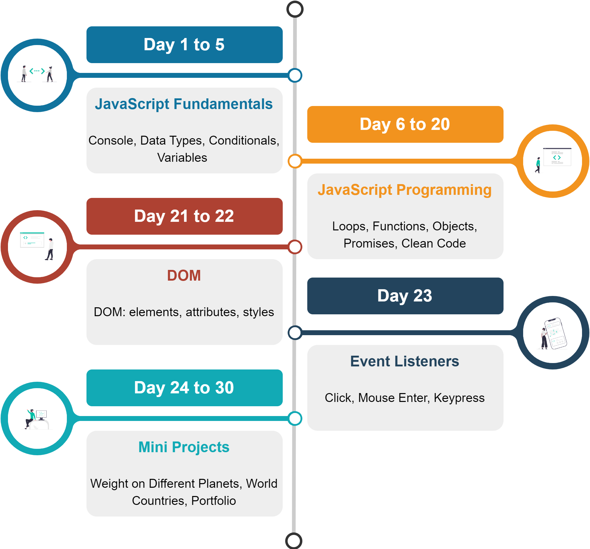

I find learning new programming language exciting. 
A lot more exciting if you come across with a well-structured and interactive course.
One such resource is [**"30 Days of JavaScript"**](https://github.com/Asabeneh/30-Days-Of-JavaScript) by Ashabeneh, recommended by my colleague [JC](https://github.com/jcawesome).

<!--truncate-->

:::info
[**"30 Days of JavaScript"**](https://github.com/Asabeneh/30-Days-Of-JavaScript) by Ashabeneh, can be found in Github, there is a markdown file for each day consisting of lectures as well as exercises.
If you're the type of learner who thrives on reading rather than following video tutorials, then this course might be the perfect fit for you.
:::

## Course Outline
[^1]

### Day 1 to 5: JavaScript Fundamentals
You will learn the JavaScript fundamentals: console, script structure etc, data types, conditionals and variables.

#### Some Learnings 
Here are some topics or ideas derived from the course to provide you some snippet of the lectures, these are somewhat I find unique compared to other programming languages that I've known so far.

:::note typeof

To check the data type of a certain variable, we use the **typeof** operator. See the following example.

```js
console.log(typeof 'Asabeneh') // string
console.log(typeof 5) // number
console.log(typeof true) // boolean
console.log(typeof null) // object type
console.log(typeof undefined) // undefined
```
See [checking data types](https://github.com/Asabeneh/30-Days-Of-JavaScript/blob/master/readMe.md#checking-data-types)
:::

The syntax is quite new to me.

:::note Window prompt() method

The window prompt methods display a prompt box with an input on your browser to take input values and the input data can be stored in a variable. The prompt() method takes two arguments. The second argument is optional.

```js
prompt('required text', 'optional text')
```

```js
let number = prompt('Enter number', 'number goes here')
console.log(number)
```

See [window prompt() method](https://github.com/Asabeneh/30-Days-Of-JavaScript/blob/master/readMe.md#checking-data-types)
:::

Using the browser as an interface instead of the terminal for inputting data.

### Day 6 to 20: JavaScript Programming
As you advance, the foundation of programming will come into play by using loops, functions, objects, classes, etc. 
You can now start with dynamic programming then will let you explore concepts like promises, focusing on data handling and manipulation.
Completing provided exercises, which are categorize into three levels, is a must to fully understand the concepts.

:::note sample exercises

Exercises: Level 1

1. Declare a function _fullName_ and it print out your full name.
2. Declare a function _fullName_ and now it takes firstName, lastName as a parameter and it returns your full - name.

...

Exercises: Level 2

1. Linear equation is calculated as follows: _ax + by + c = 0_. Write a function which calculates value of a linear equation, _solveLinEquation_.
2. Quadratic equation is calculated as follows: _ax2 + bx + c = 0_. Write a function which calculates value or values of a quadratic equation, _solveQuadEquation_.

    ```js
    console.log(solveQuadratic()) // {0}
    console.log(solveQuadratic(1, 4, 4)) // {-2}
    console.log(solveQuadratic(1, -1, -2)) // {2, -1}
    console.log(solveQuadratic(1, 7, 12)) // {-3, -4}
    console.log(solveQuadratic(1, 0, -4)) //{2, -2}
    console.log(solveQuadratic(1, -1, 0)) //{1, 0}
    ```
...

Exercises: Level 3

1. Modify the _userIdGenerator_ function. Declare a function name _userIdGeneratedByUser_. It doesn’t take any parameter but it takes two inputs using prompt(). One of the input is the number of characters and the second input is the number of ids which are supposed to be generated.

    ```sh
    userIdGeneratedByUser()
    'kcsy2
    SMFYb
    bWmeq
    ZXOYh
    2Rgxf
    '
    userIdGeneratedByUser()
    '1GCSgPLMaBAVQZ26
    YD7eFwNQKNs7qXaT
    ycArC5yrRupyG00S
    UbGxOFI7UXSWAyKN
    dIV0SSUTgAdKwStr
    '
    ```

2. Write a function name _rgbColorGenerator_ and it generates rgb colors.

    ```sh
    rgbColorGenerator()
    rgb(125,244,255)
    ```
...
:::

Its well-curated exercises is what I loved the most in this course.

### Day 21 to 22: DOM 
After foundation of programming, you will start working with the Document Object Model (DOM). 
Enabling you to dynamically modify CSS and HTML, fancy stuff 😊. 
This will give you a brief overview on how responsive and interactive websites are created. 

### Day 23: Event Listeners
As you now know how to modify DOM elements, events and event listeners is essential if you want to create responsive and interactive websites. 
This will allow you to create conditions on different user interactions.
  
### Day 24 to 30: Mini Projects: 
The last part of the course will be devoted to mini projects.
This will focus on applying everything you've learnt so far, so there are no lectures only exercises.
There are plenty of project ideas, so there are options for you to try different mini projects based on your interests.

:::note sample mini project
Develop a small application which calculate a weight of an object in a certain planet.


See [Mini Project Solar System](https://github.com/Asabeneh/30-Days-Of-JavaScript/blob/master/24_Day_Project_solar_system/24_day_project_solar_system.md#exercise-level-1)
:::

## Some Other Learnings
Here are some other topics or ideas derived from the course that I find interesting:

:::note for of loop

We use for of loop for arrays. It is very hand way to iterate through an array if we are not interested in the index of each element in the array.

```js
for (const element of arr) {
  // code goes here
}
```

See [for of loop](https://github.com/Asabeneh/30-Days-Of-JavaScript/blob/master/06_Day_Loops/06_day_loops.md#for-of-loop)
:::

Well the syntax is new to me.

:::note argument

 A function declaration provides a function scoped arguments array like object. Any thing we passed as argument in the function can be accessed from arguments object inside the functions. Let us see an example

 ```js
// Let us access the arguments object
​
function sumAllNums() {
  console.log(arguments)
}

sumAllNums(1, 2, 3, 4)
// Arguments(4) [1, 2, 3, 4, callee: ƒ, Symbol(Symbol.iterator): ƒ]

```

See [unlimited number of parameters in regular function](https://github.com/Asabeneh/30-Days-Of-JavaScript/blob/master/07_Day_Functions/07_day_functions.md#unlimited-number-of-parameters-in-regular-function)
:::

The `arguments` holds the value of passed parameters of the function. 

:::note arrow function

 Arrow function does not have the function scoped arguments object. To implement a function which takes unlimited number of arguments in an arrow function we use spread operator followed by any parameter name.  Any thing we passed as argument in the function can be accessed as array in the arrow function. Let us see an example

 ```js
// Let us access the arguments object
​
const sumAllNums = (...args) => {
  // console.log(arguments), arguments object not found in arrow function
  // instead we use a parameter followed by spread operator (...)
  console.log(args)
}

sumAllNums(1, 2, 3, 4)
// [1, 2, 3, 4]

```

See [unlimited number of parameters in arrow function](https://github.com/Asabeneh/30-Days-Of-JavaScript/blob/master/07_Day_Functions/07_day_functions.md#unlimited-number-of-parameters-in-arrow-function)
:::

The distinction of JavaScript compared to other languages `=>`, the syntax of arrow function. Use spread operator instead of `arguments` if you use the arrow function syntax for creating the function.

:::note order of script tag

The order of script tag matters, when importing variable from other files.

```html
<!DOCTYPE html>
<html lang="en">
<head>
    <meta charset="UTF-8">
    <meta name="viewport" content="width=device-width, initial-scale=1.0">
    <title>Exercises</title>
</head>
<body>
    <script src="countries.js"></script>
    <script src="webTechs.js"></script>
    <script src="index.js"></script>
</body>
</html>
```
On `index.js` file, you can import variables defined on either `countries.js` or `webTechs.js`. 
But when you create script inside `webTechs.js` you cannot use directly the variable defined on `index.js`, only the variables defined on `countries.js`
:::

## Final Thoughts
The way the course is well-structured with exercises per day makes it manageable, although I struggle to be consistent. Well, that's on me, not the course itself. 
Here's the [repository](https://github.com/ltuala/30-Days-Of-JavaScript) of my progress.

:::caution Heads up

Some of the mini projects don't have a template for HTML and CSS, so you might find it difficult to accomplish them if you're not yet comfortable with HTML and CSS. 

:::

This course serves as a valuable resource, for a complete beginner like me or someone looking to learn or revisit the JavaScript language.
I would like to express my gratitude to [JC](https://github.com/jcawesome) for introducing me to this course.

## Footnotes
[^1]: Built using [draw.io](https://app.diagrams.net/) and [undraw](https://undraw.co/illustrations)