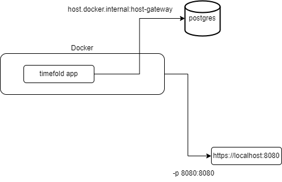
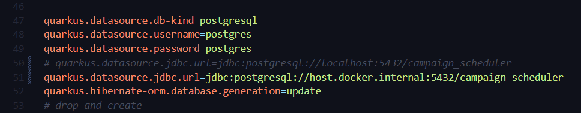
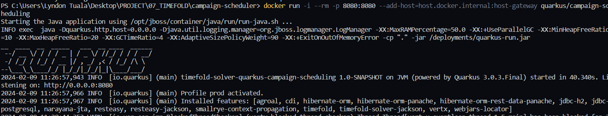
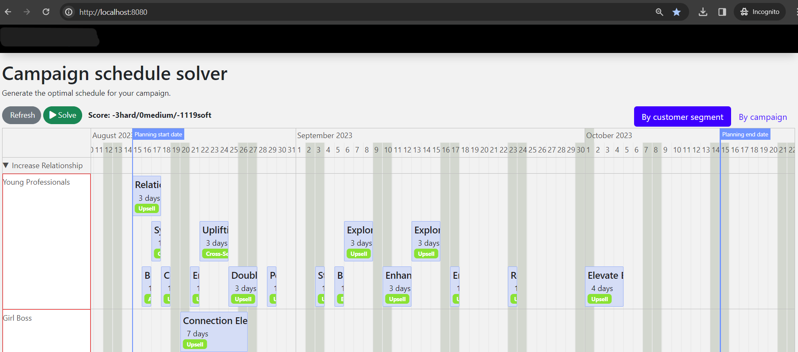

Timefold examples are available with a Dockerfile already for you to start with. In this blog, I tried to explore how to deploy the Timefold application via docker.

<!--truncate-->
:::caution Prerequisites
**Timefold** requires a Java version **17+**. See [JDK on Windows](https://docs.oracle.com/en/java/javase/20/install/installation-jdk-microsoft-windows-platforms.html), for official documentation on how to install JDK.
:::

## Here's a step-by-step guide on how I deploy the Timefold application via docker:

:::note High-level Overview

:::
Here I just deploy the Timefold application via docker and use a local database as the data source.

### 1. Package the Application
Before building the container image, package the application first. Run the command:  
```
mvn clean install 
```

### 2. Build the Image
To build the image use the Dockerfile readily available. 
:::note Dockerfile code
```
FROM registry.access.redhat.com/ubi8/openjdk-17:1.15

ENV LANGUAGE='en_US:en'


# We make four distinct layers so if there are application changes the library layers can be re-used
COPY --chown=185 target/quarkus-app/lib/ /deployments/lib/
COPY --chown=185 target/quarkus-app/*.jar /deployments/
COPY --chown=185 target/quarkus-app/app/ /deployments/app/
COPY --chown=185 target/quarkus-app/quarkus/ /deployments/quarkus/

# Add the extra host entry to the container's /etc/hosts file
# RUN echo "host.docker.internal    host-gateway" >> /etc/hosts

EXPOSE 8080
USER 185
ENV JAVA_OPTS="-Dquarkus.http.host=0.0.0.0 -Djava.util.logging.manager=org.jboss.logmanager.LogManager"
ENV JAVA_APP_JAR="/deployments/quarkus-run.jar"
```
:::

Then, run a `docker build` command:
```
docker build -f src/main/docker/Dockerfile.jvm -t quarkus/campaign-scheduling .
```
- `quarkus/campaign-scheduling` is the image name

If you have a docker desktop available the image should look like this:


### 3. Modify `application.properties`
To be able to connect to the local database make sure to update the `quarkus.datasource.jdbc.url`, set it to `host.docker.internal` instead of `localhost`. 
This tells docker to connect to a custom network made available by docker and this particular custom network allows you to connect to your local `localhost`.


### 4. Run the application
To run the aplicaion, run `docker run` command:
```
docker run -i --rm -p 8080:8080 --add-host=host.docker.internal:host-gateway quarkus/campaign-scheduling
```



### 5. Test the Application
Connect to the application via your local browser.


:::note Congratulations!
You have now successfully deployed a Timefold application via docker and allow it to connect to a local database.
:::